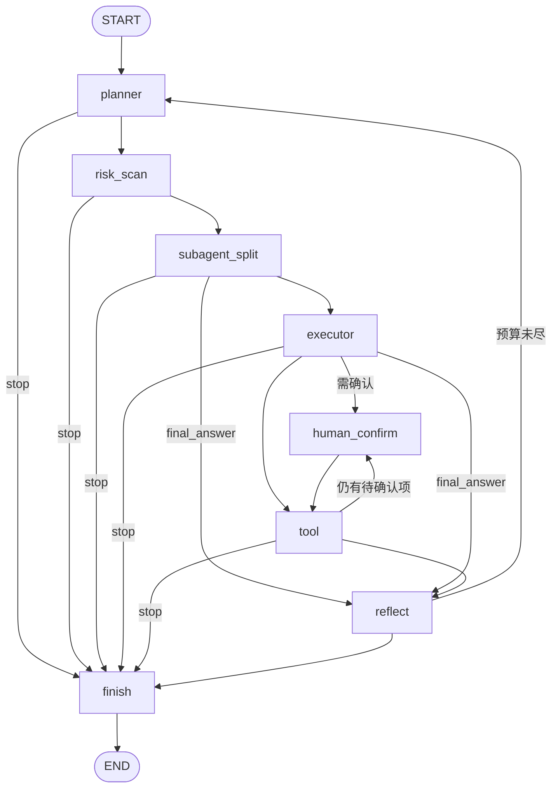

# LangGraph 自主任务 Agent

自然语言下发任务 → Agent 自主规划（planner → executor → tool → reflect 循环）→ 调用工具完成多步任务，
全程 SSE 实时可视化 + Trace 回放。基于 **LangGraph 1.2.x（StateGraph）**，FastAPI + React 前后端一体。

**365 个离线测试全绿**（零网络、零 Key、MockLLM）· 真实 LLM 双场景 PASS（千问 `qwen3.6-plus`：冒烟 + 断点续跑）· CI 五 job 全绿。

这个仓库想证明的不是"能跑通一个 agent demo"，而是 agent 运行时里那几件难做的事被工程化地解决了：
任务被中途停止后能从检查点续跑、危险操作在执行前被闸门拦住、工具连续失败时熔断降级而不是把循环拖死、
外部工具生态（MCP / OpenAPI）能动态接进来而不改内核。

---

## 快速开始

```bash
python -m venv .venv311 && source .venv311/bin/activate   # Python 3.11（Windows: .venv311\Scripts\activate）
pip install -r requirements.txt
cp .env.example .env                                      # 填 llm_api_key；或设 use_mock_llm=true 离线跑
uvicorn backend.main:app --port 8000 --reload
cd frontend && npm install && npm run dev                 # http://localhost:5173（/api 代理到 :8000）
```

一键：`python start.py --mock`（离线 Mock，无需 Key）· `python start.py`（真实 Key）· `docker compose up --build`

> 虚拟环境请叫 `.venv311`：`start.py` 会拦住仓库根目录的 `.venv`（本地那个是 3.13 且未装依赖，
> 误用只会得到一堆与真因无关的 ImportError）。

---

## 能力

- **断点续跑** —— `SqliteSaver` 检查点（`thread_id == task_id`）+ 1.x `durability="sync"`（stop() 后快照必已落盘），`POST /api/tasks/{id}/resume` 从断点复活，消息/计划/确认记录全保留。非 INTERRUPTED、无 checkpoint、停在确认闸口三类一律 409 —— 闸门永不被静默绕过；崩溃遗留的孤儿任务启动时自动对账。→ [P3 架构](docs/incremental-arch-p3-resume.md)
- **危险操作闸门** —— 规划期 EHRB 五类风险扫描（删除/破坏/财务/隐私/通信）+ `human_confirm` 图内中断节点；批准/拒绝写回 `_confirmed_ids` / `_rejected_ids` 后**重算**是否仍有待确认项（P0 修掉的死循环根因）；写类工具（HTTP 写方法 / `git_commit` / MCP 写类）额外走 per-call 判定
- **工具层韧性** —— 熔断（连续失败 3 次短路 / 冷却 30s / half-open 试探）+ 指数退避重试，跳闸发 `tool_circuit_open` 事件；写类工具 `retryable=False`（重试一个已副作用过的调用比重试失败更糟）；MCP 子进程失败隔离
- **外部工具生态** —— MCP 客户端（stdio，每 server 一线程 + 独立事件循环，工具动态注册成 `mcp__{server}__{tool}`）· OpenAPI spec 一键成工具 · `backend/plugins/` 自动发现（模板见 [`example_tool.py`](backend/plugins/example_tool.py)）· Git 7 工具（参数化无 shell + 危险命令黑名单）。接入方式全是配置项，不改内核：见 [`.env.example`](.env.example) 的 `mcp_*` / `openapi_*` / `plugins_*`
- **子 Agent 协作** —— 隔离子任务图（`mode="subtask"`，无风险/确认节点、防递归），线程池并行，主消息只留折叠摘要
- **上下文压缩 + 知识库** —— 超阈值（默认 8000 tokens）自动截断 / 可选 LLM 摘要；标准库关键词索引的 KB（离线可用），任务中经 `kb_query` / `memory_search` 检索
- **可观测** —— SSE 21 种事件 + JSONL Trace 落盘（顺序与 SSE 一致），前端时间线回放 + 导出原始字节
- **沙箱与鉴权** —— 文件白名单防逃逸、代码执行受限 subprocess；hmac token 签发（默认关闭，本地 demo 便利）

---

## 编排拓扑



与 [`backend/core/agent/graph.py`](backend/core/agent/graph.py) 逐边一致（节点 ID 用 `S0`/`E0` 是因为
mermaid 把小写 `end` 当保留字）。三处值得单独说：

- `human_confirm → tool` 是**静态边**，不是包着常量路由的条件边 —— 决策之后是否真的执行是 tool 节点的事
  （被拒绝的调用在那里跳过），是否**再次**进闸门由 `_after_tool` 决定；
- `_after_tool` 的重入判定 + `human_confirm_node` 决策后重算 `_needs_confirm`，两半合起来才是 P0 死循环的完整修复；
- 每个路由都是**具名函数 + `Literal` 返回注解**，langgraph 1.x 据此推导 `path_map`，编译出的图自己声明拓扑
  （用 lambda 或漏注解不会报错，只会静默失去这份声明）。

分层：React 三栏 UI → FastAPI/SSE → **TaskManager**（后台线程 · stop 权威信号 · checkpointer 挂载与格式守卫）
→ StateGraph / AgentRuntime → 工具层（registry 发现 + resilience 熔断）· LLM 抽象层（OpenAI 兼容 + Mock + Aux）
· 服务层（EventBus · TraceRecorder · Persistence · KnowledgeBase · Auth）。
事件由**节点内部**主动 publish 到自建 EventBus，与 langgraph 的流式输出解耦 —— 这也是迁移时没选 typed
streaming v2 的原因。

---

## langgraph 0.2 → 1.2.x 原地迁移

**为什么迁**：0.2.76 是 2024 年的 API 线，仓库教的是过期范式；`checkpoint-sqlite 2.0.11` 上两条 CVE 曾因
"3.x 破坏 resume serde 兼容"被钉版接受 —— 而那条理由从未被实测过。

**怎么迁**：装上新栈后**破坏面 = 0**（一行生产代码未改即 351 passed），所以重写是 idiom 现代化而非兼容性
修复：`add_edge(START, …)` 取代 `set_entry_point`、具名路由 + `Literal` 注解取代匿名 lambda、静态边取代
常量条件边。显式采用**恰好一个** 1.x 新特性：`durability="sync"`。

**矩阵**：`langgraph` 0.2.76 → **1.2.11**（钉 `>=1.2,<1.3`）· `langgraph-checkpoint` 2.1.2 → **4.2.0**
（显式钉：serde 住在这个包里）· `checkpoint-sqlite` 2.0.11 → **3.1.1** · 删掉 `langchain` /
`langchain-openai` / `langchain-core` 三行死钉版（全仓 0 import，且 `langchain-core<0.3` 与 1.x 直接冲突）·
`uvicorn` / `starlette` 区间不动。

**代价**：迁移前写的旧快照作废 —— 启动时用 `PRAGMA user_version` 打标 + `mode=ro` 只读检测，判定为旧格式
就告警并拒绝挂载（服务照常起、新任务照跑，只是 resume 落回 409），不做自动迁移；`durability` 只在挂了
checkpointer 时传（1.2.11 在无 checkpointer 时传 `sync` 会 `AttributeError`），一律经 `_invoke_kwargs()` 取参数。

**安全闭环**：两条曾被 dismiss 的公告（CVE-2025-67644 / CVE-2026-71433）随 3.1.1 从「已接受」变「已修复」。

**闸门**：351 → **365 passed** · `--check` 5/5 · 真实模型双场景 PASS · 受保护文件 diff 为空 · CI 全绿。

→ 完整评估、A/B 实测证据（旧钉版理由是怎么被推翻的、为什么"读得回 ≠ 跑得续"）与逐条决策：
[`docs/migration-langgraph-1x.md`](docs/migration-langgraph-1x.md)

---

## 质量门禁

```bash
pip install -r requirements-dev.txt      # ruff + mypy（钉死版本，不进运行期镜像）
python -m ruff check backend scripts     # 基线全净，零 per-file-ignores
python -m mypy                           # files=backend，生产与测试同一把闸
python -m pytest backend/tests/ -q       # 365 用例，唯一权威回归
python scripts/live_e2e.py --check       # 无 Key / 无网络的接线冒烟
```

配置与每条「刻意不启用」的规则族（附实测数字与理由）在 [`pyproject.toml`](pyproject.toml)；
CI 五 job 在 [`ci.yml`](.github/workflows/ci.yml)：受保护文件守卫 · 后端 lint + 类型 + 测试 + 冒烟 ·
前端类型检查 + 构建 · Docker 构建 · 真实模型 E2E。
发布前 / 换供应商跑真实模型：[`scripts/LIVE_E2E.md`](scripts/LIVE_E2E.md)。

---

## 与 `interview-agent-py` 的分工

- **本仓库**扛 agent **运行时深度**：图编排、检查点与 resume 语义、风险确认闸门、熔断重试、
  MCP / OpenAPI / Git / 插件工具链、SSE 可观测。数据面刻意轻（sqlite + JSON + 标准库索引，零外部服务），
  复杂度全押在编排与状态机上。
- [**interview-agent-py**](https://github.com/renjianguojinqianfan/interview-agent-py) 扛业务系统的
  **工程落地**：智能面试官平台（简历分析 / 模拟面试 / RAG 检索），PostgreSQL + pgvector、Redis、MinIO、
  async SQLAlchemy 2.0、多阶段 uv 构建、ADR 序列、`make verify` 全栈门禁。

一句话：这个仓库回答"agent 循环本身怎么做才可靠"，那个仓库回答"agent 落进一个真实业务系统要配哪些
基础设施"。两边现在说同一套门禁语言（ruff + mypy + pytest）。

---

## 文档

- **架构与契约**：[`docs/architecture.md`](docs/architecture.md)（REST + SSE 事件协议 + 类图 / 时序图）；
  运行时 Swagger 在 `http://localhost:8000/docs`；P2 的 `/api/mcp/servers`、P3 的 `/resume` 见各自增量档
- **增量设计**：[P0](docs/incremental-arch-p0.md)（上下文压缩 / 熔断 / 插件 / trace）·
  [P1](docs/incremental-prd-p1.md)（风险扫描 / 子 Agent / RAG / 辅助模型 / 鉴权 / OpenAPI）·
  [P2](docs/incremental-prd-p2.md)（MCP / Git）· [P3](docs/incremental-arch-p3-resume.md)（断点续跑）
- **迁移**：[`docs/migration-langgraph-1x.md`](docs/migration-langgraph-1x.md) ·
  [Issue #7](https://github.com/renjianguojinqianfan/langgraph-agent/issues/7) ·
  [Issue #4（断点续跑）](https://github.com/renjianguojinqianfan/langgraph-agent/issues/4)
- **配置**：[`.env.example`](.env.example)（15 组前缀，逐项带注释）
- **工程约定**：[`AGENTS.md`](AGENTS.md)（硬规则 / 目录结构 / 常用命令 / 完成定义）·
  [`OVERVIEW.md`](OVERVIEW.md)（历次交付日志，含 Issue #7 一章）

## License

MIT
