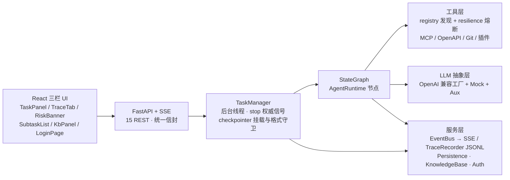

# LangGraph 自主任务 Agent

自然语言下发任务 → Agent 自主规划 → 循环调用工具（联网检索 / 文件读写 / 代码执行 / HTTP / Git /
MCP 外部工具 / OpenAPI / 知识库）→ SSE 实时可视化 + Trace 回放。前后端一体，LangGraph 1.2.x 编排。

**这个仓库想证明的不是"能跑通一个 agent demo"，而是 agent 运行时里那几件难做的事被工程化地解决了**：
任务被中途停止后能从检查点续跑、危险操作在执行前被闸门拦住、工具连续失败时熔断降级而不是把循环拖死、
外部工具生态（MCP / OpenAPI）能动态接进来而不改内核。

**365 个离线测试全绿**（零网络、零 Key、MockLLM）· 真实 LLM（OpenAI 兼容，已验证千问 `qwen3.6-plus`）
端到端 + 断点续跑双场景 PASS · CI 五个 job（受保护文件守卫 / 后端 lint + 类型 + 365 测试 + 离线冒烟 /
前端类型检查 + 构建 / Docker 构建 / 真实模型 E2E）。

> 技术栈：Python 3.11（`.python-version` 钉住）· LangGraph 1.2.x LTS · FastAPI · OpenAI 兼容 LLM 抽象层
> （可 Mock）· React 18 · Vite · TypeScript · Tailwind · Zustand · MCP SDK · ruff + mypy

---

## 1. 亮点（每条都能指到代码与测试）

### 断点续跑：把"中断"当成一等状态
- `SqliteSaver` 检查点，`thread_id == task_id`，每个 superstep 落盘完整 `AgentState`；
  `POST /api/tasks/{id}/resume` 从断点复活，消息历史 / 计划 / 已批准与已拒绝的确认记录全部保留。
- **显式采用 langgraph 1.x 的 `durability="sync"`**：`resume()` 的契约是"stop() 之后快照必须已落盘"，
  默认的 `"async"` 下写入在后台进行，`sync` 从机制上关掉这个竞态窗口（宽限双探保留为纵深防御）。
- **拒绝语义不放松**：非 INTERRUPTED、无 checkpoint、停在人工确认闸口 —— 三类一律 409 同步拒绝，
  闸门永不被静默绕过；进程崩溃遗留的孤儿任务启动时自动对账为可恢复。
- **旧格式快照守卫**：迁移前写的 sqlite 快照在启动时被检测（`PRAGMA user_version` 打标 +
  `mode=ro` 只读探测）、告警并拒绝挂载 —— 服务照常起、新任务照跑，只是 resume 落回 409，
  绝不静默腐蚀状态。

### 危险操作闸门：规划期扫描 + 执行前确认
- EHRB 五类危险词表（删除 / 破坏 / 财务 / 隐私 / 通信）在 planner 之后扫描整轮计划，高危强制确认；
- `human_confirm` 是图上的真实中断节点：批准 / 拒绝写回 `_confirmed_ids` / `_rejected_ids`，
  **每次决策后重算**是否仍有待确认项（这是 P0 修掉的死循环根因，AGENTS.md 里列为不可动红线）；
- 写类工具（HTTP 写方法 / `git_commit` / MCP 写类）额外走 per-call 确认启发式；
- 沙箱：文件白名单防逃逸、代码执行受限 subprocess、Git 命令参数化（无 shell）+ 危险命令黑名单。

### 工具层韧性：失败是常态，不是异常
- 熔断器：连续失败 3 次短路、冷却 30s、half-open 试探；指数退避重试（base=1 / factor=2 / max=2）；
  跳闸发 `tool_circuit_open` 事件，前端渲染 ⚡ 徽章；
- 写类工具 `retryable=False` —— 重试一个已经副作用过的调用比重试失败更糟；
- MCP 子进程失败隔离：连接失败只 warning，运行中被杀不崩主任务，cleanup 幂等。

### 外部工具生态：接进来，不改内核
- **MCP 客户端**：stdio 传输，每 server 一线程 + 独立事件循环，`initialize` + `list_tools` 后
  动态注册成 `BaseTool`（`mcp__{server}__{tool}`），`GET /api/mcp/servers` 可观测状态；
- **OpenAPI 一键成工具**：YAML / JSON / URL 加载 spec，每个 operation 生成一个工具（apiKey header/query、
  路径参数注入、4xx/5xx → `success=False`），无效 spec 不中断启动；
- **插件目录**：`backend/plugins/` 放一个 `BaseTool` 子类即被自动发现，同名冲突先注册者胜。

### 可观测与可验证
- SSE 实时事件流 **21 种事件**（前端 `SSEventType` 联合类型 20 种 + 后端 `task_resumed`）：
  `plan_update` / `step_start` / `tool_call` / `tool_result` / `tool_circuit_open` / `context_compressed` /
  `human_confirm_required` / `artifact_created` / `risk_report` / `risk_found` / `subtask_*` /
  `task_created` / `task_completed|failed|interrupted|resumed` / `trace_end` / `heartbeat`；
- Trace 落 JSONL，顺序与 SSE 一致，前端时间线回放 + 导出原始字节；
- **离线可验证**：`MockLLMClient` 脚本化响应 + `conftest.py` 顶部环境变量隔离（本地 `.env` 里的真实
  端点污染不到测试），365 个用例零网络零 Key 确定性通过。

---

## 2. 架构

### 2.1 编排拓扑（`mode="main"`，与 `backend/core/agent/graph.py` 一致）


（图里的 `START` / `END` 是 langgraph 的哨兵节点；节点 ID 用 `S0` / `E0` 是因为 mermaid 把
小写 `end` 当保留字，直接用会渲染失败。）

三条边值得单独说：
- `human_confirm → tool` 是**静态边**，不是包着常量路由的条件边 —— 决策之后是否真的执行是 tool 节点的
  事（被拒绝的调用在那里跳过），是否**再次**进闸门由 `_after_tool` 决定；
- `_after_tool` 的重入判定 + `human_confirm_node` 决策后重算 `_needs_confirm`，两半合起来才是 P0
  死循环的完整修复；
- 每个路由都是**具名函数 + `Literal` 返回注解**，langgraph 1.x 据此推导 `path_map`，
  编译出的图自己声明拓扑（用 lambda 或漏注解不会报错，只会静默失去这份声明）。

`mode="subtask"` 是简化拓扑（planner → executor → tool → reflect → finish），**没有** risk / confirm /
split 节点：子任务不能递归分裂，也不能停在一个无法路由回父图的确认闸口上。

### 2.2 分层



关键解耦：事件由**节点内部**主动 `publish()` 到自建 `EventBus`，与 langgraph 的流式输出无关 ——
这也是迁移时没有选 typed streaming v2 的原因（见 §3.3）。

### 2.3 目录

```
langgraph-agent/
├── AGENTS.md                 # 项目 Agent 操作手册（硬规则 / 行为边界 / 完成定义）
├── pyproject.toml            # ruff + mypy 门禁配置（含每条"刻意不启用"的理由）
├── requirements.txt          # 运行期依赖（langgraph 三包同钉，注释写明理由）
├── requirements-dev.txt      # 质量门禁工具链（ruff / mypy，钉死版本）
├── backend/
│   ├── main.py               # 应用入口 / lifespan（MCP 优雅关闭）/ CORS
│   ├── config.py             # pydantic-settings（15 组配置前缀）
│   ├── api/                  # routes（15 REST）/ sse / schemas
│   ├── core/
│   │   ├── agent/            # state / nodes / graph / context(压缩) / risk / subagent
│   │   ├── llm/              # LLMClient 抽象 + OpenAI 兼容工厂 + Mock/Aux
│   │   ├── tools/            # BaseTool + 14+ 工具 + resilience(熔断) + registry(插件发现)
│   │   ├── kb/               # KnowledgeBase（标准库关键词索引，离线可用）
│   │   └── mcp/              # McpClientManager（stdio，每 server 一线程）
│   ├── services/             # event_bus / trace / persistence / task_manager / auth
│   ├── plugins/              # 插件目录（自动发现 BaseTool）
│   └── tests/                # 40 文件 / 365 用例（含 test_qa_* 独立补充）
├── frontend/                 # React 三栏 UI（components/ 14 组件 + pages/ 2 页面）
├── docs/                     # PRD / 架构 / 增量设计（p0–p3）/ langgraph 1.x 迁移评估与实测
├── learning-records/         # 学习痕迹（带索引 README）
└── scripts/                  # live_e2e.py（真实 LLM 验证）/ live_skill_test.py
```

---

## 3. langgraph 0.2 → 1.2.x 原地迁移（Issue #7）

2026-09 完成。**完整评估、A/B 实测证据与逐条决策**在
[`docs/migration-langgraph-1x.md`](docs/migration-langgraph-1x.md)；这一节是它的摘要。
迁移以 11 个分阶段 commit 留痕（评估 → 依赖 → 编排重写 → 新特性 → 评审修复），未 squash、未重写历史。

### 3.1 为什么迁
1. **栈信号过期**：0.2.76 是 2024 年的 API 线，当前是 1.2.x LTS。仓库教的是过期范式
   （`set_entry_point`、匿名 lambda 路由、三元式 `compile`），"跑在新版上"只是数字变化。
2. **两条安全公告被钉版接受**：`checkpoint-sqlite 2.0.11` 上有
   GHSA-9rwj-6rc7-p77c / CVE-2025-67644 与 GHSA-47pj-3jcm-6whg / CVE-2026-71433，
   当时的处置是 dismiss（理由："3.x 破坏 resume serde 兼容"）。
3. **那条钉版理由从未被实测过**，是继承来的假设。

**为什么是原地迁移而不是重写**：351 个测试构成的回归网让「行为不变」可被证明（迁移后 365 全绿），
而重写会把这张网和迭代历史一起归零 —— 历史（测试网从 62 长到 365、安全告警的处置过程、CI 守卫的落地）
本身就是可信度资产。全量重写被否决的三条理由（首看可信度 / 叙事密度 / 教训回归）留在 spec 里。

### 3.2 依赖矩阵

| 组件 | 迁移前 | 迁移后 |
|---|---|---|
| `langgraph` | 0.2.76 | **1.2.11**（钉 `>=1.2,<1.3`，1.2.x LTS 线） |
| `langgraph-checkpoint` | 2.1.2（传递） | **4.2.0**（显式钉死：serde 住在这个包里） |
| `langgraph-checkpoint-sqlite` | 2.0.11 | **3.1.1** |
| `langchain-core` | 0.2.43（显式钉死） | 1.6.2（改为传递引入） |
| `langchain` / `langchain-openai` | 0.2.17 / 0.1.25（钉死） | **删除**（全仓 0 import，且 `langchain-core<0.3` 与 1.x 直接冲突） |
| `uvicorn` / `starlette` | 0.30.6 / 0.38.6 | 不动（AGENTS.md 硬约束） |

**三个包必须一起钉**：它们合起来就是 resume 契约的存储面。`langgraph-checkpoint` 若只被上游约束在
`[4.1,5)`，一次普通 `pip install` 就能把它抬到 4.5 并改掉快照语义 —— 既过不了钉版检查也过不了
`CHECKPOINT_FORMAT_VERSION`（打标只区分迁移前 / 后，感知不到 4.x 内部漂移），而失败形态正是
"静默腐蚀 resume"。抬版需人评估放行。

### 3.3 实测结论（先测再改）
- **旧钉版理由被推翻**：对 2.0.11 真实写入的快照（104 行 / 7 thread）在旧栈与新栈下做 `mode=ro`
  只读 A/B 探测，结构化 diff 的**全部**差异只有三行版本号 —— 3.1.1 + checkpoint 4.2.0 能无损读回。
- **但旧快照仍然作废**，理由换成诚实的那条：**读得回 ≠ 跑得续**。resume 要恢复的是 pregel 循环的
  执行位置（`channel_versions` / `versions_seen` / `writes` / 0.2 时代的 `branch:*` 通道），
  1.x 重写了调度与分支语义；跨大版本的执行位置等价性未证明，而 `data/` 是纯运行时数据、可弃。
  赌错的失败模式是静默腐蚀 resume 状态 —— 最难查的一类。
- **破坏面 = 0**：装上新栈、一行生产代码未改，351 passed。所以"重写"的性质是 idiom 现代化，
  不是兼容性修复。
- **1.x 新特性选 durability，不选 typed streaming v2**：本项目是「后台线程 + `graph.invoke()` +
  自建 EventBus → SSE」，事件由节点内部 publish，与 langgraph 流式输出解耦；改用 stream 循环会改
  SSE 事件时序与类型，违反"零前端契约变更"。durability 只影响 checkpoint 写入时机，且与断点续跑
  叙事天然咬合。

### 3.4 代价（都写进了代码注释与硬规则）
1. **旧快照作废**需要一次运维动作：按日志提示把 `data/checkpoints/checkpoints.sqlite` 移走
   （本仓库已重命名为 `*.pre-1x-legacy`），新建的库会打上 `format v1`。不做自动迁移。
2. **`durability` 只在挂了 checkpointer 时传**：1.2.11 在**无** checkpointer 时传
   `durability="sync"` 会 `AttributeError: 'SyncPregelLoop' object has no attribute
   '_put_checkpoint_fut'` —— 恰好就是"旧库被拒绝挂载"之后的状态。两个决策会相互撞上，
   所以 invoke 一律经 `TaskManager._invoke_kwargs()` 取参数。这不是推理出来的，是被
   `test_new_tasks_still_run_with_legacy_store_present` 抓出来的。
3. **检测连接必须 `mode=ro`**：对 WAL 库而言，最后一个关闭的读写连接会把 `-wal` 折回主库并删掉
   `-wal`/`-shm` —— "决定拒绝它"这个动作本身会改写被拒文件，毁掉运维事后用旧栈取证的现场。
4. **打标写入必须 try/except 降级为拒绝挂载**：否则只读目录 / 磁盘满会把"单任务失败"升级成
   "FastAPI 起不来"，那是比迁移前更差的降级。
5. `websockets` 被新依赖链的上限从 17.0.1 降到 16.1.1（仍在 uvicorn 声明区间内，本项目只跑
   HTTP + SSE，无功能影响）；`pip check` 关于 mcp 要求 `uvicorn>=0.31.1` 的告警**迁移前就存在**，
   是"mcp 用 `--no-deps` 装、不升级 uvicorn/starlette"的既定代价。

### 3.5 闸门（Phase 1 迁移交付时）

| 闸门 | 结果 |
|---|---|
| 离线套件 | 351 → **365 passed**（+6 旧库守卫、+3 拓扑声明、+2 durability、+3 评审后补：更高版本标记 / 损坏库 / 不可写库）|
| `live_e2e.py --check` 离线冒烟 | 5/5 PASS |
| 真实模型（qwen3.6-plus）| 场景 1 冒烟 PASS、场景 2 stop→重建→resume→COMPLETED PASS |
| 受保护文件 | 迁移分支上 `git diff master...HEAD -- conftest.py nodes.py resilience.py registry.py` 为空 |
| CI | 五个 job 全绿（live-e2e 因仓库未配 `LLM_API_KEY` secret 而由 gate 步骤跳过，不代表真跑过）|

> Phase 2 接入门禁后，`nodes.py` 多了三处与红线无关的改动（删一个死 `import uuid`；planner 降级分支加一行
> 纯注解；MCP 鸭子类型判定包一层运行时恒等的 `typing.cast`）；`human_confirm_node` 的 `_needs_confirm`
> 重算块、`conftest.py` 隔离块与两个 CI 冻结文件仍逐字未动（逐行可验）。

### 3.6 安全闭环
两条曾在 2.0.11 上被评估为 `not_used` 而 dismiss 的公告，随 `checkpoint-sqlite 3.1.1` 从
**「已接受」变成「已修复」**。issue #5 / #6 维持 dismissed 不重开（处置记录留在 issue 里），
`requirements.txt` 注释与本节互为索引。

---

## 4. 与 `interview-agent-py` 的分工

两个仓库都用 LangGraph + FastAPI + React，但**刻意不重复**：

| | **langgraph-agent**（本仓库） | [**interview-agent-py**](https://github.com/renjianguojinqianfan/interview-agent-py) |
|---|---|---|
| 定位 | Agent **运行时深度** | 业务系统的**工程落地** |
| 主线 | 图编排、断点续跑与检查点语义、风险确认闸门、熔断重试、MCP / OpenAPI / Git / 插件工具链、SSE 可观测 | 智能面试官平台：简历分析、模拟面试、RAG 知识库检索 |
| 数据面 | 刻意轻：sqlite checkpoint、JSON 持久化、标准库关键词索引 —— 零外部服务，复杂度全押在编排与状态机上 | PostgreSQL + pgvector（async SQLAlchemy 2.0）、Redis、MinIO（S3 兼容） |
| 部署 | 单镜像 + docker-compose，本地即跑 | 多阶段 uv 构建、非 root、单 worker（asyncio，ADR-0005）、HEALTHCHECK |
| 决策留痕 | `AGENTS.md` 硬规则 + `docs/` 增量 PRD/架构 + 迁移实测档 | `docs/` ADR 序列 + `CONTEXT.md` |
| 门禁 | ruff + mypy + 365 pytest + `live_e2e --check` + CI 守卫 job | `make verify`（后端 test/typecheck/lint/format-check + 前端 lint/typecheck/test/build） |

一句话分工：**这个仓库回答"agent 循环本身怎么做才可靠"，那个仓库回答"agent 落进一个真实业务系统
要配哪些基础设施"。** 两边现在说同一套门禁语言（ruff + mypy + pytest），可以互相印证。

---

## 5. 运行

### 5.1 后端
```bash
python -m venv .venv311              # Python 3.11（见 .python-version）
source .venv311/bin/activate         # Windows: .venv311\Scripts\activate
pip install -r requirements.txt
cp .env.example .env                 # 填 llm_api_key，或设 use_mock_llm=true 离线跑
uvicorn backend.main:app --host 0.0.0.0 --port 8000 --reload
```

> 虚拟环境请叫 `.venv311`：`start.py` 会拦住仓库根目录的 `.venv`（本地那个是 3.13 且未装依赖，
> 误用只会得到一堆与真因无关的 ImportError）。

> 不填 Key 也能跑：`use_mock_llm=true` 启用离线 Mock LLM。真实模型示例（千问 DashScope）：
> `llm_base_url=https://dashscope.aliyuncs.com/compatible-mode/v1` + `llm_model=qwen3.6-plus`。

### 5.2 前端
```bash
cd frontend && npm install && npm run dev     # http://localhost:5173（/api 代理到 :8000）
```

### 5.3 一键 / Docker
```bash
python start.py --mock                        # 前后端 + 离线 Mock
python start.py                               # 前后端 + 真实 Key（需 .env）
docker compose up --build                     # 需先 cp .env.example .env 并填 Key
```

---

## 6. 质量门禁

四道闸，全部可本地复现（解释器一律 `.venv311/Scripts/python.exe`）：

```bash
pip install -r requirements-dev.txt                    # ruff + mypy（钉死版本）

python -m ruff check backend scripts                   # 闸 1：lint（基线全净）
python -m mypy                                         # 闸 2：类型（files=backend，生产+测试）
python -m pytest backend/tests/ -q                     # 闸 3：365 离线用例（唯一权威回归）
python scripts/live_e2e.py --check                     # 闸 4：无 Key/无网络的接线冒烟
LLM_API_KEY="$DASHSCOPE_API_KEY" python scripts/live_e2e.py    # 发布前：真实模型双场景
```

配置全部在 [`pyproject.toml`](pyproject.toml)，两条原则写在文件注释里：

- **基线全净，不留 ignore 债**：ruff 没有任何 `per-file-ignores`；mypy 只有一处 override
  —— `backend/core/tools/registry.py`，因为它是 AGENTS.md「熔断层零改动」+ CI
  `guard-protected-files` 机械化拦截的冻结文件，修它那 2 处返回类型不精确必须改冻结签名。
  排除的是"在该模块内报错"，其它模块引用它时仍按它的注解检查。
- **刻意不启用的规则族都附了实测数字与理由**（`UP` 会改到冻结文件、`BLE001/S110` 与本项目
  "失败只降级不中断"的语义冲突、`RUF012` 对类级 JSON schema 常量是纯噪音、`RUF100` 与
  select 集合耦合会误删 load-bearing 的 `noqa`）—— 免得后人把取舍当成漏配。

CI（[`.github/workflows/ci.yml`](.github/workflows/ci.yml)）五个 job：
`guard-protected-files`（受保护文件守卫，`[OVERRIDE]` 逃生舱）· `backend-test`（ruff + mypy +
365 pytest + `--check` 冒烟）· `frontend-build`（tsc + vite build）· `docker-build` ·
`live-e2e`（需 `LLM_API_KEY` secret，否则 gate 步骤跳过）。

---

## 7. 核心 API（`/api` 前缀，统一信封 `{code,data,message}`）

| 方法 | 路径 | 说明 |
|------|------|------|
| POST | `/api/tasks` | 下发任务 `{input, title?}` → `{task_id}` |
| GET  | `/api/tasks` | 历史任务列表 |
| GET  | `/api/tasks/{id}` | 任务完整状态 |
| POST | `/api/tasks/{id}/stop` | 停止任务（≤2s 生效） |
| POST | `/api/tasks/{id}/resume` | 从断点续跑 INTERRUPTED 任务（Issue #4） |
| GET  | `/api/tasks/{id}/events` | **SSE** 步骤事件流 |
| GET  | `/api/tasks/{id}/trace` | Trace 回放（NDJSON / `?format=json`）|
| GET  | `/api/tasks/{id}/artifacts/{aid}` | 下载产物 |
| GET  | `/api/tasks/{id}/artifacts/{aid}/preview` | 预览产物（文本类 inline）|
| POST | `/api/tasks/{id}/confirm` | 人工确认（批准 / 拒绝） |
| POST | `/api/auth/token` | 登录签发（默认关闭） |
| GET/POST/DELETE | `/api/kb`… | 知识库管理 / 重建 / 删除 |
| GET  | `/api/mcp/servers` | MCP 服务器状态 |
| GET  | `/health` | 健康检查 |

## 8. 配置（`.env`，15 组前缀）

| 前缀 | 用途 | 示例默认 |
|------|------|---------|
| `llm_*` | 主模型 | provider=openai / model=gpt-4o-mini |
| `aux_llm_*` | 辅助模型（默认关，零额外调用） | enabled=false |
| `context_*` | 上下文压缩 | token_budget=8000 / keep_recent=10 |
| `tool_*` | 熔断重试 | failure_threshold=3 / cooldown=30s |
| `risk_*` | 风险扫描 | scan_enabled=true / policy=confirm |
| `subagent_*` | 子 Agent | enabled=true / max_concurrency=2 |
| `kb_*` | 知识库 | dir=data/kb / top_k=5 |
| `mcp_*` | MCP 客户端 | servers=[] / timeout=30s |
| `git_*` | Git 工具 | enabled=true / repo_dir=data/repos |
| `checkpoint_*` | 断点续跑存储 | enabled=true / dir=""（空 = `<data_dir>/checkpoints`）|
| `openapi_*` | OpenAPI 工具 | enabled=false |
| `auth_*` | 鉴权 | enabled=false / token_ttl_sec=86400 |
| `plugins_*` | 插件 | dir=backend/plugins / autoload=true |
| `trace_*` | Trace 落盘 | enabled=true / dir=data/traces |
| `sandbox_*` | 沙箱 | timeout=30s |

完整样板见 [`.env.example`](.env.example)。

## 9. 扩展

**新工具（插件目录自动发现）**：在 `backend/plugins/` 放一个 `BaseTool` 子类即可，无需改内核：

```python
from backend.core.tools.base import BaseTool, ToolResult, register

@register
class MyTool(BaseTool):
    name = "my_tool"
    description = "What it does."
    args_schema = {"type": "object", "properties": {"x": {"type": "string"}}, "required": ["x"]}

    def run(self, **kwargs) -> ToolResult:
        return ToolResult(success=True, data={"ok": kwargs.get("x")})
```

**接入 MCP 服务器**：在 `.env` 的 `mcp_servers` 里配置 stdio server（如 `npx` 启动的 MCP server），
启动时工具自动注册。

**OpenAPI 一键成工具**：配置 `openapi_spec_path` / `openapi_spec_url`，每个 operation 自动生成一个
`BaseTool`。

**知识库**：`data/kb/` 放文本文档 → `POST /api/kb/rebuild` 重建索引（标准库关键词索引，CJK 按字切分，
离线可用）→ 任务中经 `kb_query` / `memory_search` 检索。`.agents/skills/` 下的千问官方 skills 就是
这样接进来的（`scripts/live_skill_test.py` 复制 references 入库并验证"KB 命中 + 答案给出具体模型"全链路）。

## 10. 文档

- [PRD](docs/prd.md) · [架构设计](docs/architecture.md)（含类图 / 时序图）
- [P0 增量（对齐 HelloAgents/DeepAgent 四件套）](docs/incremental-prd-p0.md) · [P0 架构](docs/incremental-arch-p0.md)
- [P1 增量（风险扫描 / 子 Agent / RAG / 辅助模型 / 鉴权 / OpenAPI）](docs/incremental-prd-p1.md) · [P1 架构](docs/incremental-arch-p1.md)
- [P2 增量（MCP 客户端 / Git 工具）](docs/incremental-prd-p2.md) · [P2 架构](docs/incremental-arch-p2.md)
- [P3 增量（断点续跑 / LangGraph checkpointer）](docs/incremental-arch-p3-resume.md) · [Issue #4](https://github.com/renjianguojinqianfan/langgraph-agent/issues/4)
- **[langgraph 0.2 → 1.2.x 原地迁移：评估与实测记录](docs/migration-langgraph-1x.md)** · [Issue #7](https://github.com/renjianguojinqianfan/langgraph-agent/issues/7)
- [真实 LLM 接入指南](scripts/LIVE_E2E.md)
- [交付概览（历次增量日志）](OVERVIEW.md)
- 项目 Agent 操作手册：[AGENTS.md](AGENTS.md)

## 11. License

MIT
