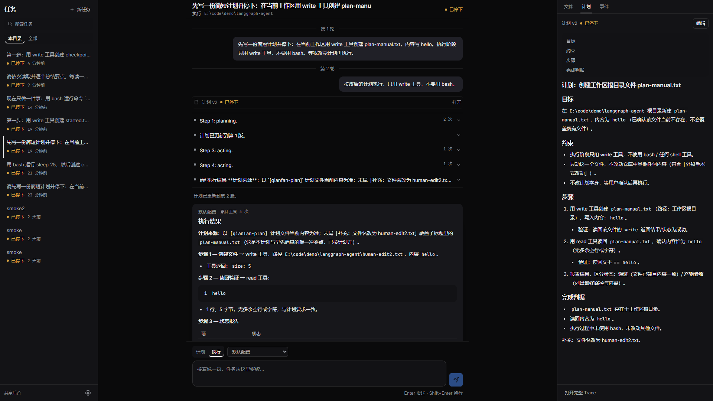

# LangGraph 自主任务 Agent

基于 **LangGraph 1.2.x（StateGraph）** 的自主任务 Agent 平台：自然语言任务 → **一条 loop、计划 / 执行两模式** → 工具调用 → 停下时人看工作区里的文件；FastAPI + React 前后端一体，SSE 实时可视化 + Trace 回放。

重点是运行时：多轮续说、checkpoint、模式切换、危险动作拦截、工具生态与可观测性，而不是一个 demo 界面。

**离线测试全绿**（零网络、零 Key、MockLLM）· CI 三个 job · 发布前按 [9 个真模型场景](docs/manual-verification.md) 在网页端跑一遍。



## 快速开始

日常使用（需要 [uv](https://docs.astral.sh/uv/) 与 Node 22；仓库外任意目录都能敲
`qianfan`，后端与网页同源起在 `127.0.0.1`）：

```bash
cp .env.example .env                             # LLM_API_KEY 走环境变量；或 use_mock_llm=true 离线
uv tool install -e . --overrides overrides.txt   # 每台机器一次
cd frontend && npm ci && npm test && npm run build && cd ..  # 前端产物；改前端后重跑
qianfan                                          # 自动开浏览器；--port / --no-browser 可选
```

`overrides.txt` 只做一件事：mcp 声明 `uvicorn>=0.31.1`，而本仓钉 `uvicorn<0.31`；
override 让干净环境装出与 `requirements.txt` 一致的版本。缺 `frontend/dist` 时
`qianfan` 会提示先打包；产物比 `frontend/src` 旧时会提示重跑 `npm run build`。

改前端时用开发启动（Vite 热重载，后端 `--reload`）：

```bash
python -m venv .venv311
.venv311\Scripts\activate                        # Git Bash: source .venv311/Scripts/activate
python start.py --install  # 后端依赖按 CI 同口径装（过滤 mcp 行 + mcp --no-deps）+ 前端 npm install
python start.py            # 虚拟环境请叫 .venv311；start.py 会拦住根目录的 .venv
```

`--install` 与 CI 的两步安装完全同构：`requirements.txt` 过滤掉 `mcp` 行后安装，再
`pip install --no-deps mcp>=1.2,<2.0`（mcp 元数据要求 uvicorn>=0.31.1，与本仓 uvicorn 钉版
冲突，直接 `pip install -r requirements.txt` 解不出来）。三个 requirements 文件注释保持
纯 ASCII：Windows 上 pip 按系统 locale（中文 = cp936）解码依赖文件，非 ASCII 会在解析前
直接 `UnicodeDecodeError`（#259）。`--port 9123` 时 Vite 代理跟随 `PORT`，且 `/health`
也在代理内（`frontend/vite.config.ts`）。

## 终端

不想开浏览器时，用同一个 `qianfan` 命令进终端会话：

```bash
qianfan repl
```

一条命令进入常驻多轮会话：首条输入创建任务，之后继续说话沿同一 `thread_id` 续跑；`/new`
新任务（仅当当前任务已停下；仍在跑时先 `/stop`）、`/stop` 停止当前任务、`exit` / `quit`
退出。**Ctrl-C 分两处**：提示符处直接退出；等待任务时先停当前任务、回提示符（不退出）。
只渲染任务 / 步骤 / 工具 / final answer 与「停下」「出错」两类终态，纯 `print`、不引
Rich/TUI；**思考块（reasoning）只在网页端显示，终端当前不显示**——不要预期终端出现模型思考过程。

- **与网页后台互斥**：终端会话写 `data/server.json`（`mode=repl`），`qianfan` / `python start.py`
  在它跑着时拒绝启动；反过来网页或开发后台在跑时 `qianfan repl` 也拒绝。锁由 REPL 退出路径的
  `finally` 释放；关闭终端时**正在跑的任务不是优雅 stop**——进程退出后它不会继续跑，下次启动
  按孤儿对账归为 INTERRUPTED（停下），可续说 / 续跑；`TaskManager.shutdown()` 只释放后台线程与
  进程内资源，不是任务停止语义。
- **启动守卫复用**：与网页入口同一套（`auth_enabled` 校验、回环 host 校验、单实例锁），
  `auth_enabled=true` 时 REPL 同样先过启动校验，不另开旁路。
- **编码**：入口把 stdout/stderr `reconfigure(encoding="utf-8", errors="replace")`（有
  `hasattr` 守卫），Windows GBK 控制台不会因 emoji / CJK 崩溃；重定向到文件同样是 UTF-8。
- **不重开交互确认闸门**：危险动作仍由设置里的 `policy_rules` 规则表在钩子处**当场拒绝**
  （ADR 0008 决策 6），终端也不弹 y/n。#20 票面的「y/n 交互确认」与「`--auto-approve` 旁路」
  二选一已按 spec 作废（2026-10-19 校准：确认闸门已随 ADR 0008 删除，交互式终端有人在场
  也不重开它）。

## 核心模型

一个任务 = 一段多轮对话：

```text
agent ──有 tool call──> tool ──> agent
  └── 本轮最后一次调用没有 tool call ──> finish（停下，INTERRUPTED）
```

- **一条 loop、一个 `agent` 节点**；模式只换 prompt 和工具面：`plan` = 只读 `explore` 档，`build` = 全部已挂载工具。默认 `build`，开关黏性。
- **停下 = 这一轮的最后一次 `agent` 调用没有工具调用**；状态只有 `RUNNING / INTERRUPTED / FAILED`，没有「完成」。
- **停下后可以继续说**：`POST /api/tasks/{id}/messages` 沿同一 `thread_id` / checkpoint 续跑；`POST /api/tasks/{id}/resume` 保留给停止 / 崩溃后的续跑。
- **计划是一个文件**：计划模式下模型把计划写成 Markdown，系统存到任务目录的 `.qianfan/plans/<task_id>.md`；计划区显示原文、可整份编辑（`PUT /api/tasks/{id}/plan` 写回文件），用外部编辑器改同样生效。执行时计划以一条消息进入对话，下一条消息按文件当前内容跑。
- **危险动作**由设置里的 `policy_rules` + 一个钩子当场拒：不弹框、不进图重入；空表 = 不拦（`.env.example` / 本地 `.env` 已带一组保守起步规则，理由见 `docs/security.md` §5；不是安全边界，见下）。
- **断点续跑**用 `SqliteSaver` + `durability="sync"`；checkpoint 格式 v2，v1 旧库按迁移文档 §2.4 拒绝挂载。

## 工作区

- 在哪个目录敲 `qianfan`，新任务就在哪个目录读写、跑 bash、加载那里的 `AGENTS.md` 与 `.agents/skills`；页面地址带 `?dir=` 时以它为准（ADR 0010）。
- 历史列表默认只显示当前目录，可切「全部」；任务头标出目录。续说回到任务自己的目录；目录被删后只剩记录，续说返回 409。
- 历史可逐条或按目录删除（#241）：只删 `tasks.json` 记录、checkpoint 与 trace，**不动工作区文件**；这些任务名下的后台进程会一并终止，运行中的任务会被拒绝（409）。
- 页面内可切换工作区（#242）：左栏底部显示当前目录，点开输入一个已存在的本地目录或选最近目录；只切换历史与新建任务的落点，不重启后台，`?dir=` 深链保持。
- 这就是在你的项目里直接干活：bash 与写工具会改真实文件，**撤销靠 git**；在主目录或盘根启动不拦（见「这不是安全边界」）。
- MCP 服务仍是整个后台共用一份，工作目录是后台的启动目录，不随任务切换。

**一台机器只共用一个后台**（ADR 0010）：第二次在别的目录敲 `qianfan`，它会把浏览器开到已在跑的后台、定位到当前目录，然后退出，不另起进程（`--port` 只对第一次生效）。关掉启动它的终端 = 所有项目的任务停下，之后可以续说 / 续跑。`start.py` 的开发后台与 `qianfan` 互斥，一个在跑时另一个会拒绝启动；`start.py` 现在**先抢 `data/server.json` 再起 uvicorn**，启动窗口内也不可能出现第二个写者；`--reload` 下锁保持 supervisor pid（reload worker 不接管，避免 reload 间隙锁被当 stale）。**手工 `uvicorn backend.main:app` 一律拒绝**：没有 `QIANFAN_INSTANCE` 实例标识会绕过单后台 / 回环 host / Key 三道守卫，请用 `qianfan`（日常）或 `python start.py`（开发）。`host` 只允许回环（`127.0.0.1` / `localhost` / `::1`），`0.0.0.0` 等非回环值在启动期直接拒绝（本章只支持本机访问）；健康探针跟随配置 host（IPv6 自动加方括号），开发态 Vite 代理固定 `127.0.0.1`（只用 IPv4 回环）。

## 能力

- **工具**：沙箱文件读写（`read` / `write` / `edit` / `ls` / `glob` / `grep`）、`bash`（工作区根、环境白名单、可配超时、停止收进程树含调用返回后的后台进程）、`web_search`（搜索源 `duckduckgo` / `serpapi` / `exa`；国内网络下 duckduckgo 可能不可达，设 `search_provider=exa` 并导出 `EXA_API_KEY`）、MCP（子进程只继承白名单环境变量：**环境变量里的** LLM / 云 Key 不会被继承；文件仍可读，见「这不是安全边界」；额外变量用 `mcp_servers[].env` 显式声明）。
- **子 agent**：`spawn_subagent` 单入口，`explore` / `execute` 两档，工具面只能收窄。
- **能力包与预设（#67 P4-1，ADR 0012）**：工具面与注入面按能力包声明（`files` / `bash` /
  `skills` / `web-search` / `subagent` / `mcp`），全局预设三档：`minimal`（files+bash）、
  `research`（files+bash+skills+web-search+subagent+mcp）、`full`（全部，**默认 = 现行为**）。
  关掉的包是**真关**：不实例化、不进 schema / dispatch、不加注入片段、不连 MCP（不承诺模块不被
  import）；子代理实际面 = 固定 tier ∩ 已启用包。本片只有 `plugins_preset`（环境变量
  `PLUGINS_PRESET`，重启生效）；`data/plugins.json`、设置页与 `qianfan --preset` 在 P4-2。
- **失败回传**：工具调用只执行一次（不自动重试、不熔断）；工具失败 / 被规则拒时，事件面与模型面各有一份可读原因。
- **上下文**：两层 AGENTS.md 注入、skills 清单、工具结果逐出、压缩。
- **工作区文件**：列出当前任务目录里按 `.gitignore` 可见的文件（bash 写的也在），文本预览、流式下载；**列表只是可见性过滤，preview / download 仍可点名被忽略的文件**；撤销靠 git。
- **观测**：SSE 事件流 + JSONL trace，前端可回放 / 导出。

## 模型

- 后端模型配置是 **v2：Provider（地址 / 协议 / Key）+ 模型目录**（一个 Provider 下挂多个模型条目）；设置页在 P2-3 前仍按扁平档案展示，旧 `/api/models` 接口保留为兼容投影，行为不变。预设只有 **DeepSeek**；协议支持 **OpenAI 兼容** 与 **Anthropic 原生**（非流式）；Anthropic 的「获取可用模型」暂不支持；`thinking` / `reasoning_effort` 可配置（OpenAI 兼容路径经 `extra_body` 透传），但 Anthropic 路径写入即被拒（可读 400，见 [ADR 0011](docs/adr/0011-model-config-two-protocols.md)）。
- 旧的 `data/models.json`（扁平 profile）首次启动自动迁移为 Provider + 模型目录，迁移前把原文件备份为 `models.json.bak-v1`（幂等，只备份一次）。
- Key 两种来源：界面粘贴（存 `~/.qianfan/credentials.json`，仓库外，按 Provider 记）优先；其次配置里写的环境变量名（如 `LLM_API_KEY` / `DASHSCOPE_API_KEY`）。接口只回「已设 / 未设」与来源（粘贴 / 环境变量 / 无），不回 Key 本身。
- 新建任务默认用全局默认，创建前也可先选一套；任务里可中途换模型，下一条消息生效；子代理与压缩摘要跟随父任务的模型。
- 采样参数挂在模型条目上、Provider 可给默认值：`temperature`（缺省 0.2）、`max_tokens`、`thinking` / `reasoning_effort`（`reasoning_effort` 限 low / medium / high；OpenAI 兼容路径经 `extra_body` 透传；Anthropic 路径不支持、写入即拒）；参数可显式清空回落到 Provider / 缺省。
- 粘贴的 Key 是明文落盘，同账号的 bash 读得到；Coding Plan 条款通常不允许自建客户端调用，用「自定义」后果自担。
- **保存 Key 失败**：Key 文件在仓库外的 `~/.qianfan/`；进程被沙箱/权限边界挡住写该目录时，界面会显示后端返回的原因与下一步（#244）——用普通终端启动 qianfan，或改用该配置的环境变量。

## 这不是安全边界

`qianfan` 只监听 `127.0.0.1`，Host 检查只认 `127.0.0.1` / `localhost`（挡 DNS 重绑定），
但这些都是**减少暴露面**，不是沙箱：

- **默认没有登录**：同一台机器上的其他进程 / 用户可以直接驱动 API；`auth_enabled` 只挡无凭据的访问，不是权限边界。远程访问不在本章范围。`auth_enabled=true` 时 token 为空 / 占位会拒绝启动（issuer 本身也 fail-closed），启动日志会明示认证状态；开启后 REST 只认 `Authorization: Bearer`，`?token=` 只给 SSE 与文件下载两个浏览器原生入口，access log 里的 query token 已打码（#271）。
- `bash` 拿到的是**运行账号的权限**：工作目录只是起点，`data/`（含 trace / checkpoint）、`.git`、`.env`、家目录与网络都可读写；trace 不是防篡改审计日志。撤销靠 git。
- 子进程只继承白名单环境变量；这挡的是「继承」，不是读文件（Linux 下 `/proc/$PPID/environ` 不在本章形态内）。
- **停止 / 超时**回收本次调用建立的进程组（POSIX）或 Job Object（Windows），包括调用已返回、任务随后被停止时的后台进程；用 `setsid` 等自行脱离的进程不受管。
- **只限时**（默认 30s，1–600s）并截断输出尾部（每流 30KB）；没有 CPU / 内存 / 磁盘 / 进程数上限。
- 需要真隔离就放进容器或虚拟机（本章不提供 Docker 启动方式）。
- 密钥明文决策 / 轮换处置、公开仓库的路径与用户名暴露面、危险动作起步集、已知 CVE 的当前缓解，统一见 [`docs/security.md`](docs/security.md)。

## 质量门禁

```bash
.\.venv311\Scripts\python.exe -m pip install -r requirements-dev.txt   # ruff / mypy / pre-commit
.\.venv311\Scripts\python.exe -m pytest backend/tests/ -q
.\.venv311\Scripts\python.exe -m ruff check backend scripts start.py
.\.venv311\Scripts\python.exe -m mypy
.\.venv311\Scripts\python.exe scripts\check_design_tokens.py
cd frontend; npm run typecheck; npm test; npm run check:sse; npm run build
```

提交前钩子每台机器装一次：`.\.venv311\Scripts\python.exe -m pre_commit install`。
CI 跑后端 lint / 类型 / 测试、前端类型 / 单元测试 / 构建。发布前 / 换供应商：启服务在网页端手动跑一遍（不记模型与时间）。

## 文档

- 决策：[ADR 0008](docs/adr/0008-single-loop-plan-build-modes.md)（一条 loop + 计划 / 执行两模式）；[ADR 0009](docs/adr/0009-minimal-agent-chapter.md)（当前一章：最简 agent）；[ADR 0010](docs/adr/0010-launch-dir-workspace-and-model-profiles.md)（工作区 / 单后台 / 模型配置）
- 架构：[docs/architecture.md](docs/architecture.md)（现役；§3.3 REST / §3.4 SSE / §5 共享约定是契约面）；拓扑以 [graph.py](backend/core/agent/graph.py) 为准
- 切片历史：[docs/archive/pivot-plan-build.md](docs/archive/pivot-plan-build.md)
- 迁移：[docs/migration-langgraph-1x.md](docs/migration-langgraph-1x.md)
- 配置：[.env.example](.env.example)；工程约定：[AGENTS.md](AGENTS.md)；术语：[GLOSSARY.md](GLOSSARY.md)
- 历史：[docs/archive/OVERVIEW.md](docs/archive/OVERVIEW.md)（交付日志）

## License

MIT
