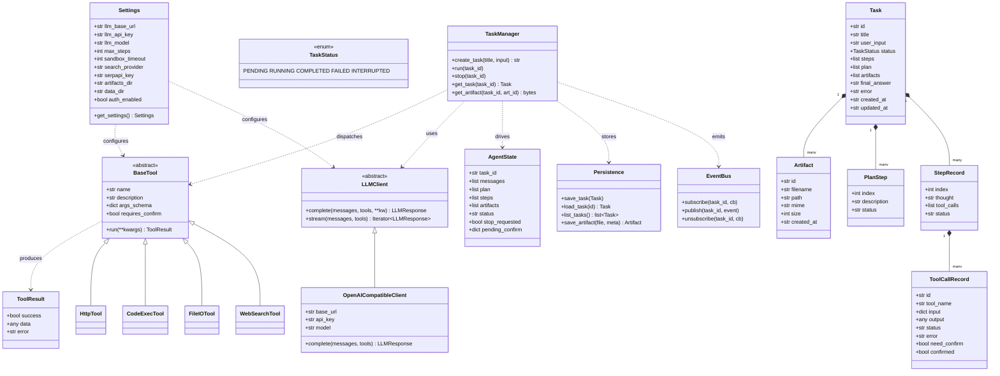
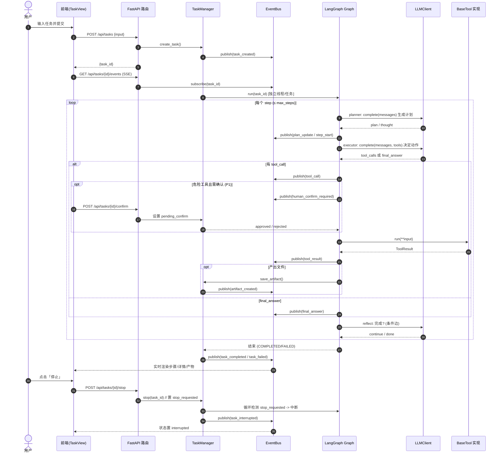
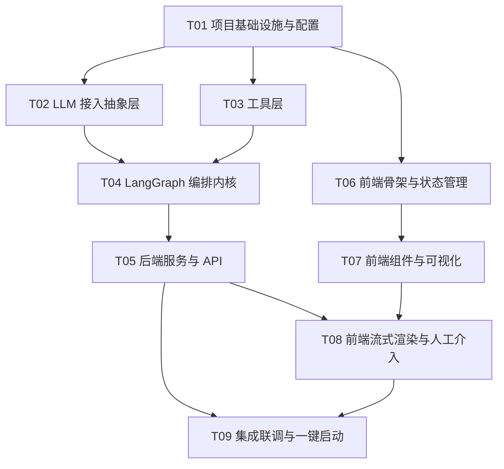

# 系统架构设计文档：基于 LangGraph 的自主任务 Agent 平台

> 架构师：高见远（Gao）　|　版本：v0.1　|　日期：2025-08-24
> 关联文档：PRD（`E:\code\demo\docs\prd.md`）
> 项目根目录：`E:\code\demo\langgraph-agent\`

---

## 1. 实现方案 + 框架选型

### 1.1 技术难点分析

| 难点 | 说明 | 解决思路 |
|------|------|----------|
| 自主规划/反思循环 | 需 LLM 驱动多轮"规划→执行→工具→反思"状态机，且可中断 | 用 **LangGraph `StateGraph`** 显式编排节点与条件边，天然支持循环与 human-in-the-loop 中断 |
| 流式可观测 | 后端每一步需实时推给前端，延迟 < 1s | 进程内 **EventBus（pub/sub）** + **SSE** 长连接推送结构化事件 |
| 可控中断 | 用户点"停止"要 2s 内生效 | 任务执行在独立线程/任务中运行，通过 `threading.Event` 信号量中断循环 |
| 多供应商 LLM | 用户可能用 OpenAI / DeepSeek / Ollama | 抽象 **`LLMClient`** 统一接口，底层走 OpenAI 兼容 HTTP |
| 工具安全与可扩展 | 代码执行需隔离；新增工具要低成本 | `BaseTool` 统一契约 + 注册表自动发现；代码执行用受限 subprocess 沙箱 |
| 持久化（P1） | 重启后历史可见 | v1 用 **内存 + JSON 文件落盘**，预留 SQLite 仓储接口 |

### 1.2 框架与库选型

| 层 | 选型 | 版本区间 | 理由 |
|----|------|----------|------|
| 后端语言 | Python | ≥3.10 | LangGraph 生态要求 |
| 编排内核 | `langgraph` + `langchain` + `langchain-openai` | langgraph ^0.2、langchain ^0.2 | 状态图、节点、中断、流式回调 |
| Web 框架 | `fastapi` + `uvicorn` | fastapi ^0..111、uvicorn ^0.30 | 异步、原生 SSE、自动 OpenAPI |
| 配置 | `pydantic-settings` | ^2.3 | `.env` → 强类型配置 |
| LLM 调用 | `openai` SDK（兼容模式） | ^1.30 | 通过 `base_url` 适配 DeepSeek/Ollama |
| Web 检索 | `duckduckgo-search`（默认免费）/ 预留 SerpAPI | ddgs ^4.0 | 不强制付费 Key |
| 数据校验 | `pydantic` | ^2.7 | 模型与 API schema |
| 前端框架 | React + Vite + TypeScript | react ^18.3、vite ^5.3 | 快速、类型安全 |
| 前端样式 | Tailwind CSS | ^3.4 | 三栏布局、响应式 |
| 状态管理 | Zustand | ^4.5 | 轻量、适合 SSE 事件累积 |
| 图表/时间线 | 原生 DOM + Tailwind（不引入重型库） | — | 步骤时间线用列表即可 |

### 1.3 架构模式

- 后端：**分层 + 事件驱动**。API 层（FastAPI）→ 服务层（TaskManager）→ 编排层（LangGraph graph）→ 能力层（LLM / Tools）。执行过程通过 EventBus 解耦并以 SSE 流出。
- 前端：**组件化 + 状态机 UI**。三栏布局，SSE 事件驱动右侧 Step 详情与中部时间线刷新。
- 部署：**单体仓库（monorepo）**，后端独立进程、前端 Vite 开发/构建，由 `start.py` 或 `docker-compose` 统一拉起。

---

## 2. 文件列表及相对路径

项目根：`E:\code\demo\langgraph-agent\`

```
langgraph-agent/
├── README.md                         # 启动/部署说明
├── .env.example                      # 配置模板（复制为 .env）
├── requirements.txt                  # Python 依赖
├── pyproject.toml                    # 可选，项目元数据
├── start.py                          # 一键启动（先后端，再前端 dev）
├── docker-compose.yml                # 可选容器化
│
├── backend/                          # ── 后端 ──
│   ├── __init__.py
│   ├── main.py                       # FastAPI app 入口、CORS、挂载路由
│   ├── config.py                     # pydantic-settings：Settings 单例
│   ├── api/
│   │   ├── routes.py                 # REST + SSE 端点
│   │   ├── schemas.py                # 请求/响应 Pydantic 模型
│   │   └── sse.py                    # SSE 响应构造 + 断线清理
│   ├── core/
│   │   ├── agent/
│   │   │   ├── state.py              # AgentState（TypedDict）
│   │   │   ├── graph.py              # 构建 StateGraph（节点+边）
│   │   │   ├── nodes.py              # planner/executor/reflect/human_confirm 节点
│   │   │   └── prompts.py           # 系统提示词/工具调用约束
│   │   ├── llm/
│   │   │   ├── client.py            # LLMClient 抽象基类 + LLMResponse
│   │   │   └── openai_compat.py     # OpenAI 兼容实现（OpenAI/DeepSeek/Ollama）
│   │   └── tools/
│   │       ├── base.py              # BaseTool 抽象类 + ToolResult
│   │       ├── registry.py          # 工具注册表/自动发现
│   │       ├── web_search.py        # 联网检索（DuckDuckGo 默认，可插 SerpAPI）
│   │       ├── file_io.py           # 文件读/写/列目录（沙箱白名单）
│   │       ├── code_exec.py         # 受限 subprocess 代码执行
│   │       └── http_api.py          # P1：通用 HTTP 请求
│   ├── services/
│   │   ├── event_bus.py             # 进程内 pub/sub（步骤事件）
│   │   ├── persistence.py           # 内存 + JSON 落盘（预留 SQLite 仓储）
│   │   └── task_manager.py          # 任务生命周期：run/stop/查询
│   └── utils/
│       ├── sandbox.py               # subprocess 超时/资源/临时目录封装
│       └── logging.py               # 统一日志
│
└── frontend/                         # ── 前端 ──
    ├── package.json
    ├── vite.config.ts
    ├── tsconfig.json
    ├── tsconfig.node.json
    ├── tailwind.config.js
    ├── postcss.config.js
    ├── index.html
    └── src/
        ├── main.tsx                 # React 入口
        ├── App.tsx                  # 根组件 + 三栏布局
        ├── index.css                # Tailwind 指令 + 全局样式
        ├── api/
        │   └── client.ts            # REST 封装 + SSE 订阅
        ├── types/
        │   └── index.ts             # 与后端 schema 对齐的 TS 类型
        ├── store/
        │   └── taskStore.ts         # Zustand：任务/事件/UI 状态
        ├── hooks/
        │   └── useSSE.ts            # EventSource/流式订阅 hook
        ├── components/
        │   ├── HistoryPanel.tsx     # 左：历史任务列表
        │   ├── TaskPanel.tsx        # 中：任务主区容器
        │   ├── TaskHeader.tsx       # 顶部：标题+状态徽章+停止
        │   ├── MessageStream.tsx    # 对话/任务流（消息）
        │   ├── StepTimeline.tsx     # 步骤时间线（规划+工具）
        │   ├── StepDetail.tsx       # 右：当前 step 入参/出参/日志
        │   ├── InputBar.tsx         # 输入框+发送+停止
        │   ├── ArtifactList.tsx     # 产物列表+下载/预览
        │   └── ConfirmDialog.tsx    # P1：人工确认弹窗
        └── pages/
            └── TaskView.tsx         # 单个任务页（组合上述组件）
```

---

## 3. 数据结构和接口

### 3.1 类图 / 数据模型（mermaid `classDiagram`）

> 详见 `docs/class-diagram.mermaid`。



### 3.2 关键数据模型（Pydantic 字段摘要）

| 模型 | 关键字段 |
|------|----------|
| `TaskStatus` | `PENDING / RUNNING / COMPLETED / FAILED / INTERRUPTED` |
| `Task` | `id, title, user_input, status, steps[], plan[], artifacts[], final_answer, error, created_at, updated_at` |
| `StepRecord` | `index, thought, tool_calls[]:ToolCallRecord, status` |
| `ToolCallRecord` | `id, tool_name, input, output, status(success/failed), error, need_confirm, confirmed` |
| `PlanStep` | `index, description, status(pending/active/done)` |
| `Artifact` | `id, filename, path, mime, size, created_at` |
| `ToolResult` | `success:bool, data:Any, error:str` |
| `LLMResponse` | `content:str, tool_calls:list, raw:dict` |

### 3.3 REST + SSE 接口定义

**基础路径**：`/api`　**内容类型**：`application/json`

| 方法 | 路径 | 说明 | 请求体 / 参数 | 响应 |
|------|------|------|---------------|------|
| POST | `/api/tasks` | 下发新任务 | `{title?:str, input:str}` | `{task_id:str}` |
| GET | `/api/tasks` | 历史任务列表 | query: `?limit=50` | `{tasks: Task[]}` |
| GET | `/api/tasks/{id}` | 任务完整状态 | path `id` | `Task` |
| POST | `/api/tasks/{id}/stop` | 停止任务 | path `id` | `{ok:bool, status:str}` |
| GET | `/api/tasks/{id}/events` | **SSE 流式事件**（见 3.4） | path `id` | `text/event-stream` |
| GET | `/api/tasks/{id}/artifacts/{aid}` | 下载产物 | path `id,aid` | `application/octet-stream` |
| GET | `/api/tasks/{id}/artifacts/{aid}/preview` | 预览产物（文本/图片） | path `id,aid` | 按 mime 返回 |
| POST | `/api/tasks/{id}/confirm` | P1 人工确认 | `{tool_call_id:str, approved:bool}` | `{ok:bool}` |
| POST | `/api/auth/token` | P1 鉴权（auth_enabled 时） | `{token:str}` | `{ok:bool}` |

**统一响应信封**：`{code:int, data:any, message:str}`（错误时 `code≠0`）。

### 3.4 SSE 事件协议（步骤事件 schema）

`GET /api/tasks/{id}/events` 推送 `event: <type>\ndata: <json>\n\n`：

| event 类型 | data 字段 | 含义 |
|------------|-----------|------|
| `task_created` | `{task_id, title, status}` | 任务已创建 |
| `plan_update` | `{plan: PlanStep[]}` | 规划步骤更新 |
| `step_start` | `{index, thought}` | 某 step 开始（LLM 思考文本） |
| `tool_call` | `ToolCallRecord`（含 `need_confirm`） | 即将/正在调用工具 |
| `tool_result` | `ToolCallRecord`（含 `output/status`） | 工具返回 |
| `human_confirm_required` | `{tool_call_id, tool_name, input}` | 需用户确认（P1） |
| `artifact_created` | `Artifact` | 产出文件 |
| `final_answer` | `{answer:str}` | 最终答案 |
| `task_completed` | `{task_id, status}` | 完成 |
| `task_failed` | `{task_id, error}` | 失败 |
| `task_interrupted` | `{task_id, status}` | 被停止 |
| `heartbeat` | `{}` | 保活（每 15s） |

---

## 4. 程序调用流程（mermaid `sequenceDiagram`）

> 详见 `docs/sequence-diagram.mermaid`。



---

## 5. 共享知识（跨文件约定）

> 工程师编码前务必遵循以下全局约定。

1. **配置管理**：所有配置经 `backend/config.py` 的 `Settings`（`pydantic-settings`），从 `.env` 读取。**禁止**在业务代码中硬编码 Key/路径；通过 `get_settings()` 获取单例。
2. **LLM 接入抽象层**：业务只依赖 `LLMClient` 抽象。调用统一返回 `LLMResponse{content, tool_calls, raw}`。新增供应商只需新增 `LLMClient` 子类并据 `Settings` 选择；支持 OpenAI / DeepSeek / 本地 Ollama（仅改 `base_url`）。
3. **工具接口规范 `BaseTool`**：
   - 每个工具实现 `name / description / args_schema(dict) / requires_confirm / run(**kwargs)->ToolResult`；
   - `args_schema` 必须是 JSON Schema（供 LLM function calling 使用）；
   - 工具务必返回 `ToolResult`，**禁止**抛未捕获异常导致进程崩溃（外层统一 try/except 兜底）；
   - 新工具在 `registry.py` 中 `@register` 即被 Agent 自动发现（满足 SC4 上手 <30min）。
4. **事件/消息协议**：后端 → 前端仅通过 SSE 事件（见 3.4）通信；事件 `data` 为 JSON，字段名与后端模型一致；前端 `types/index.ts` 必须与后端 schema 保持字段对齐（单一事实来源：后端 `schemas.py`）。
5. **错误与重试约定**：工具失败返回 `ToolResult(success=False, error=...)`；`code_exec`/`http_api` 支持按 `Settings` 重试（P1-4，默认退避 2s×2）。LangGraph 节点级异常被 `TaskManager` 捕获并 `publish(task_failed)`。
6. **停止信号**：`AgentState.stop_requested` 由 `TaskManager.stop()` 置位；图节点在每轮开头检测，为真则提前 `END` 并发布 `task_interrupted`（P0-9：2s 内生效）。
7. **人工介入**：`requires_confirm=True` 的工具（代码执行、HTTP 写操作）在 `executor` 后插入 `human_confirm` 中断（P1-2）；前端 `ConfirmDialog` 提交 `POST /confirm`。
8. **产物与路径安全**：所有文件读写限定在 `Settings.artifacts_dir` / 沙箱白名单目录；越界路径一律拒绝（P0-4）。
9. **成功判定（Q8）**：任务进入最终反思并产出 `final_answer`、期间无未捕获致命异常 → 记 `COMPLETED`（成功）；达到 `max_steps` 未产出或抛出异常 → `FAILED`。
10. **日志**：统一经 `utils/logging.py`，结构化输出到控制台 + `data_dir/logs/`；不打印明文 API Key。

---

## 6. 依赖包列表

### 6.1 Python（`requirements.txt`）

```
langgraph>=0.2.0,<0.3.0
langchain>=0.2.0,<0.3.0
langchain-openai>=0.1.0,<0.2.0
langchain-core>=0.2.0,<0.3.0
fastapi>=0.111.0,<0.113.0
uvicorn[standard]>=0.30.0,<0.31.0
pydantic>=2.7.0,<3.0.0
pydantic-settings>=2.3.0,<3.0.0
openai>=1.30.0,<2.0.0
duckduckgo-search>=4.0.0,<5.0.0
python-dotenv>=1.0.0
httpx>=0.27.0          # 供 http_api 工具使用
```

### 6.2 前端（`frontend/package.json`）

```
{
  "dependencies": {
    "react": "^18.3.1",
    "react-dom": "^18.3.1",
    "zustand": "^4.5.0"
  },
  "devDependencies": {
    "@types/react": "^18.3.0",
    "@types/react-dom": "^18.3.0",
    "@vitejs/plugin-react": "^4.3.0",
    "typescript": "^5.5.0",
    "vite": "^5.3.0",
    "tailwindcss": "^3.4.0",
    "postcss": "^8.4.0",
    "autoprefixer": "^10.4.0"
  }
}
```

---

## 7. 有序任务列表（工程师编码依据）

> 说明：任务按**实现依赖顺序**排列，每个任务含 ≥3 个文件。`T01` 为项目基础设施（必为首个任务）。优先级：`P0`=MVP，`P1`=重要。任务粒度到"可独立编码"。

| ID | 任务名 | 源文件（核心） | 依赖 | 优先级 |
|----|--------|----------------|------|--------|
| T01 | 项目基础设施与配置 | `backend/config.py`、`backend/__init__.py`、`requirements.txt`、`frontend/package.json`、`frontend/vite.config.ts`、`frontend/tsconfig.json`、`frontend/tailwind.config.js`、`frontend/index.html`、`start.py`、`.env.example`、`README.md` | — | P0 |
| T02 | LLM 接入抽象层 | `backend/core/llm/client.py`、`backend/core/llm/openai_compat.py`、`backend/utils/logging.py` | T01 | P0 |
| T03 | 工具层（BaseTool + 四件套） | `backend/core/tools/base.py`、`backend/core/tools/registry.py`、`backend/core/tools/web_search.py`、`backend/core/tools/file_io.py`、`backend/core/tools/code_exec.py`、`backend/utils/sandbox.py`、`backend/core/tools/http_api.py` | T01 | P0/P1 |
| T04 | LangGraph 编排内核 | `backend/core/agent/state.py`、`backend/core/agent/graph.py`、`backend/core/agent/nodes.py`、`backend/core/agent/prompts.py` | T02, T03 | P0 |
| T05 | 后端服务与 API | `backend/services/event_bus.py`、`backend/services/persistence.py`、`backend/services/task_manager.py`、`backend/api/schemas.py`、`backend/api/routes.py`、`backend/api/sse.py`、`backend/main.py` | T04 | P0 |
| T06 | 前端骨架与状态管理 | `frontend/src/main.tsx`、`frontend/src/App.tsx`、`frontend/src/index.css`、`frontend/src/types/index.ts`、`frontend/src/store/taskStore.ts`、`frontend/src/api/client.ts` | T01 | P0 |
| T07 | 前端组件与三栏可视化 | `frontend/src/components/HistoryPanel.tsx`、`TaskPanel.tsx`、`TaskHeader.tsx`、`MessageStream.tsx`、`StepTimeline.tsx`、`StepDetail.tsx`、`InputBar.tsx`、`ArtifactList.tsx`、`pages/TaskView.tsx` | T06 | P0 |
| T08 | 前端流式渲染与人工介入 | `frontend/src/hooks/useSSE.ts`、`frontend/src/components/ConfirmDialog.tsx`（增强 `StepDetail`/`ArtifactList` 下载预览） | T05, T07 | P0/P1 |
| T09 | 集成联调与一键启动 | `start.py`（联调）、`docker-compose.yml`、`README.md`（补充）、端到端 demo 验证脚本 | T05, T08 | P0 |

### 7.1 实现顺序建议

```
T01(基建) → T02(LLM) ┐
                     ├→ T04(编排) → T05(服务/API) ┐
        T01 → T03(工具) ┘                          ├→ T09(联调)
        T01 → T06(前端骨架) → T07(组件) ───────────┘
                                            T08(流式/介入) ↑依赖 T05,T07
```

---

## 8. 待明确事项与已确认技术决策

### 8.1 已确认技术决策（面向本地 demo，可后续调整）

| 问题 | 决策 | 说明 |
|------|------|------|
| **Q1 前端栈** | **React + Vite + TypeScript + Tailwind** | 见 T01/T06/T07 |
| **Q2 LLM** | **OpenAI 兼容接口**，抽象 `LLMClient`；`base_url`+`api_key`+`model` 经 `.env`；支持 OpenAI / DeepSeek / 本地 Ollama | 见 T02 |
| **Q3 持久化** | v1 **内存 + JSON 文件落盘**（任务记录 + 产物），**预留 SQLite 仓储**（`Persistence` 抽象隔离） | 见 `persistence.py` |
| **Q4 鉴权** | v1 **本地 demo 不做登录鉴权**；`Settings.auth_enabled=False`；接口预留 `POST /api/auth/token`（P1-6 仅在公网时开启） | 文档注明 |
| **Q5 沙箱** | **受限 subprocess**（独立临时目录 + 超时 + 基础资源限制）；Docker 作为可选增强，**首版不强制** | 见 `sandbox.py`/`code_exec.py` |
| **Q6 web search** | **内置可插拔搜索工具**，默认轻量免费方案 **DuckDuckGo**（`ddgs`），预留 SerpAPI 接口（需 Key 时配置） | 见 `web_search.py` |
| **Q7 人工介入** | **P1 实现**：对危险工具（`requires_confirm=True`，即代码执行 / HTTP 写操作）执行前确认，`human_confirm` 节点中断 | 见 T04/T08 |
| **Q8 成功率度量** | 任务进入最终反思并产出 `final_answer`、期间无未捕获致命异常 → 记 **成功（COMPLETED）**；否则 `FAILED` | 见 §5.9 |

### 8.2 仍需用户/产品最终确认的极少数项（非阻塞，已给默认值）

1. **默认 LLM 供应商**：当前默认占位为 OpenAI 兼容，需用户填入实际 `base_url/api_key`（或确认用 DeepSeek/Ollama）。→ 已默认提供 `.env.example`，用户启动时填即可。
2. **`max_steps` 默认值**：当前默认 `15`（PRD P0-1），如需调整请在 `.env` 覆盖。
3. **Web 检索默认供应商**：默认 DuckDuckGo（免费）；若需更高召回率是否启用 SerpAPI（付费）？→ 已预留接口，按需开启。
4. **鉴权范围**：确认 v1 仅本地 demo（无鉴权）是否被接受；若需公网演示则开启 `auth_enabled` 与 `P1-6`。

> 以上 4 项均不阻塞开发，架构已按"可配置、可插拔"设计，后续调整无需改核心代码。

---

## 9. 任务依赖图（mermaid `graph`）


