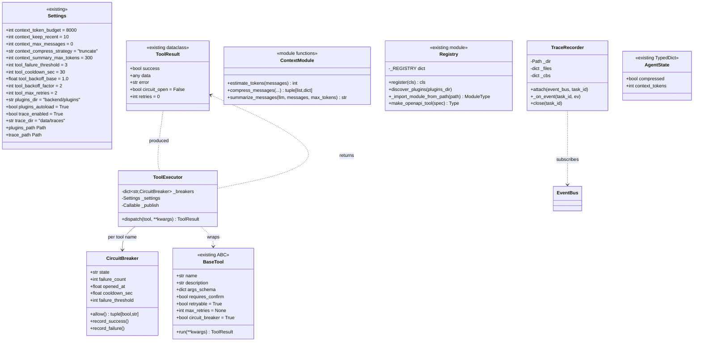
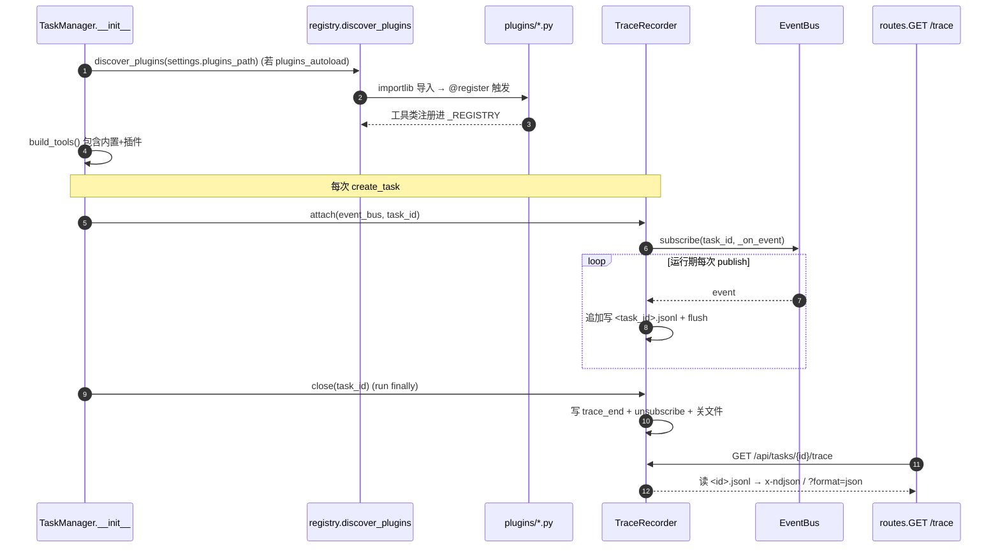
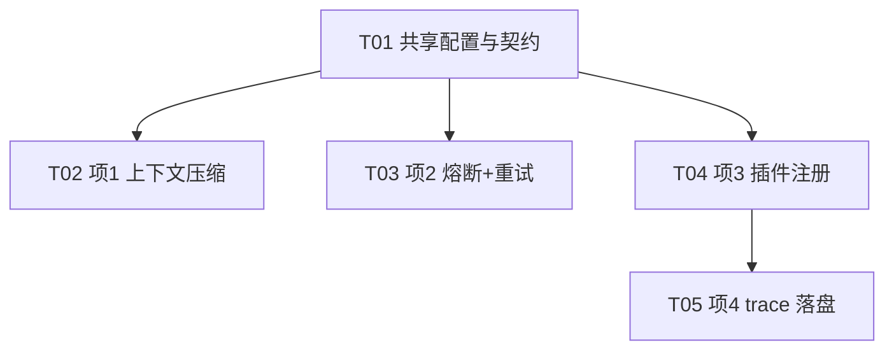

# 增量架构设计（P0 四件套）— 基于 LangGraph 的自主任务 Agent

> 文档性质：**增量架构设计（仅描述 P0 四件套变更，不重写整份架构）**
> 架构师：高见远（Gao）　|　版本：v0.1　|　日期：2025-08-24
> 关联文档：`docs/architecture.md`（整体架构）、`docs/incremental-prd-p0.md`（增量 PRD）
> 项目根目录：`E:\code\demo\langgraph-agent\`

---

## 0. 范围与对齐说明

本次增量**只补齐 P0 四件套**，在不破坏现有编排内核（`StateGraph` + `AgentRuntime`）、SSE 推送（`event_bus.py` 逻辑零改动）、人工确认（`human_confirm_node`）与鉴权（现状）的前提下落地：

1. **上下文压缩/管理**（项1）—— 新增 `backend/core/agent/context.py` + 改 `nodes.py`/`state.py`。
2. **工具熔断 + 重试退避**（项2）—— 新增 `backend/core/tools/resilience.py` + 改 `nodes.py`/`base.py`/4 个内置工具。
3. **插件式工具注册**（项3）—— 改 `backend/core/tools/registry.py` + 新增 `backend/plugins/` + 改 `task_manager.py`。
4. **持久化可观测 trace 落盘**（项4）—— 新增 `backend/services/trace.py` + 改 `task_manager.py`/`routes.py`/`config.py`。

**设计原则**：新增能力用"包装层/订阅者"接入，不修改 `BaseTool.run` 签名、不修改 `event_bus` 推送逻辑、不改动 `graph.py` 的条件边。所有 P0 开关统一收敛到 `Settings`，默认零回归。

---

## 1. 模块落点（每项能力的文件改动）

### 项1：上下文压缩/管理

| 变更类型 | 相对路径 | 职责 |
|----------|----------|------|
| 新增 | `backend/core/agent/context.py` | `estimate_tokens(messages)` 估算 token（≈`chars/4`，中文保守）；`compress_messages(...)` 执行截断/LLM 摘要；`summarize_messages(llm, messages, max_tokens)` 生成摘要块 |
| 改 | `backend/core/agent/nodes.py` | `AgentRuntime._build_messages` 在拼装 system 前对 `state["messages"]` 统一压缩；写回 `state["messages"]` / `compressed` / `context_tokens`；可选发 `context_compressed` 事件 |
| 改 | `backend/core/agent/state.py` | `AgentState` 增加 `compressed: bool`、`context_tokens: int`（`total=False`，向后兼容） |

### 项2：工具熔断 + 重试退避

| 变更类型 | 相对路径 | 职责 |
|----------|----------|------|
| 新增 | `backend/core/tools/resilience.py` | `CircuitBreaker`（状态机：closed/open/half_open）；`with_retry(callable, ...)`（通用指数退避）；`ToolExecutor`（整合熔断+重试+`tool_circuit_open` 事件发布），**不改 `BaseTool.run` 契约** |
| 改 | `backend/core/agent/nodes.py` | `tool_node` 将原 `tool.run(**input)` 替换为 `self.tool_executor.dispatch(tool, **input)`；把 `circuit_open`/`retries` 透传到 `rec` 与 `tool_result` 事件 |
| 改 | `backend/core/tools/base.py` | `ToolResult` 增加 `circuit_open: bool`、`retries: int`；`BaseTool` 增加类属性 `retryable`/`max_retries`/`circuit_breaker`（均带默认值，内置工具零强制改动） |
| 改 | `backend/core/tools/{web_search,http_api,code_exec,file_io}.py` | 按 PRD 2.5 设类属性覆盖：`web_search`/`http_request` → 熔断+重试；`code_exec`/`file_io` → 无重试、无熔断（零额外延迟） |

### 项3：插件式工具注册

| 变更类型 | 相对路径 | 职责 |
|----------|----------|------|
| 改 | `backend/core/tools/registry.py` | 新增 `discover_plugins(plugins_dir)`（importlib 递归扫描 `*.py` 并导入，触发 `@register`）、`_import_module_from_path(path)`、`make_openapi_tool(spec)`（占位骨架）；`register`/发现增加**同名冲突保留先注册者 + warning** |
| 新增 | `backend/plugins/__init__.py` | 插件包标记（空 `__init__`，允许无包目录也能被 importlib 单文件加载） |
| 新增 | `backend/plugins/example_tool.py` | 最小 `BaseTool` + `@register` 模板（冒烟验证用） |
| 改 | `backend/services/task_manager.py` | `__init__` 在 `build_tools()` 之前调用 `discover_plugins(settings.plugins_path)`；受 `plugins_autoload` 开关控制；目录缺失则跳过、不报错 |

### 项4：持久化可观测 trace 落盘

| 变更类型 | 相对路径 | 职责 |
|----------|----------|------|
| 新增 | `backend/services/trace.py` | `TraceRecorder`：`EventBus` **常驻订阅者**，每次 `publish` 追加写 `<trace_dir>/<task_id>.jsonl`（每行 `{"type","data","ts"}`）；`attach(bus, task_id)` / `close(task_id)` 生命周期 |
| 改 | `backend/services/task_manager.py` | `create_task` 内 `trace.attach(event_bus, task_id)`；`run()` 的 `finally` 调 `trace.close(task_id)`（写 `trace_end` 并 unsubscribe） |
| 改 | `backend/api/routes.py` | 新增 `GET /api/tasks/{id}/trace` |
| 改 | `backend/config.py` | 新增 `trace_enabled`、`trace_dir` + `trace_path` 绝对路径属性 |
| **不改** | `backend/services/event_bus.py` | 仅作为 subscriber 接入；推送逻辑零改动 |

---

## 2. 接口 / 数据结构变更

### 2.1 新增配置项（`backend/config.py` 的 `Settings`）

| 配置项 | 类型 | 默认值 | 说明 |
|--------|------|--------|------|
| `context_token_budget` | int | `8000` | 估算 token 超此值触发压缩（主触发） |
| `context_keep_recent` | int | `10` | 压缩时保留最近 N 条原始消息 |
| `context_max_messages` | int | `0` | 消息条数兜底（`0`=仅 token 触发；>0 则 `len>max` 也触发） |
| `context_compress_strategy` | str | `"truncate"` | `truncate` \| `summarize`（默认零额外 LLM 调用） |
| `context_summary_max_tokens` | int | `300` | 仅 `summarize` 策略使用 |
| `tool_failure_threshold` | int | `3` | 连续失败达此值 → 熔断 open |
| `tool_cooldown_sec` | int | `30` | open 状态冷却秒数 |
| `tool_backoff_base` | float | `1.0` | 退避基数（秒） |
| `tool_backoff_factor` | int | `2` | 退避因子 |
| `tool_max_retries` | int | `2` | 全局默认最大重试次数（工具可 override） |
| `plugins_dir` | str | `"backend/plugins"` | 插件目录（相对 PROJECT_ROOT） |
| `plugins_autoload` | bool | `True` | 启动自动发现开关 |
| `trace_enabled` | bool | `True` | trace 落盘开关 |
| `trace_dir` | str | `"data/traces"` | trace 落盘目录（相对 PROJECT_ROOT） |

新增绝对路径属性（沿用 `data_path`/`artifacts_path` 写法）：
```python
@property
def plugins_path(self) -> Path:
    p = Path(self.plugins_dir)
    return p if p.is_absolute() else PROJECT_ROOT / p

@property
def trace_path(self) -> Path:
    p = Path(self.trace_dir)
    return p if p.is_absolute() else PROJECT_ROOT / p
```

### 2.2 新增 SSE 事件类型（`nodes.py` / `trace.py` 发布，前端 `types/index.ts` 需对齐）

| event 类型 | data 字段 | 含义 | 是否必做 |
|------------|-----------|------|----------|
| `tool_circuit_open` | `{tool_name: str, cooldown_sec: int}` | 工具熔断短路，前端展示"⚡熔断"徽章 | **必做** |
| `context_compressed` | `{step_index: int, dropped: int, context_tokens: int, strategy: str}` | 上下文压缩指示（前端小标记） | 可选（PRD 标定） |

> 现有 `tool_result` 事件的 `ToolCallRecord` 额外携带 `circuit_open` / `retries` 字段（见 2.4），前端据此显示"↻重试×N"。

### 2.3 新增 REST 接口

`GET /api/tasks/{id}/trace`

- 默认：`Content-Type: application/x-ndjson`，返回原始 `<trace_dir>/<id>.jsonl` 文本（逐行 `{"type","data","ts"}`），供前端逐行回放。
- `?format=json`：返回统一信封 `{code:0, data:[Event,...], message:"ok"}`（解析后的事件数组）。
- 文件不存在 → `404 task trace not found`。
- 受 `trace_enabled` 控制；关闭时返回 `404`（或信封 `code=1`，说明未启用）。

### 2.4 压缩后消息结构

```
[ {role:"system", content: <原始 system 提示（全部保留）>},
  {role:"system", content:"[上下文已截断：前 N 步历史已省略]"},   # 截断占位；或单条 LLM 摘要块
  ... 最近 context_keep_recent 条原始消息 ]                        # assistant/tool 轮，OpenAI 字段完整保留
```

- 绝不清空：至少保留 system + 最近 1 个 assistant+tool 轮。
- `role`/`content`/`tool_calls`/`tool_call_id` 等 OpenAI 字段**全部保留**，不破坏 LangGraph 透传。

### 2.5 熔断状态结构（运行时，不入持久化）

```python
class CircuitBreaker:
    state: Literal["closed", "open", "half_open"]
    failure_count: int
    opened_at: float | None      # time.time() 触发 open 的时刻
    cooldown_sec: float
    failure_threshold: int
```

`ToolExecutor` 按 `tool.name` 在 `Dict[str, CircuitBreaker]` 中维护各工具独立 breaker。

### 2.6 数据模型字段扩展

| 模型 | 新增字段 |
|------|----------|
| `ToolResult`（dataclass） | `circuit_open: bool = False`、`retries: int = 0` |
| `ToolCallRecord`（pydantic） | `circuit_open: bool = False`、`retries: int = 0` |
| `AgentState`（TypedDict） | `compressed: bool`、`context_tokens: int` |
| `BaseTool`（ABC 类属性） | `retryable: bool = True`、`max_retries: Optional[int] = None`、`circuit_breaker: bool = True` |

### 2.7 增量类图（仅变更/新增类型）



---

## 3. 对现有机制的改动点（关键，避免破坏）

### 3.1 上下文压缩如何接入 `nodes.py`

- **接入点**：仅改 `AgentRuntime._build_messages(state, system)`。在拼装 `[{role:system}, *messages]` 之前，对 `state["messages"]` 调 `compress_messages(...)`；仅当确实超阈值（返回 `meta["compressed"]=True`）才**改写** `state["messages"]`、置 `state["compressed"]/state["context_tokens"]`，并可选发 `context_compressed`。
- **统一入口**：`planner` 与 `executor` 都走 `_build_messages`，因此"进 LLM 前"天然被统一压缩，无需每节点重复。
- **零回归保证**：`context_token_budget`/`context_max_messages` 均为触发阈值；未超阈值时 `compress_messages` 原样返回，消息列表不被改动。默认 `strategy=truncate`，**零额外 LLM 调用**。
- **不改**：`graph.py` 条件边、`AgentState` 其余字段、`LangGraph` 编译流程。

### 3.2 熔断 + 重试如何包装工具调用

- **包装层而非改签名**：新增 `ToolExecutor` 作为独立包装层。`tool_node` 把
  `result = tool.run(**rec["input"])` 改为 `result = self.tool_executor.dispatch(tool, **rec["input"])`。
- **`ToolExecutor.dispatch` 内部流程**：
  1. 取/建 `breaker = self._breakers.setdefault(tool.name, CircuitBreaker(...))`（仅当 `tool.circuit_breaker=True`；False 则跳过熔断逻辑，直接放行）。
  2. `allowed, st = breaker.allow()`；若 `not allowed` → 返回 `ToolResult(success=False, error=f"circuit open: {tool.name}", circuit_open=True)`，并通过 `_publish("tool_circuit_open", {"tool_name": tool.name, "cooldown_sec": ...})` 发事件。
  3. 否则用 `with_retry` 包裹 `tool.run`：尝试 `1 + effective_max_retries` 次，`delay = backoff_base * (backoff_factor ** attempt)`，仅当 `tool.retryable=True` 时重试；记录实际重试次数到 `ToolResult.retries`。
  4. 按整体结果 `breaker.record_success()` / `breaker.record_failure()`（单次 dispatch 计一次，而非每次重试各计一次）。
- **`ToolExecutor` 来源**：`AgentRuntime` 用**惰性属性**构造（见 3.5），传入 `publish_fn=self._publish`，避免破坏现有测试（`task_manager=None` 场景）。
- **前端透传**：`tool_node` 把 `result.circuit_open`/`result.retries` 写入 `rec` 与 `tool_result` 事件。

### 3.3 插件发现如何复用/扩展现有 registry

- **契约不变**：`register` 装饰器、`@register` 用法、`build_tools()` 实例化逻辑完全不动；内置 4 类经 `backend/core/tools/__init__.py` 导入即注册（已验证）。
- **独立扫描**：新增 `discover_plugins(plugins_dir)` 用 `importlib.util.spec_from_file_location` + `_import_module_from_path` **递归**扫描目录下所有 `*.py`（含无 `__init__.py` 的单文件模块），导入时触发其中 `@register`。与内置工具共享同一 `_REGISTRY`。
- **冲突处理**：`register` 改为"同名已存在则保留先注册者 + `logger.warning` 不覆盖"；`discover_plugins` 导入异常时捕获并 warning，不中断启动。
- **开关**：`TaskManager.__init__` 在 `build_tools()` 之前调用 `discover_plugins(settings.plugins_path)`；`plugins_autoload=False` 或目录不存在 → 跳过，行为等同现状。

### 3.4 TraceRecorder 如何接入 EventBus（不改动 event_bus）

- `TraceRecorder.attach(event_bus, task_id)` 调 `event_bus.subscribe(task_id, cb)`，回调把 `event` 以 `json.dumps(ensure_ascii=False, default=str)+"\n"` **追加写**文件并 `flush()`，保证与 SSE 顺序一致。
- **完全不改** `EventBus.publish/subscribe/unsubscribe` 逻辑；`TraceRecorder` 只是另一个 fan-out subscriber。
- `close(task_id)`：先写一行 `{"type":"trace_end","data":{},"ts":...}`，再 `unsubscribe` + 关闭文件句柄。
- **生命周期**：`create_task` 内（`save_task`/`publish task_created` 之前）`attach`；`run()` 的 `finally` 中 `close`，确保任务无论成功/失败/中断均完整落盘。

### 3.5 `AgentRuntime` 改造要点（兼容现有测试）

- `test_build_graph_compiles` 用 `AgentRuntime(task_id="t", task_manager=None, ...)`，故 `tool_executor` 必须**惰性构造**且对 `task_manager=None` 健壮：
  ```python
  @property
  def tool_executor(self) -> "ToolExecutor":
      if self._te is None:
          from ..tools.resilience import ToolExecutor
          s = getattr(getattr(self, "tm", None), "settings", None) or get_settings()
          self._te = ToolExecutor(s, publish_fn=self._publish)
      return self._te
  ```
- `_build_messages` 取 settings 同样用 `getattr(self.tm, "settings", None) or get_settings()` 兜底。

---

## 4. 关键流程（mermaid 时序图）

### S1：上下文压缩接入 planner / executor

```mermaid
sequenceDiagram
    autonumber
    participant N as nodes.AgentRuntime
    participant C as context.compress_messages
    participant L as LLMClient
    participant EB as EventBus

    N->>C: compress_messages(messages, budget, keep_recent, strategy, llm?)
    alt 未超阈值
        C-->>N: (messages, {compressed:False})
    else 超阈值 (truncate)
        C-->>N: (sys+占位+recent, {compressed:True, dropped:N})
        N->>N: state["messages"]=压缩结果; state["compressed"]=True
        N->>EB: publish(context_compressed, {step_index,dropped,...})  (可选)
    else 超阈值 (summarize)
        N->>L: summarize_messages(llm, early_msgs)
        L-->>N: 摘要块
        C-->>N: (sys+摘要+recent, {compressed:True})
        N->>N: 写回 state
    end
    N->>L: complete(_build_messages(state, system))
```

### S2：工具熔断 + 指数退避重试（含 tool_circuit_open）

```mermaid
sequenceDiagram
    autonumber
    participant TN as tool_node
    participant TE as ToolExecutor
    participant CB as CircuitBreaker
    participant T as BaseTool.run
    participant EB as EventBus

    TN->>TE: dispatch(tool, **input)
    TE->>CB: allow()
    alt 熔断中 (open/half_open 冷却未到)
        CB-->>TE: (False, "open")
        TE-->>TN: ToolResult(success=False, circuit_open=True)
        TE->>EB: publish(tool_circuit_open, {tool_name, cooldown_sec})
    else 放行
        loop 至多 1+max_retries 次
            TE->>T: run(**input)
            T-->>TE: ToolResult
            opt 失败且 tool.retryable
                TE->>TE: sleep(backoff_base*factor**attempt)
            end
        end
        TE->>CB: record_success() / record_failure()
        TE-->>TN: ToolResult(success, retries=k)
    end
    TN->>TN: rec["circuit_open"]=r.circuit_open; rec["retries"]=r.retries
    TN->>EB: publish(tool_result, rec)
```

### S3：启动发现插件 + trace 常驻订阅 + 回放



---

## 5. 依赖包

**零新增第三方依赖。** 全部使用 Python 标准库：

| 模块 | 用途 |
|------|------|
| `importlib.util` | 插件目录动态导入（`discover_plugins`） |
| `json` / `pathlib` / `threading` / `time` | trace 落盘、路径、并发安全 |
| `dataclasses` / `pydantic`（已依赖） | 数据结构扩展 |

`httpx` 已在 `requirements.txt`（`http_api` 工具使用）。**`requirements.txt` 无需改动。**

---

## 6. 有序任务列表（≤5 个，含依赖、源文件、改动类型）

> 颗粒度到"可独立编码"，每项 ≥3 个文件。第一个任务为共享基础（配置/契约），后续按 P0 四项能力分组。

| ID | 任务名 | 源文件（核心） | 改动类型 | 依赖 | 优先级 |
|----|--------|----------------|----------|------|--------|
| **T01** | 共享配置与契约（基础） | `backend/config.py`、`backend/core/tools/base.py`、`backend/api/schemas.py` | 改 | — | P0 |
| **T02** | 项1 上下文压缩模块 | `backend/core/agent/context.py`、`backend/core/agent/nodes.py`、`backend/core/agent/state.py` | 新增 + 改 | T01 | P0 |
| **T03** | 项2 工具熔断 + 重试 | `backend/core/tools/resilience.py`、`backend/core/agent/nodes.py`、`backend/core/tools/{web_search,http_api,code_exec,file_io}.py` | 新增 + 改 | T01 | P0 |
| **T04** | 项3 插件式工具注册 | `backend/core/tools/registry.py`、`backend/plugins/__init__.py`、`backend/plugins/example_tool.py`、`backend/services/task_manager.py` | 新增 + 改 | T01 | P0 |
| **T05** | 项4 持久化 trace 落盘 | `backend/services/trace.py`、`backend/services/task_manager.py`、`backend/api/routes.py` | 新增 + 改 | T04, T01 | P0 |

### 6.1 任务依赖与实现顺序说明

```
T01（基础：配置/契约）
 ├─► T02（上下文压缩）
 ├─► T03（熔断+重试）
 └─► T04（插件注册）──► T05（trace 落盘）
```

- **T01**：新增全部 `Settings` 字段 + `plugins_path`/`trace_path` 属性；`ToolResult` 加 `circuit_open`/`retries`；`BaseTool` 加 `retryable`/`max_retries`/`circuit_breaker`；`ToolCallRecord` 加 `circuit_open`/`retries`；同步在 `.env.example` 追加 P0 配置样板。
- **T02**：`context.py` 实现三函数；`nodes.py._build_messages` 接入压缩并写回 `state`；`state.py` 加字段。**与 T03 都改 `nodes.py` 的不同方法，建议按 T02→T03 顺序应用（逻辑上 T03 仅依赖 T01）。**
- **T03**：`resilience.py` 实现 `CircuitBreaker`/`with_retry`/`ToolExecutor`；`nodes.py.tool_node` 改用 `dispatch` 并发 `tool_circuit_open`；4 个内置工具按 2.5 设类属性覆盖。
- **T04**：`registry.py` 加 `discover_plugins`/`_import_module_from_path`/`make_openapi_tool`（占位）+ 冲突 warning；新增 `plugins/` 包与示例工具；`task_manager.py.__init__` 在 `build_tools()` 前调用发现。
- **T05**：`trace.py` 实现 `TraceRecorder`；`task_manager.py` 在 `create_task`/`run.finally` 接入 `attach`/`close`；`routes.py` 加 `GET /trace`。**`task_manager.py` 同时被 T04、T05 改动（不同位置），故 T05 依赖 T04，顺序应用。**

---

## 7. 任务依赖图（mermaid）



---

## 8. 共享知识（跨文件约定）

1. **开关统一收口 `Settings`**：四项能力的启用/调参全部经 `Settings`（`context_compress_strategy`、`tool_*`、`plugins_autoload`、`trace_enabled`），业务代码禁止硬编码；通过 `get_settings()` 取单例。
2. **配置命名前缀**：`context_*` / `tool_*` / `plugins_*` / `trace_*`，一眼可辨归属。
3. **事件类型注册位置**：新增 SSE 事件类型（`tool_circuit_open`、`context_compressed`）作为字符串直接由 `nodes.py`/`trace.py` 发布；前端 `frontend/src/types/index.ts` 须同步新增字段（`circuit_open`/`retries`/新事件）以保持单一事实来源。
4. **插件契约不变**：插件只需"继承 `BaseTool` + `@register`"，核心零改动；同名冲突保留先注册者并 `warning`，绝不静默覆盖。
5. **TraceRecorder 是常驻订阅者**：不改动 `EventBus`；写入用 `append + flush` 保证顺序与 SSE 一致；`close()` 必须写 `trace_end` 并 `unsubscribe`。
6. **熔断/重试为包装层**：`ToolExecutor` 禁止改动 `BaseTool.run` 签名；`BaseTool` 新增类属性均有默认值，内置工具零强制改动，仅按需 override。
7. **压缩零额外 LLM 调用是默认**：`context_compress_strategy="truncate"` 默认；仅 `summarize` 才消耗 LLM，且 `llm is None` 时自动回退 `truncate`。
8. **异常兜底不变**：工具仍须返回 `ToolResult` 而非抛异常；`tool_node` 仍保留外层 `try/except` 兜底，二者与 `ToolExecutor` 的 `with_retry` 互补。

---

## 9. 待明确事项（均不阻塞，PRD 已给默认值）

| # | 项 | 本设计采用默认 | 说明 |
|---|----|----------------|------|
| Q1 | `context_max_messages` 是否启用消息数兜底 | 默认 `0`（仅 token 触发） | 如需兜底设正整数；不改代码 |
| Q2 | `context_summary_max_tokens` | 默认 `300` | 仅 `summarize` 策略使用 |
| Q3 | `make_openapi_tool` | 仅占位骨架（抛 `NotImplementedError` + 文档注释） | P0 不实现封装，签名预留 |
| Q4 | 前端 Trace 回放 / 熔断徽章 / 压缩标记 | **本次 P0 后端增量不含前端实现** | 已预留事件（`tool_circuit_open`、`context_compressed`）与字段（`circuit_open`/`retries`），后续前端任务直接消费 |
| Q5 | 插件目录递归深度 / 单文件模块 | 递归发现，允许无 `__init__.py` 单文件 `.py` | 与 PRD Q3 对齐 |

> 以上均沿用 PRD 默认，确认后仅写入 `.env.example` 即可，无需改核心代码。
