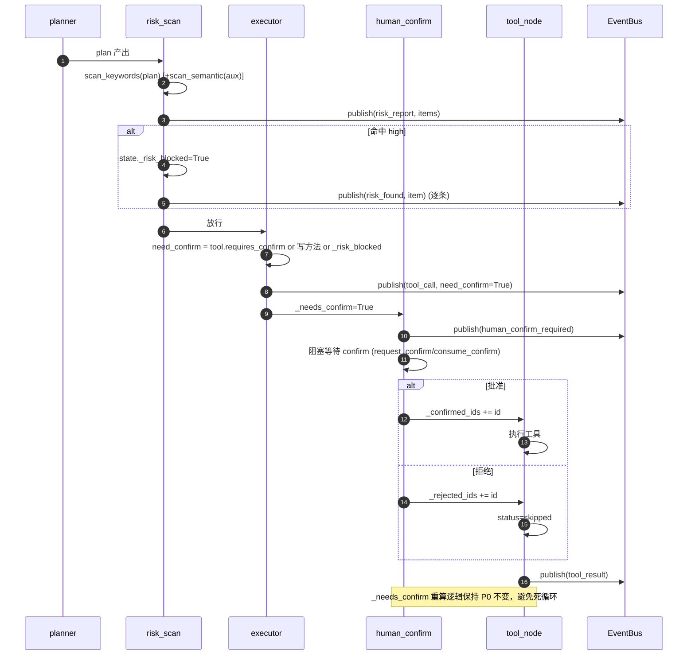
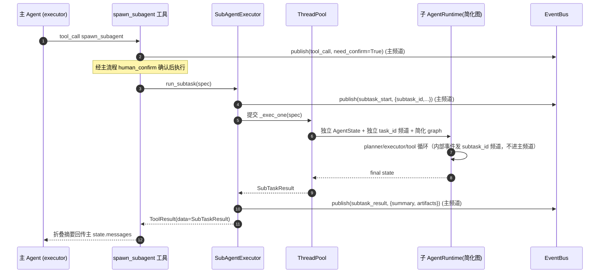
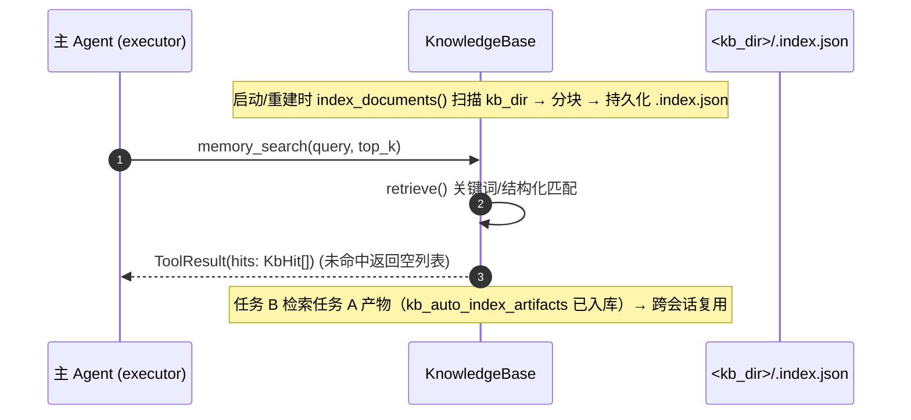
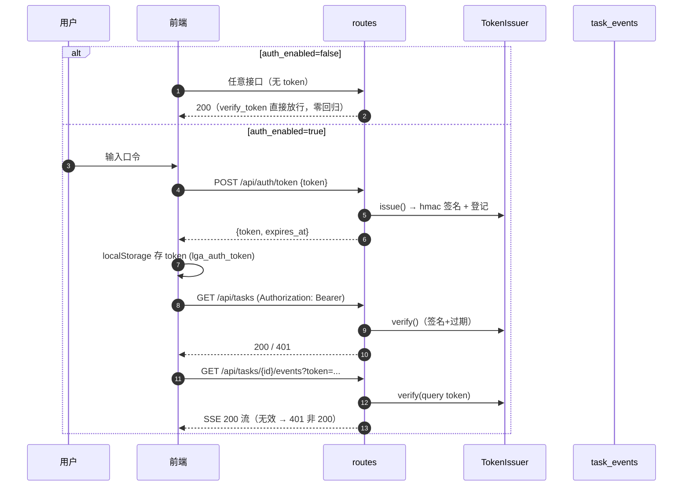
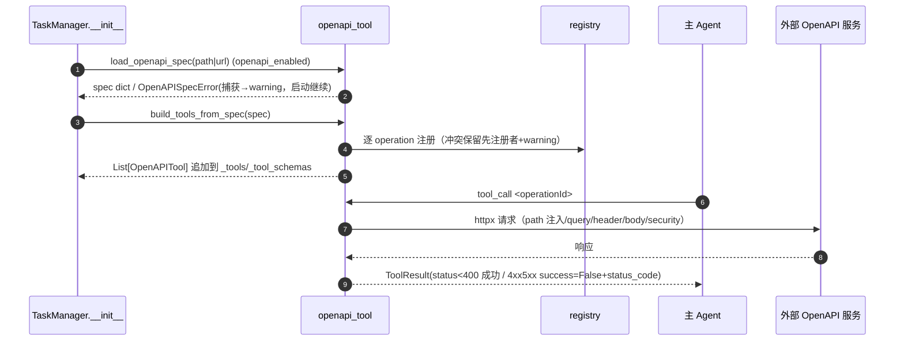
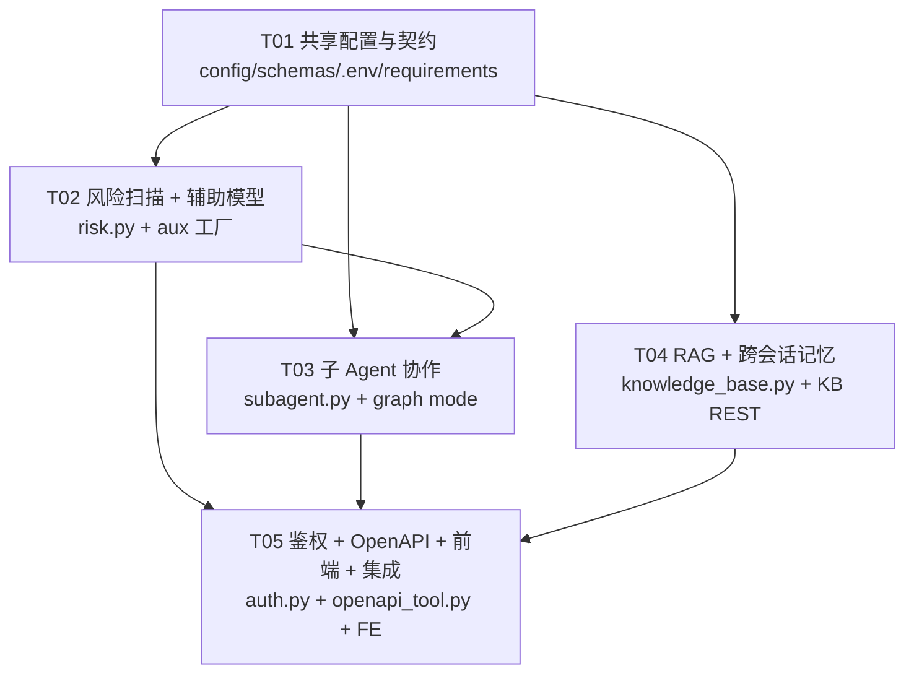

# 增量架构设计（P1 六项能力）— 基于 LangGraph 的自主任务 Agent

> 文档性质：**增量架构设计（仅描述 P1 六项能力变更，不重写整份架构）**
> 架构师：高见远（Gao）　|　版本：v0.1　|　日期：2025-08-24
> 关联文档：`docs/architecture.md`（整体架构）、`docs/incremental-arch-p0.md`（P0 增量）、`docs/incremental-prd-p1.md`（P1 增量 PRD）
> 项目根目录：`E:\code\demo\langgraph-agent\`

---

## 0. 范围与设计原则

本次增量在**不破坏现有编排内核（StateGraph + AgentRuntime + SSE + P0 压缩/熔断/插件/trace）**的前提下，落地 P1 六项能力：

| # | 能力 | 一句话方案 |
|---|------|-----------|
| 1 | 规划期风险扫描（EHRB） | 新增独立 `risk_scan` 节点插入 `planner→executor` 之间；关键词扫描+可选 aux 语义分析；命中 high → 该轮工具调用强制走**现有 human_confirm** 确认（`risk_policy=confirm`，不整任务暂停） |
| 2 | 子 Agent 协作 | 新增 `SubAgentExecutor`：独立 AgentState + 独立 task_id 频道 + 复用同一工具集/LLM 的独立 `AgentRuntime`；`spawn_subagent` 工具 + 内置"调研+报告"确定性拆分（后端调度，不走 LLM 编排） |
| 3 | RAG + 跨会话记忆 | 新增 `KnowledgeBase`（分块 + 纯标准库关键词/结构化索引，持久化 `.index.json`，无 Embedding 自动离线）；`memory_search`/`kb_query` 工具 + KB 管理 REST |
| 4 | 辅助模型分工 | `aux_llm_*` 配置 + `create_aux_llm_client()` 工厂（未启用返回 None）；摘要/风险语义优先 aux，无 aux 自动降级主模型/规则，**零额外 LLM 调用** |
| 5 | 基础鉴权 | 新增 `services/auth.py`（标准库 hmac 签发/校验/过期）；`POST /api/auth/token` 落地；受保护接口 `Depends(verify_token)`；SSE 用 `?token=`；`auth_enabled=false` 全放行 |
| 6 | OpenAPI 工具封装 | 新增 `core/tools/openapi_tool.py`：spec 加载（YAML/JSON/URL）→ 每 operation 生成 BaseTool → 调用/注册；`make_openapi_tool` 占位替换为真实实现；无效 spec 仅 warning 不中断启动 |

**设计原则**：
1. **复用而非新建机制**：风险确认复用 P0 的 `human_confirm`/`_confirmed_ids`/`_rejected_ids`/`_needs_confirm`（P0 已修复死循环，直接复用，零新增确认状态机）。
2. **隔离而非污染**：子任务持有独立 `AgentState` 与独立 EventBus 频道（`<parent>:sub:<hex>`），主 `messages` 零污染；子任务内部事件不进主任务 SSE。
3. **默认零回归**：6 项能力开关全部收口 `Settings` 且默认值遵循 PRD Q1–Q6（`risk_scan_enabled=true` 但空词表不阻断、`subagent_enabled=true` 但场景不匹配即跳过、`aux_llm_enabled=false`、`auth_enabled=false`、`openapi_enabled=false`、`kb_enabled=true` 目录缺失静默）。
4. **子任务用简化 graph**：子任务运行时使用不含 `risk_scan`/`human_confirm`/`subagent_split` 的简化图，规避"子任务内确认无法路由回主任务"的复杂度；`spawn_subagent` 工具本身 `requires_confirm=True`，派生子任务前经主流程确认。

---

## 1. 模块落点（每项能力的文件改动）

### 项1：规划期风险扫描（EHRB）

| 变更类型 | 相对路径 | 职责 |
|----------|----------|------|
| 新增 | `backend/core/agent/risk.py` | `RiskLevel`/`RiskAction` 枚举；`DANGER_KEYWORDS` 五类危险词表；`scan_keywords(plan)`；`scan_semantic(aux_llm, item, step)`（可选语义分析）；`scan_tool_output()`（P1 骨架，仅 warning）；`RiskScanner` 门面（组合关键词+语义） |
| 改 | `backend/core/agent/nodes.py` | 新增 `AgentRuntime.risk_scan` 节点；`executor` 中 `need_confirm` 计算叠加 `_risk_blocked`；`AgentRuntime` 新增 `aux_llm` 属性（惰性，供语义分析/摘要） |
| 改 | `backend/core/agent/graph.py` | `build_graph(runtime, mode="main")`：main 模式新增 `risk_scan` 节点 + 条件边 `planner → risk_scan → subagent_split`；subtask 模式不含 risk 节点 |
| 改 | `backend/core/agent/state.py` | `AgentState` 新增 `risk_report`、`_risk_blocked` |
| 改 | `backend/api/schemas.py` | 新增 `RiskItem`；`Task` 新增 `risk_report: List[RiskItem]` |
| 改 | `backend/api/sse.py` 协议（`types/index.ts`） | 新增事件类型 `risk_report`、`risk_found` |
| 改 | `backend/config.py` + `.env.example` | 新增 `risk_*` 配置 |

### 项2：子 Agent 协作

| 变更类型 | 相对路径 | 职责 |
|----------|----------|------|
| 新增 | `backend/core/agent/subagent.py` | `SubTaskSpec`/`SubTaskResult`；`SubAgentExecutor`（线程池 `ThreadPoolExecutor(max_workers=subagent_max_concurrency)`、`run_subtask` 单发、`run_plan_with_subtasks` 内置场景调度、`_exec_one` 独立 runtime+state+简化 graph）；`DEFAULT_SPLIT_SCENARIOS`；`split_plan_for_scenario(user_input, plan)` |
| 新增 | `backend/core/tools/subagent_tool.py` | `SpawnSubagentTool`（`@register`，name=`spawn_subagent`，`requires_confirm=True`，run 调 `SubAgentExecutor.run_subtask` 同步等待） |
| 改 | `backend/core/agent/nodes.py` | 新增 `AgentRuntime.subagent_split` 节点（场景匹配则执行子任务并折叠回传，否则放行 executor） |
| 改 | `backend/core/agent/graph.py` | main 模式新增 `subagent_split` 节点 + 条件边 `risk_scan → subagent_split → (executor | reflect)` |
| 改 | `backend/core/agent/prompts.py` | `PLANNER_SYSTEM` 增加"调研+报告"拆分指引（提示词引导，后端仍有兜底匹配） |
| 改 | `backend/core/agent/state.py` | `AgentState` 新增 `subtasks`、`_is_subtask`（子任务标记防递归） |
| 改 | `backend/services/task_manager.py` | 持有 `SubAgentExecutor` 实例并注入 `AgentRuntime`；`request_confirm` 支持子任务 id（spawn 工具确认走主任务，子任务内部无确认） |
| 改 | `backend/api/schemas.py` | 新增 `SubTask`；`Task` 新增 `subtasks: List[SubTask]` |
| 改 | `backend/api/sse.py` 协议（`types/index.ts`） | 新增事件类型 `subtask_start`、`subtask_result`、`subtask_failed` |
| 改 | `backend/config.py` + `.env.example` | 新增 `subagent_*` 配置 |

### 项3：RAG + 跨会话记忆

| 变更类型 | 相对路径 | 职责 |
|----------|----------|------|
| 新增 | `backend/core/kb/__init__.py` | KB 包标记 |
| 新增 | `backend/core/kb/knowledge_base.py` | `KbDoc`/`KbChunk`/`KbHit`；`KnowledgeBase`：`index_documents()`、`add_document(path)`、`retrieve(query, top_k)`、`list_docs()`、`rebuild()`、`remove(doc_id)`；分块（≤`kb_chunk_size` 字符）；索引持久化 `<kb_dir>/.index.json`；关键词/结构化检索（标准库，无 embedding 离线可用）；`set_embedder(fn)` 向量接口占位 |
| 新增 | `backend/core/tools/kb_tools.py` | `MemorySearchTool`（name=`memory_search`）+ `KbQueryTool`（name=`kb_query`，继承同实现）；args `{query, top_k?}` |
| 改 | `backend/services/task_manager.py` | 初始化 `KnowledgeBase` 单例；`add_artifact` 后若 `kb_auto_index_artifacts` 且文本类 → `kb.add_document()`；KB 工具注入 settings |
| 改 | `backend/api/routes.py` | 新增 `GET /api/kb`、`POST /api/kb/rebuild`、`DELETE /api/kb/{doc_id}` |
| 改 | `backend/api/schemas.py` | 新增 `KbDoc`/`KbHit` 模型 |
| 改 | `backend/config.py` + `.env.example` | 新增 `kb_*` 配置 |

### 项4：辅助模型分工

| 变更类型 | 相对路径 | 职责 |
|----------|----------|------|
| 改 | `backend/core/llm/client.py` | 新增 `MockAuxLLMClient`（脚本化 role 响应：summary/risk/tool_choice，记录调用次数供零额外调用断言） |
| 改 | `backend/core/llm/openai_compat.py` | 新增 `create_aux_llm_client(settings) -> LLMClient | None`；`get_aux_llm(settings, main_llm)` 守卫（未启用/缺配置返回 None）；mock 分支 |
| 改 | `backend/core/agent/context.py` | `compress_messages`/`summarize_messages` 已接受任意 `llm` 参数——`_build_messages` 传入 aux（有则 aux，无则主模型） |
| 改 | `backend/core/agent/nodes.py` | `AgentRuntime.aux_llm` 惰性属性；`_build_messages` 摘要用 aux；`risk_scan` 语义分析用 aux |
| 改 | `backend/core/agent/risk.py` | `scan_semantic` 接收 `aux_llm`（None 则跳过语义分析） |
| 改 | `backend/services/task_manager.py` | `__init__` 构造 aux client 并注入 `AgentRuntime` |
| 改 | `backend/config.py` + `.env.example` | 新增 `aux_llm_*` 配置 |
| 预留 | `backend/core/tools/tool_choice.py`（可选，P1 可不建文件） | 工具预选 `filter_tool_schemas(aux, schemas, query)`——P1 仅接口占位（默认返回全量），不接入主流程 |

### 项5：基础鉴权（P1-6）

| 变更类型 | 相对路径 | 职责 |
|----------|----------|------|
| 新增 | `backend/services/auth.py` | `TokenIssuer`（hmac 签名 token `{expires_ts}.{sig}` + 内存 TokenStore 登记）；`verify_token` FastAPI 依赖（读 `Authorization: Bearer` 或 `?token=`；`auth_enabled=false` 直接放行） |
| 改 | `backend/api/routes.py` | `POST /api/auth/token` 落地签发（返回 `{token, expires_at}`）；受保护接口（tasks 系列、trace、kb）挂 `Depends(verify_token)`；`task_events` 支持 `?token=` 校验 |
| 改 | `backend/api/sse.py` | `sse_response` 透传校验结果（校验在 routes 层完成，sse.py 零改动或仅签名透传） |
| 改 | `backend/api/schemas.py` | 新增 `AuthTokenResponse`；`AuthTokenRequest` 保持 |
| 改 | `backend/config.py` + `.env.example` | 新增 `auth_token_ttl_sec` |
| 改 | `backend/main.py` | lifespan 初始化 `app.state.auth = TokenIssuer(...)`；`/health` 返回 `auth_enabled` |
| 新增 | `frontend/src/pages/LoginPage.tsx` | 登录页（口令输入 → POST /auth/token → localStorage） |
| 新增 | `frontend/src/components/AuthGuard.tsx` | 路由守卫（auth_enabled && 无 token → 登录页） |
| 新增 | `frontend/src/store/authStore.ts` | token/authEnabled 状态、login/logout |
| 改 | `frontend/src/App.tsx` | 挂 AuthGuard + 路由分流（登录页 / TaskView） |
| 改 | `frontend/src/api/client.ts` | `req()` 注入 `Authorization: Bearer`；`login()`/`logout()` 封装 |
| 改 | `frontend/src/hooks/useSSE.ts` | EventSource URL 追加 `?token=` |

### 项6：OpenAPI 工具封装完整实现

| 变更类型 | 相对路径 | 职责 |
|----------|----------|------|
| 新增 | `backend/core/tools/openapi_tool.py` | `OpenAPISpecError`；`load_openapi_spec(source)`（本地 YAML/JSON 路径或 HTTP(S) URL）；`build_tools_from_spec(spec, settings) -> List[BaseTool]`（每 operation 一个工具，name=operationId 缺省 `{method}_{path}`，args_schema 映射 parameters/requestBody，security 解析 apiKey）；`OpenAPITool.run`（httpx 调用，路径参数注入 URL、query/header/body 映射，4xx/5xx → `success=False` + status_code） |
| 改 | `backend/core/tools/registry.py` | `make_openapi_tool(spec, settings)` 占位替换为真实入口（委托 `build_tools_from_spec`，返回 `List[BaseTool]`；无效 spec 抛 `OpenAPISpecError` 由调用方捕获） |
| 改 | `backend/services/task_manager.py` | `__init__` 若 `openapi_enabled` 且配置 spec 路径/URL → 加载生成工具并**追加**到 `_tools`/`_tool_schemas`（经 `register` 冲突语义：先注册者保留 + warning）；无效 spec 捕获后 warning 启动继续 |
| 改 | `backend/config.py` + `.env.example` | 新增 `openapi_*` 配置 |
| 改 | `requirements.txt` | 新增 `pyyaml`（仅项6 使用） |

---

## 2. 接口 / 数据结构变更

### 2.1 新增配置项（`backend/config.py` 的 `Settings`，默认值沿用 PRD Q1–Q6）

| 配置项 | 类型 | 默认值 | 说明 |
|--------|------|--------|------|
| `risk_scan_enabled` | bool | `True` | 风险扫描总开关（false 跳过 → 零回归） |
| `risk_semantic_enabled` | bool | `False` | LLM 语义分析开关（需 aux 或主模型） |
| `risk_policy` | str | `"confirm"` | `confirm` \| `pause`（默认 confirm：命中 high 仅需确认） |
| `risk_danger_keywords` | str | `""` | 可选覆盖词表（JSON 数组，空则用内置五类词表） |
| `subagent_enabled` | bool | `True` | 子 Agent 总开关 |
| `subagent_max_concurrency` | int | `2` | 并行度（=1 时串行） |
| `subagent_timeout_sec` | int | `120` | 单个子任务超时 |
| `kb_enabled` | bool | `True` | 知识库总开关 |
| `kb_dir` | str | `"data/kb"` | 知识库目录（相对 PROJECT_ROOT） |
| `kb_auto_index_artifacts` | bool | `True` | 产物自动入库 |
| `kb_chunk_size` | int | `2000` | 分块字符上限 |
| `kb_embedding_enabled` | bool | `False` | 向量化检索（预留，false 用关键词检索离线可用） |
| `kb_top_k` | int | `5` | 检索默认返回条数 |
| `aux_llm_enabled` | bool | `False` | 辅助模型总开关 |
| `aux_llm_provider` | str | `"openai"` | 辅助模型 provider（预设同主模型） |
| `aux_llm_base_url` | str | `""` | 辅助模型 base_url（空 → 用 provider 预设） |
| `aux_llm_api_key` | str | `""` | 辅助模型 api_key |
| `aux_llm_model` | str | `""` | 辅助模型 model（空 → 无 aux，降级） |
| `aux_llm_use_mock` | bool | `False` | 辅助模型离线 mock（配合 use_mock_llm） |
| `auth_token_ttl_sec` | int | `86400` | token 有效期（秒） |
| `openapi_enabled` | bool | `False` | OpenAPI 工具生成总开关 |
| `openapi_spec_path` | str | `""` | 本地 spec 文件路径（YAML/JSON） |
| `openapi_spec_url` | str | `""` | 远程 spec URL |
| `openapi_api_key` | str | `""` | 注入 security apiKey（header） |
| `openapi_global_headers` | str | `"{}"` | 全局请求头（JSON 字符串） |

新增派生路径属性（沿用 `plugins_path`/`trace_path` 写法）：

```python
@property
def kb_path(self) -> Path:
    p = Path(self.kb_dir)
    return p if p.is_absolute() else PROJECT_ROOT / p
```

### 2.2 新增 SSE 事件类型（5 个，前端 `types/index.ts` 需对齐）

| event 类型 | data 字段 | 含义 |
|------------|-----------|------|
| `risk_report` | `{items: RiskItem[], policy: str, semantic_enabled: bool}` | 每轮规划后的全量风险报告 |
| `risk_found` | `RiskItem` | 命中 high/medium 的单项（逐条推送，前端可打角标） |
| `subtask_start` | `{subtask_id, name, status, parent_task_id}` | 子任务开始 |
| `subtask_result` | `{subtask_id, name, status, summary, artifacts[]}` | 子任务完成（summary 为折叠摘要，含 tool_calls_executed 计数） |
| `subtask_failed` | `{subtask_id, name, error}` | 子任务失败（不导致主任务崩溃） |

`RiskItem` 载荷结构：

```json
{
  "step_index": 1,
  "level": "high",
  "matched_keywords": ["rm -rf", "删除"],
  "suggestion": "删除类高危操作，建议人工确认后再执行",
  "action": "confirm"
}
```

### 2.3 新增 REST 接口

| 方法 | 路径 | 说明 | 请求体 / 参数 | 响应 data |
|------|------|------|---------------|-----------|
| POST | `/api/auth/token` | 登录签发（auth_enabled=false 时保持现状 `{ok:true}`） | `{token:str}` | `{token, expires_at, ok}` |
| GET | `/api/kb` | 知识库文档清单 | — | `{docs: KbDoc[]}` |
| POST | `/api/kb/rebuild` | 重建索引（扫描目录 + 落盘） | — | `{ok, indexed: int}` |
| DELETE | `/api/kb/{doc_id}` | 移除文档索引 | path | `{ok}` |

- 受保护接口：`POST /api/tasks`、`GET /api/tasks`、`GET /api/tasks/{id}`、`POST /api/tasks/{id}/stop`、`GET /api/tasks/{id}/events`（SSE，`?token=`）、`GET /api/tasks/{id}/trace`、`GET/POST /api/tasks/{id}/artifacts/*`、`POST /api/tasks/{id}/confirm`、KB 三接口——`auth_enabled=true` 时需 `Authorization: Bearer`，无/错/过期 → 401。
- 不受保护：`POST /api/auth/token`、`GET /health`（返回新增 `auth_enabled` 字段供前端判定）。
- 统一响应信封不变：`{code, data, message}`；鉴权失败用 HTTP 401（前端据此跳登录页）。

### 2.4 AgentState 新增字段与子 Agent 隔离方案

| 字段 | 类型 | 说明 |
|------|------|------|
| `risk_report` | `List[Dict]` | 最新一轮 risk_item 列表（持久化到 `Task.risk_report`） |
| `subtasks` | `List[Dict]` | 子任务摘要列表（持久化到 `Task.subtasks`） |
| `_risk_blocked` | bool | 内部：本轮计划含 high 风险 → executor 中所有 tool_call `need_confirm=True` |
| `_is_subtask` | bool | 内部：标记子任务 state（简化 graph 用，防递归拆分） |

**子 Agent 运行时隔离方案**（回答"独立 AgentRuntime 实例？独立 state？"）：
- **独立 state**：每个子任务新建 `AgentState`（`messages=[{role:"user", content: instruction}]`、空 plan/steps/artifacts），与主 state 完全分离；子任务完成后主 `state["messages"]` 只追加一条**折叠摘要** assistant 消息（token 量级 ≤ 子任务全量 1/10，可经 `context.summarize_messages` 佐证）。
- **独立 AgentRuntime**：`SubAgentExecutor._exec_one` 为每个子任务 new 一个 `AgentRuntime(task_id=subtask_id, task_manager=tm, llm=主LLM, tools=同一工具集, tool_schemas=同一schemas)`，并 `build_graph(runtime, mode="subtask")`（简化图：planner→executor→tool→reflect→finish，无 risk/confirm/subagent_split）。
- **独立事件频道**：子任务内部事件发布到 `subtask_id` 频道（同一 EventBus 的不同 key），**不进主任务 SSE**；主任务频道只收到 3 类汇总事件。子任务不挂 `TraceRecorder`（保持简单，trace 文件仅主任务）。
- **并行**：`SubAgentExecutor` 持 `ThreadPoolExecutor(max_workers=subagent_max_concurrency)`；内置场景 `run_plan_with_subtasks` 批量提交，=2 时两子任务运行区间重叠（时间戳可证），=1 时排队串行。

### 2.5 风险扫描插入 graph 的方案（回答"独立节点还是 planner 内联"）

**采用独立 `risk_scan` 节点 + 条件边**，理由：
1. 与 PRD 1.1 明示的 `planner → risk_scan → executor` 对齐，语义清晰、可单测；
2. 职责分离：planner 只管规划，risk 只管扫描，executor 只管执行，未来 EHRB 第三层（工具输出复检）可对称挂在 `tool` 后；
3. 内联会污染 planner 节点、难以在 mock/离线测试中独立断言。

新 graph 拓扑（main 模式）：

```
planner
  → (stop? finish : risk_scan)
risk_scan
  → (stop? finish : subagent_split)
subagent_split
  → (_last_action=="final_answer" ? reflect : executor)
executor
  → (stop? finish : final_answer? reflect : needs_confirm? human_confirm : tool)
tool
  → (stop? finish : needs_confirm? human_confirm : reflect)
human_confirm → tool
reflect
  → (stop? finish : final_answer? finish : max_steps? finish : planner)
finish → END
```

`risk_policy=confirm`（默认）时 risk_scan **不阻塞**：只产 report + 置 `_risk_blocked`，确认动作在 executor 决策出具体 tool_call 后走现有 human_confirm；`risk_policy=pause` 时 risk_scan 内对整计划做一次阻塞确认（复用 `request_confirm/consume_confirm`，确认键 `risk_plan`），拒绝则跳过（`_risk_blocked=False` + 计划中高危步骤标记 skipped）。

---

## 3. 对现有机制的改动点（关键，避免破坏）

### 3.1 风险扫描与现有 human_confirm / _needs_confirm 协同

- **零新增确认状态机**：`_risk_blocked` 只在 `executor` 中把 `need_confirm` 置 True（与工具自身 `requires_confirm`、HTTP 写方法叠加），随后完全走现有流程：
  `executor(_needs_confirm=True) → human_confirm → tool → (仍有未决则 human_confirm) → reflect`。
- **避免重蹈 P0 死循环覆辙**：不改 `human_confirm_node` 的 `_needs_confirm` 重算逻辑（该逻辑已修复单工具流死循环）；`risk_scan` 不发布 `human_confirm_required`（避免与现有事件流混淆），只发布 `risk_report`/`risk_found`；确认/拒绝仍通过 `_confirmed_ids`/`_rejected_ids` 记录。
- **tool_node 零改动**：`need_confirm` 标记在 executor 已设置，tool_node 的"confirmed→执行 / rejected→skipped"逻辑原样复用。
- **pause 模式**：仅 risk_scan 节点内多一次整计划确认，不引入新边。

### 3.2 子 Agent 与主 EventBus / trace / persistence 的关系

| 机制 | 关系 | 说明 |
|------|------|------|
| EventBus | 同 bus、不同频道 | 子任务内部事件发 `subtask_id` 频道；主频道只发 3 类汇总事件；`spawn_subagent` 工具调用本身作为普通 tool_call 事件进入主频道 |
| TraceRecorder | 子任务不挂 | 简化；子任务可观测性由 `subtask_result.summary` 提供（含 tool_calls_executed）；如 QA 需要可后续加 `trace.attach(bus, subtask_id)`（零成本，因 TraceRecorder 按 task_id 隔离） |
| Persistence | 子任务不落盘为 Task | 子任务非独立任务，不写入 `tasks.json`；仅折叠摘要进入主 `Task.subtasks` |
| confirm 路由 | 子任务内部无确认 | 子任务用简化 graph（无 human_confirm）；`spawn_subagent` 工具 `requires_confirm=True`，派生前经主流程确认，规避子任务确认无法路由回主任务的问题 |

### 3.3 RAG 与现有 artifacts / persistence 的关系；无 embedding 退化

- **KB 与 Persistence 正交**：KB 是独立索引层（`<kb_dir>/.index.json`），不读 `tasks.json`；`kb_auto_index_artifacts` 在 `TaskManager.add_artifact` 成功后触发 `kb.add_document(path)`（按路径去重），失败仅 warning 不影响任务。
- **离线退化**：`kb_embedding_enabled=false`（默认）→ 关键词/结构化索引（标准库 `re` + 词频/子串匹配）；`set_embedder(fn)` 为向量接口占位，P1 不做向量库；无任何 Key 可完整索引+检索。
- **零回归**：`kb_enabled=false` 或目录缺失 → `KnowledgeBase` 为空实例，`memory_search` 返回空列表（非报错），任务不受影响。

### 3.4 辅助模型抽象（与 LLMClient 关系、降级路径）

- **同接口不同实例**：aux 仍是 `LLMClient` 抽象（`OpenAICompatibleClient` 或 `MockAuxLLMClient`），与主模型只是**配置不同**；工厂 `create_aux_llm_client(settings)` 按 `aux_llm_*` 构造。
- **降级守卫统一入口**：`get_aux_llm(settings, main_llm)` 返回 `aux | None`；`aux_llm_enabled=false`、缺 `aux_llm_model`/`aux_llm_base_url`/`aux_llm_api_key`、`aux_llm_use_mock` 且无 mock 场景 → 均返回 None。
- **三项辅助任务降级路径**（PRD 4.3）：
  - ① 风险语义分析：aux 为 None → 跳过（仅关键词扫描）；
  - ② 上下文摘要：`context_compress_strategy="summarize"` 时，有 aux 用 aux，无 aux 用主模型（现状）；
  - ③ 工具选择：P1 预留 `filter_tool_schemas` 接口，默认返回全量（不接入主流程）→ 无 aux 行为与现状完全一致。
- **零额外 LLM 调用**：aux 未配置时 `get_aux_llm` 返回 None，辅助任务直接走规则/跳过，不产生 `complete()` 调用（`MockAuxLLMClient` 记录调用次数，QA 可断言无 aux 时计数为 0）。

### 3.5 鉴权中间件实现方式与影响面

- **用 FastAPI 依赖注入（`Depends`）而非全局中间件**，理由：精确控制哪些接口受保护（auth/health 白名单），且对现有路由函数只加一个参数、可读性最好。
- **`verify_token` 依赖**：读取 `Authorization: Bearer`（REST）或 `?token=`（SSE query，`EventSource` 不支持 header）；`auth_enabled=false` → 直接返回 `"local"`（零回归）；`auth_enabled=true` → `TokenIssuer.verify()` 校验签名 + 内存 TokenStore 过期，失败 `HTTPException(401)`。
- **影响面**：仅 `routes.py` 中受保护路由函数签名追加 `_ = Depends(verify_token)`（或 `auth_guard` 依赖）；`sse.py` 零改动（校验在 routes 层完成）；`main.py` lifespan 加 `app.state.auth`；`/health` 加 `auth_enabled`。
- **前端**：`client.ts` 的 `req()` 注入 Bearer；`useSSE` URL 加 `?token=`；`AuthGuard` 依据 `/health.auth_enabled` + localStorage token 决定是否跳登录页；localStorage key 约定 `lga_auth_token`。

### 3.6 OpenAPI 工具与现有 BaseTool / registry / discover_plugins 集成

- **生成物是普通 BaseTool 子类**：`build_tools_from_spec` 返回 `List[OpenAPITool 实例]`，实现 `name/description/args_schema/run`，天然满足 `BaseTool` 契约与 `to_openai_schema()`。
- **注册复用 registry 冲突语义**：`make_openapi_tool` 不再抛 `NotImplementedError`，改为委托 `build_tools_from_spec`；启动注册经 `register` 语义（同名冲突保留先注册者 + warning，与插件规则一致）；单 operation 解析失败逐个跳过不中断。
- **与 `discover_plugins` 关系**：OpenAPI 工具是"配置驱动生成"，非"目录扫描发现"，在 `TaskManager.__init__` 的 `build_tools()` **之后**追加到 `_tools`/`_tool_schemas`（内置+插件先注册，OpenAPI 后注册，天然不覆盖内置）。

---

## 4. 关键流程（mermaid 时序图）

> 详见 `docs/incremental-class-diagram-p1.mermaid` 与 `docs/incremental-sequence-diagram-p1.mermaid`。

### S1：风险扫描 + 高危确认（confirm 模式）



### S2：子 Agent 派生与隔离回传



### S3：RAG 检索与跨会话复用



### S4：鉴权登录 + SSE token



### S5：OpenAPI 工具生成与调用



---

## 5. 依赖包

| 包 | 版本 | 用途 | 新增？ |
|----|------|------|--------|
| `pyyaml` | `>=6.0,<7.0` | OpenAPI spec YAML 解析（仅项6） | **新增**（PRD Q5） |
| `httpx` | 已有 | OpenAPITool 调用 | 否 |
| `pydantic` / `pydantic-settings` | 已有 | 模型/配置 | 否 |
| 标准库 | — | `hmac`/`hashlib`/`secrets`（鉴权）、`re`/`json`/`pathlib`（KB 索引）、`concurrent.futures`/`threading`（子 Agent 并行）、`urllib.request`/`json`（spec URL 加载） | 否 |

`requirements.txt` 仅追加一行：`pyyaml>=6.0,<7.0`。前端无新增依赖（zustand/react 已有）。

---

## 6. 有序任务列表（≤5 个，含依赖、源文件、改动类型）

> 说明：P1 共 6 项能力 + 前端联动，按"≤5 任务"硬性上限与"每任务 ≥3 文件、按功能模块分组"原则，将 team-lead 建议的 8 任务分组收敛为 5 个：**T01 共享契约（基础）→ T02 风险+辅助模型 → T03 子 Agent → T04 RAG/KB → T05 鉴权+OpenAPI+前端联动+集成**。T05 内部按 5a/5b/5c/5d 子模块顺序编码。

| ID | 任务名 | 源文件（核心） | 改动类型 | 依赖 | 优先级 |
|----|--------|----------------|----------|------|--------|
| **T01** | 共享配置与契约 | `backend/config.py`、`backend/api/schemas.py`、`.env.example`、`requirements.txt`、`frontend/src/types/index.ts`（类型骨架同步） | 改 | — | P0 |
| **T02** | 项1 风险扫描 + 项4 辅助模型 | `backend/core/agent/risk.py`（新）、`backend/core/agent/nodes.py`、`backend/core/agent/graph.py`、`backend/core/agent/state.py`、`backend/core/agent/context.py`、`backend/core/llm/client.py`（MockAuxLLMClient）、`backend/core/llm/openai_compat.py`（create_aux_llm_client）、`backend/services/task_manager.py`（aux 注入） | 新增 + 改 | T01 | P0 |
| **T03** | 项2 子 Agent 协作 | `backend/core/agent/subagent.py`（新）、`backend/core/tools/subagent_tool.py`（新）、`backend/core/agent/nodes.py`（subagent_split）、`backend/core/agent/graph.py`（mode 参数 + 边）、`backend/core/agent/prompts.py`、`backend/core/agent/state.py`、`backend/services/task_manager.py`（SubAgentExecutor 注入） | 新增 + 改 | T01, T02 | P0 |
| **T04** | 项3 RAG + 跨会话记忆 | `backend/core/kb/__init__.py`（新）、`backend/core/kb/knowledge_base.py`（新）、`backend/core/tools/kb_tools.py`（新）、`backend/services/task_manager.py`（KB 初始化 + 产物入库）、`backend/api/routes.py`（KB REST）、`backend/api/schemas.py`（KbDoc/KbHit） | 新增 + 改 | T01 | P0 |
| **T05** | 项5 鉴权 + 项6 OpenAPI + 前端联动 + 集成 | 5a 鉴权：`backend/services/auth.py`（新）、`backend/api/routes.py`、`backend/api/sse.py`、`backend/main.py`、`backend/api/schemas.py`；5b OpenAPI：`backend/core/tools/openapi_tool.py`（新）、`backend/core/tools/registry.py`、`backend/services/task_manager.py`；5c 前端：`frontend/src/pages/LoginPage.tsx`（新）、`frontend/src/components/AuthGuard.tsx`（新）、`frontend/src/store/authStore.ts`（新）、`frontend/src/components/RiskBanner.tsx`（新）、`frontend/src/components/SubtaskList.tsx`（新）、`frontend/src/components/KbPanel.tsx`（新）、`frontend/src/App.tsx`、`frontend/src/api/client.ts`、`frontend/src/hooks/useSSE.ts`、`frontend/src/store/taskStore.ts`、`frontend/src/components/TaskPanel.tsx`、`frontend/src/components/ConfirmDialog.tsx`、`frontend/src/pages/TaskView.tsx`、`frontend/src/types/index.ts`；5d 集成：`backend/tests/test_auth.py`、`test_openapi_tool.py`、`test_p1_integration.py`（新），`backend/tests/conftest.py` | 新增 + 改 | T02, T03, T04 | P0 |

### 6.1 实现顺序说明

- **T01**：一次性落地 6 组配置（`risk_*`/`subagent_*`/`kb_*`/`aux_llm_*`/`auth_token_ttl_sec`/`openapi_*`）、全部新 Pydantic 模型（`RiskItem`/`SubTask`/`AuthTokenResponse`/`KbDoc`/`KbHit`）、`Task` 扩展字段（`risk_report`/`subtasks`）、`requirements.txt` 加 `pyyaml`、`.env.example` 追加样板。**契约先行，后续任务只实现不新增字段。**
- **T02**：先 aux（client/factory）后风险（risk.py → nodes → graph → state），因 `risk_scan` 语义分析依赖 aux；`task_manager` 只加 aux 注入（不同方法/属性，与 T03/T04 顺序应用不冲突）。
- **T03**：`graph.py` 的 `mode` 参数是本任务关键改动（main/subtask 两模式）；`subagent_split` 节点在 `risk_scan` 之后插入；`task_manager` 加 `SubAgentExecutor` 注入。
- **T04**：KB 模块完全独立（`core/kb/` + `kb_tools` + REST）；`task_manager.add_artifact` 后加一行入库调用；不触碰 graph。
- **T05**：先 5a 鉴权（独立 auth.py + 路由），再 5b OpenAPI（openapi_tool.py + registry），再 5c 前端（依赖后端事件/接口已就绪），最后 5d 集成测试（含离线 mock 场景回归 + 新功能断言）。**task_manager 的 OpenAPI 注册是最后追加改动，避免与 T02/T03/T04 冲突。**

---

## 7. 任务依赖图（mermaid）



---

## 8. 共享知识（跨文件约定）

1. **配置命名前缀**：`risk_*` / `subagent_*` / `kb_*` / `aux_llm_*` / `auth_*` / `openapi_*`；全部经 `backend/config.py` 的 `Settings` 读取，业务代码禁止硬编码；通过 `get_settings()` 取单例。
2. **事件类型注册位置**：P1 新增 5 个事件（`risk_report`/`risk_found`/`subtask_start`/`subtask_result`/`subtask_failed`）作为字符串直接由 `nodes.py`/`subagent.py` 发布；**前端 `frontend/src/types/index.ts` 必须同步**（`SSEventType` 联合类型 + 各事件 data 接口），单一事实来源是后端 `schemas.py`。
3. **风险确认复用现有 human_confirm**：禁止新增独立确认状态机；`_risk_blocked` 只在 `executor` 中抬升 `need_confirm`；`_needs_confirm` 重算逻辑（P0 已修）不得改动。
4. **子任务隔离三原则**：独立 `AgentState`、独立 EventBus 频道（`<parent>:sub:<hex>`）、简化 graph（`mode="subtask"`）；主 `messages` 只追加折叠摘要；子任务内部事件绝不发到主任务频道。
5. **辅助模型降级统一走 `get_aux_llm(settings, main_llm)`**：返回 None 即降级（跳过/主模型/规则），默认 `aux_llm_enabled=false` 时零额外 LLM 调用；`MockAuxLLMClient` 记录调用次数供 QA 断言。
6. **鉴权三约定**：`auth_enabled=false` 时 `verify_token` 直接放行（零回归）；REST 用 `Authorization: Bearer`，SSE 用 `?token=`；前端 token 存 `localStorage` 键 `lga_auth_token`，`/health` 返回 `auth_enabled` 供前端判定。
7. **OpenAPI 生成契约**：生成物是标准 `BaseTool` 子类（`OpenAPITool`），经 `build_tools_from_spec` 返回实例列表；同名冲突保留先注册者 + warning；无效 spec 抛 `OpenAPISpecError` 由 `TaskManager` 捕获 warning，**绝不中断启动**；`make_openapi_tool` 不再抛 `NotImplementedError`。
8. **KB 持久化约定**：索引文件固定 `<kb_dir>/.index.json`；`kb_embedding_enabled=false` 时用关键词/结构化检索（离线可用）；检索未命中返回空列表而非报错；`kb_enabled=false`/目录缺失 → KB 为空实例（零回归）。
9. **异常兜底不变**：工具仍须返回 `ToolResult`；`tool_node` 外层 `try/except` 兜底保留；子任务失败捕获后发 `subtask_failed` 且**不导致主任务崩溃**。
10. **测试离线约定**：新增测试全部走 `MockLLMClient`/`MockAuxLLMClient` + `tmp_path` 临时目录（沿用 `conftest.make_settings`），不新增网络依赖；`test_build_graph_compiles` 用 `AgentRuntime(task_manager=None, ...)` 的兼容性保持（新增 `aux_llm` 属性必须惰性构造）。

---

## 9. 待明确事项（均不阻塞，沿用 PRD 默认）

| # | 项 | 本设计采用 | 说明 |
|---|----|------------|------|
| Q1 | 风险扫描危险词表与处置 | 内置五类词表 + `risk_policy=confirm`（默认） | 词表在 `risk.py` 集中维护，`risk_danger_keywords` 可覆盖 |
| Q2 | 知识库目录与产物入库 | `kb_dir=data/kb`、`kb_auto_index_artifacts=true`、无 Key 关键词检索 | 向量化仅占位 `set_embedder`，P1 不做向量库 |
| Q3 | 辅助模型默认关闭 | `aux_llm_enabled=false`，未配置零额外 LLM 调用 | 降级路径见 §3.4 |
| Q4 | 鉴权默认关闭 + SSE 方式 | `auth_enabled=false`；SSE `?token=` | 前端经 `/health.auth_enabled` 判定是否强制登录 |
| Q5 | OpenAPI 范围与依赖 | 支持 3.0/3.1 paths 核心字段；新增 `pyyaml`；apiKey header/query，basic 占位 | 单 operation 失败逐个跳过 |
| Q6 | 子 Agent 并行度与内置场景 | `subagent_max_concurrency=2`；后端确定性拆分"调研+报告" | 单发 `spawn_subagent` 同步等待；并行由内置场景批量调度保证 |

**本设计新增的 4 个架构层假设（供主理人知悉，不影响开发）**：
1. 风险确认粒度采用"**轮次级**"（高危计划 → 该轮所有工具调用需确认），比 PRD 的 step 级略粗，但满足"命中 high 的操作确认前不执行"验收；如需 step 级精确映射可后续细化（P2）。
2. 子任务**内部不挂 TraceRecorder、不落盘 Task**（独立频道 + 汇总事件 + 折叠摘要），保持简单；QA 验证隔离用"主 messages 无子任务内部消息"断言。
3. `make_openapi_tool` 返回类型由 P0 占位的 `Type[BaseTool]` 调整为 `List[BaseTool]`（一个 spec 对应多个工具），调用方同步适配。
4. 前端判定登录态依赖 `/health` 新增 `auth_enabled` 字段（后端小改动，已在 T05 覆盖）。

---

## 附：P1 增量对现有模块的改动汇总

| 现有模块 | 本增量改动 |
|----------|-----------|
| `backend/config.py` + `.env.example` | 新增 `risk_*`/`subagent_*`/`kb_*`/`aux_llm_*`/`auth_token_ttl_sec`/`openapi_*`；`kb_path` 属性 |
| `backend/core/agent/state.py` | `AgentState` 新增 `risk_report`、`subtasks`、`_risk_blocked`、`_is_subtask` |
| `backend/core/agent/nodes.py` | 新增 `risk_scan`/`subagent_split` 节点；`executor.need_confirm` 叠加 `_risk_blocked`；`aux_llm` 惰性属性 |
| `backend/core/agent/graph.py` | `build_graph(runtime, mode="main")`；main 模式新增 risk_scan/subagent_split 边 |
| `backend/core/agent/context.py` | `summarize_messages` 支持注入 aux（经 `_build_messages` 传入） |
| `backend/core/agent/prompts.py` | `PLANNER_SYSTEM` 增加"调研+报告"拆分指引 |
| `backend/core/llm/client.py` | 新增 `MockAuxLLMClient` |
| `backend/core/llm/openai_compat.py` | 新增 `create_aux_llm_client()`/`get_aux_llm()` |
| `backend/core/tools/registry.py` | `make_openapi_tool` 占位替换为真实实现 |
| `backend/services/task_manager.py` | aux 注入；SubAgentExecutor 注入；KB 初始化 + 产物入库；OpenAPI 工具注册 |
| `backend/api/routes.py` | auth 路由落地；受保护接口依赖注入；KB REST；SSE `?token=` |
| `backend/api/sse.py` 协议 | 新增 5 个事件类型（实现零改动，类型在前端/文档注册） |
| `backend/api/schemas.py` | 新增 `RiskItem`/`SubTask`/`AuthTokenResponse`/`KbDoc`/`KbHit`；`Task` 扩展 |
| `backend/main.py` | lifespan 初始化 `app.state.auth`；`/health` 加 `auth_enabled` |
| `frontend/src/**` | 新增 LoginPage/AuthGuard/authStore/RiskBanner/SubtaskList/KbPanel；client token 注入；useSSE `?token=`；TaskPanel 子任务 Tab；ConfirmDialog 风险提示 |
| `requirements.txt` | 新增 `pyyaml` |
