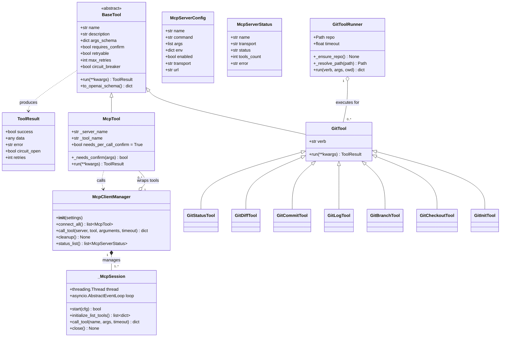
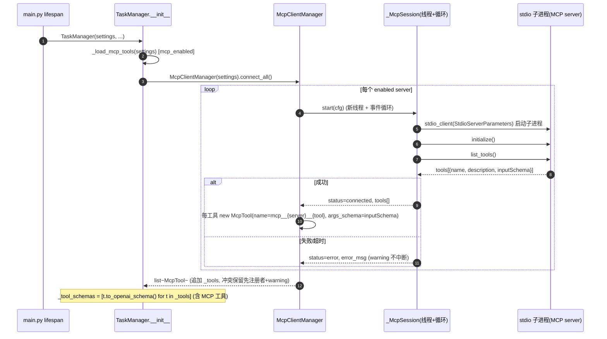
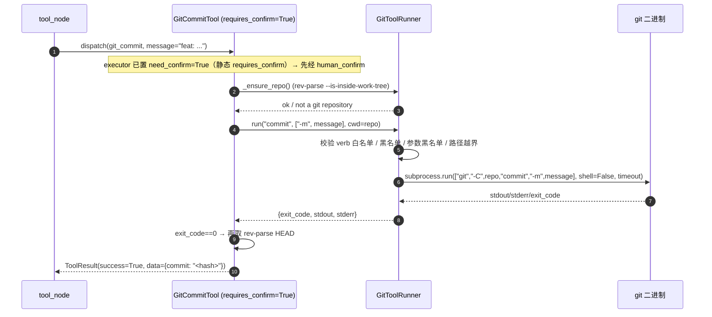
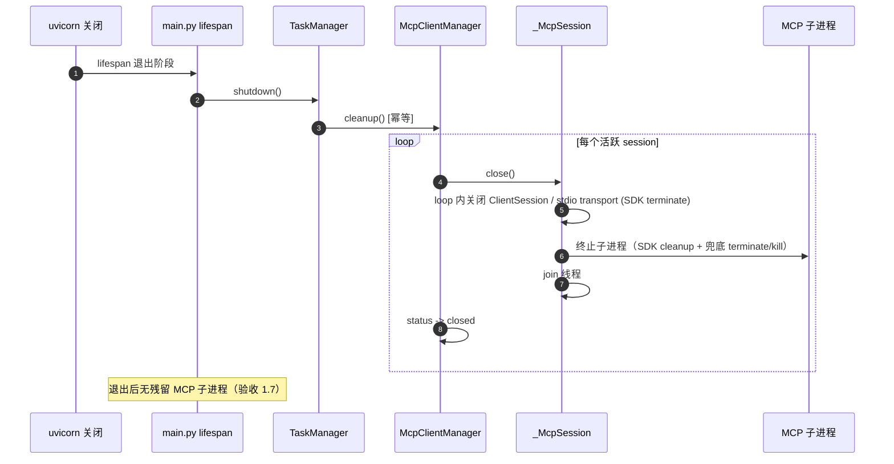
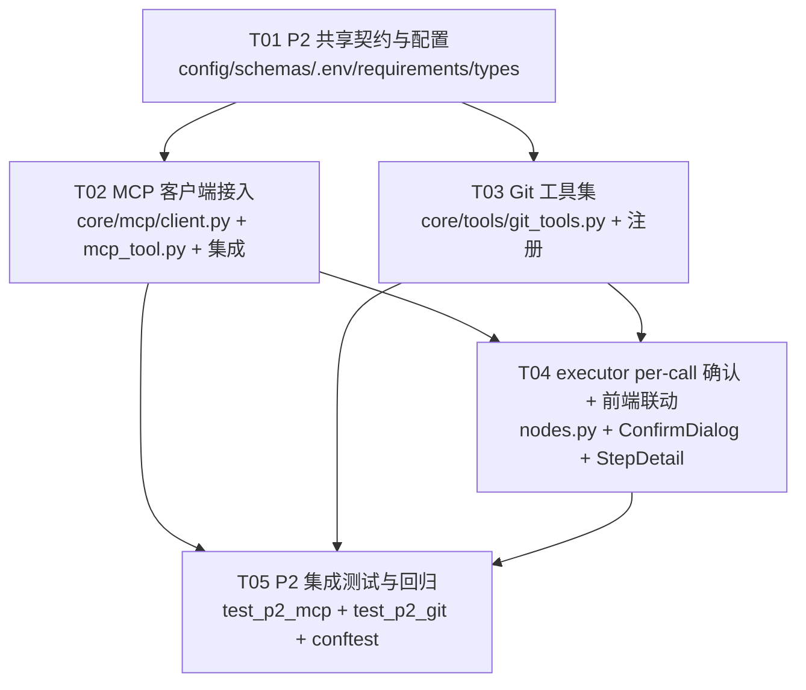

# 增量架构设计（P2 两项能力）— 基于 LangGraph 的自主任务 Agent

> 文档性质：**增量架构设计（仅描述 P2 两项能力变更，不重写整份架构）**
> 架构师：高见远（Gao）　|　版本：v0.1　|　日期：2026-08-24
> 关联文档：`docs/architecture.md`（整体架构）、`docs/incremental-arch-p1.md`（P1 增量）、`docs/incremental-prd-p2.md`（P2 增量 PRD）
> 项目根目录：`E:\code\demo\langgraph-agent\`

---

## 0. 范围与设计原则

本次增量在**不破坏现有编排内核（StateGraph + SSE + P0 压缩/熔断/插件/trace + P1 风险/子Agent/RAG/辅助模型/鉴权/OpenAPI）**的前提下，落地 PRD-P2 两项能力：

| # | 能力 | 一句话方案 |
|---|------|-----------|
| 1 | **MCP 客户端接入** | 新增 `backend/core/mcp/client.py`（`McpClientManager`：stdio 子进程 + 每 server 独立事件循环）在启动期 `initialize + list_tools`，把 server 暴露的工具包装为 `McpTool(BaseTool)` 追加进工具集（命名 `mcp__{server}__{tool}`，冲突保留先注册者 + warning）；调用经 `call_tool` 转发、映射 `ToolResult`，**零改动复用 P0 `ToolExecutor` 熔断重试**；`main.py` lifespan 退出阶段调用 `TaskManager.shutdown()` 优雅关闭 |
| 2 | **Git 工具** | 新增 `backend/core/tools/git_tools.py`：`GitToolRunner`（参数化 `subprocess`、`shell=False`、`-C repo`、超时、路径越界拒绝、黑名单防御）+ 7 个 `BaseTool`（status/diff/commit/log/branch/checkout/init）；只读直执行、改写类 `requires_confirm=True`、危险命令默认拒绝；与 `code_exec` 沙箱**正交**（独立 runner，不经 `sandbox.run_code`） |

**设计原则**（与 P1 一致）：

1. **复用而非新建**：MCP 工具确认走现有 `human_confirm` 流程（`executor` 里加一个 per-call 判定分支）；MCP 调用走现有 `ToolExecutor.dispatch`（不改 `resilience.py`）；MCP/Git 工具注册走 P1 OpenAPI 同款"生成实例追加 + 先注册者保留"路径。
2. **默认零回归**：`mcp_enabled=true` 但 `mcp_servers=[]` → 零 MCP 工具、零子进程；`git_enabled=false` → 零 Git 工具；`mcp_servers` 非法 JSON / server 连接失败 → 仅 warning 启动继续。
3. **生命周期收口**：MCP 子进程连接只发生在 `TaskManager.__init__`（进程级单例），cleanup 由 `TaskManager.shutdown()` 幂等执行；重复构造 `TaskManager` 不泄漏连接。
4. **安全双保险**：MCP 写类工具启发式 + `mcp_force_confirm` 覆盖；Git 静态确认 + 参数化 subprocess（无 shell）+ 黑名单（白名单内命令 + 参数级选项注入防护 + 路径越界拒绝）。

---

## 1. 依赖可行性确认（MCP SDK，PRD Q5）

**结论：官方 `mcp` Python SDK 可用，采用 `mcp>=1.2,<2.0`。**

| 检查项 | 结果 | 说明 |
|--------|------|------|
| 环境 Python 版本 | `.venv` 为 **Python 3.13.14** | mcp 1.x 官方要求 Python ≥3.10，兼容 |
| mcp 1.x 最新版 | pip index 显示 **1.29.0**（2.0.0 已发布但被 `<2.0` 排除） | 1.29.0 为 1.x 稳定线 |
| 依赖冲突面 | mcp 1.x 依赖 `pydantic>=2.7`（现有 `>=2.7,<3`）、`httpx`（现有 `>=0.27`）、`anyio` | 与现有 langgraph/fastapi/pydantic 栈同生态，无版本冲突预期；若安装时 `httpx` 需升到 0.28（mcp 1.29 约束），放宽 `httpx>=0.27,<0.29` 即可（不破坏现有 http_api/openapi_tool） |
| stdio 客户端 | mcp 1.x 内置 `mcp.client.stdio.stdio_client` + `ClientSession` | 满足 PRD stdio 必做；Streamable HTTP 字段仅预留不实现 |

**实现要点（SDK 用法）**：

- 每 server 使用 `StdioServerParameters(command=..., args=..., env=..., cwd=...)` 启动本地子进程；`env` 必须合并 `os.environ`（否则 `npx` 等找不到 PATH）。
- SDK 为 async 接口，而 `BaseTool.run()` 是同步方法 → **每 server 一个专用线程 + 独立 `asyncio` 事件循环**（`asyncio.new_event_loop()` 在子线程 `run_forever`），session 创建在该循环内完成，同步侧用 `asyncio.run_coroutine_threadsafe(...).result(timeout)` 桥接（详见 §4.4）。
- **Windows 注意**：`subprocess` 无 shell 时 `npx` 可能解析不到 `.cmd`，配置示例建议 `command="npx.cmd"`（Windows）或 Node 完整路径；离线测试一律用 `sys.executable` 启动自写 echo server（绝对路径，最稳）。

**退路（若安装受阻）**：`McpClientManager` 内把 SDK import 收敛到 `_import_sdk()` 一处；SDK 缺失时 `connect_all()` 返回空并 warning（不崩溃），后续可替换为标准库 `subprocess` + JSON-RPC 自实现（本次不落地，作为文档备份）。

---

## 2. 模块落点（每项能力的文件改动）

### 项1：MCP 客户端接入

| 变更类型 | 相对路径 | 职责 |
|----------|----------|------|
| 新增 | `backend/core/mcp/__init__.py` | MCP 包标记 |
| 新增 | `backend/core/mcp/client.py` | `McpServerConfig`（pydantic 模型，解析 `mcp_servers` 单项）、`McpServerStatus`、`McpClientManager`（`connect_all()` / `call_tool()` / `cleanup()` / `status_list()`；每 server 专用线程 + 事件循环；stdio 连接、initialize、list_tools、工具清单缓存） |
| 新增 | `backend/core/tools/mcp_tool.py` | `McpTool(BaseTool)`：name=`mcp__{server}__{tool}`、args_schema 直接采用 MCP inputSchema、`run()` 经 manager 转发 `call_tool` 并映射 `ToolResult`、`_needs_confirm(args)` 写类启发式 + `mcp_force_confirm` 覆盖 |
| 改 | `backend/services/task_manager.py` | `__init__` 中 `_load_mcp_tools(settings)`（在 `_load_openapi_tools` 之后、`_tool_schemas` 之前）；`_wire_injected_tools` 支持 `McpTool`；新增 `shutdown()`（幂等调 `mcp.cleanup()`） |
| 改 | `backend/api/routes.py` | 新增 `GET /api/mcp/servers`（返回每 server 状态；未启用返回空列表） |
| 改 | `backend/api/schemas.py` | 新增 `McpServerInfo` 响应模型 |
| 改 | `backend/main.py` | lifespan 退出阶段调用 `task_manager.shutdown()`（MCP 子进程收尾） |
| 改 | `backend/config.py` + `.env.example` | 新增 `mcp_enabled`/`mcp_servers`/`mcp_timeout_sec`/`mcp_connect_timeout_sec`/`mcp_force_confirm` |
| 改 | `frontend/src/types/index.ts` | 追加 `McpServerInfo` 类型（与后端 schema 对齐；**不新增 SSE 事件**，见 §3.3） |

### 项2：Git 工具

| 变更类型 | 相对路径 | 职责 |
|----------|----------|------|
| 新增 | `backend/core/tools/git_tools.py` | `GitCommandError`；`GitToolRunner`（参数化 subprocess runner：白名单 verb、黑名单防御、`-C repo`、路径越界拒绝、非 git 目录探测、超时）；`GitTool` 基类 + 7 个子工具（`GitStatusTool`/`GitDiffTool`/`GitCommitTool`/`GitLogTool`/`GitBranchTool`/`GitCheckoutTool`/`GitInitTool`）；`build_git_tools(settings) -> List[GitTool]` |
| 改 | `backend/services/task_manager.py` | `_load_git_tools(settings)`（`git_enabled` 时实例化并追加到 `_tools`；与 MCP/OpenAPI 同路径、先注册者保留）；Git 工具注入 `git_repo_path` |
| 改 | `backend/core/tools/__init__.py` | 导出 `build_git_tools`（包公共 API，供 TaskManager 引用；**Git 工具不经 `@register`**，理由见 §3.5） |
| 改 | `backend/config.py` + `.env.example` | 新增 `git_enabled`/`git_repo_dir`/`git_timeout_sec` |
| 改 | `frontend/src/components/StepDetail.tsx` | `git_diff`/`git_log` 等文本型输出用 `<pre>` 原样渲染（轻量分支） |
| 改 | `frontend/src/components/ConfirmDialog.tsx` | 确认标题按工具前缀分类（`git_*` → "Git 操作确认"，`mcp__*` → "MCP 工具确认"） |

---

## 3. 接口 / 数据结构变更

### 3.1 Settings 新增配置（`backend/config.py`，默认值沿用 PRD Q1–Q4）

| 配置项 | 类型 | 默认值 | 说明 |
|--------|------|--------|------|
| `mcp_enabled` | bool | `True` | MCP 总开关（false → 零 MCP 工具、零子进程） |
| `mcp_servers` | str | `"[]"` | JSON 数组字符串；每项 `{name, command, args[], env{}, enabled=true, cwd?, transport="stdio", url?}` |
| `mcp_timeout_sec` | float | `30.0` | 单次 `call_tool` 超时 |
| `mcp_connect_timeout_sec` | float | `15.0` | 单 server `initialize + list_tools` 超时 |
| `mcp_force_confirm` | str | `"[]"` | JSON 数组；列出 `mcp__{server}__{tool}` 全名 → 即使读类也强制确认 |
| `git_enabled` | bool | `True` | Git 工具总开关（false → 零 Git 工具） |
| `git_repo_dir` | str | `"data/repos"` | Git 操作根目录（相对 PROJECT_ROOT） |
| `git_timeout_sec` | float | `30.0` | 单次 git 调用超时 |

新增派生属性（沿用 `kb_path` 写法）：

```python
@staticmethod
def _parse_json_list(raw: str, default: list) -> list:
    if not raw or not raw.strip():
        return default
    try:
        data = json.loads(raw)
        return data if isinstance(data, list) else default
    except Exception:
        return default

@property
def mcp_servers_list(self) -> list[dict]:
    return self._parse_json_list(self.mcp_servers, [])

@property
def mcp_force_confirm_list(self) -> list[str]:
    return self._parse_json_list(self.mcp_force_confirm, [])

@property
def git_repo_path(self) -> Path:
    p = Path(self.git_repo_dir)
    return p if p.is_absolute() else PROJECT_ROOT / p
```

`.env.example` 样板：

```
# ── MCP client (P2) ──────────────────────────────────────────────
mcp_enabled=true
# JSON array: [{name, command, args[], env{}, enabled, cwd?, transport?, url?}]
mcp_servers=[]
mcp_timeout_sec=30
mcp_connect_timeout_sec=15
# JSON array of mcp__{server}__{tool} names that always require confirm.
mcp_force_confirm=[]

# ── Git tools (P2) ───────────────────────────────────────────────
git_enabled=true
git_repo_dir=data/repos
git_timeout_sec=30
```

### 3.2 新增 REST 接口

| 方法 | 路径 | 说明 | 请求/参数 | 响应 data |
|------|------|------|-----------|-----------|
| GET | `/api/mcp/servers` | MCP 服务器诊断（连接状态 + 工具数） | — | `{servers: McpServerInfo[]}` |

`McpServerInfo`（`backend/api/schemas.py` 新增）：

```python
class McpServerInfo(BaseModel):
    name: str
    transport: str = "stdio"        # stdio（本次实现）| http（预留）
    status: str = "disabled"        # connected | error | disabled
    tools_count: int = 0
    error: Optional[str] = None
```

- 未启用（`mcp_enabled=false` 或 `mcp_servers=[]`）→ `servers: []`（零回归）。
- 受 `Depends(verify_token)` 保护（与既有接口一致）。
- 前端如做 MCP 诊断面板：轮询该接口即可（轻量、无 SSE 订阅）。

### 3.3 SSE 事件类型评估（结论：**不新增**）

PRD 1.8 将 `mcp_connected`/`mcp_failed` 标为"可选"。评估后**决定不新增**，理由：

1. `EventBus` 按 `task_id` 频道组织（见 `event_bus.py`），MCP 连接发生在 `TaskManager.__init__`（进程启动期、无任务上下文），没有自然频道承载；
2. SSE 是"任务流"协议，MCP 连接是"平台级健康信息"，更适合 REST 轮询（`GET /api/mcp/servers`）；
3. 验收标准仅要求"接口可查"，未要求事件推送；避免前端 `SSEventType` 协议膨胀。

前端类型仅同步 `McpServerInfo`，`SSEventType` 联合类型**保持不变**。

### 3.4 类图 / 继承关系（mermaid `classDiagram`）

> 详见 `docs/incremental-class-diagram-p2.mermaid`。



### 3.5 工具注册路径（MCP / Git 与 `registry.py`、`discover_plugins` 的关系）

| 机制 | 内置/插件工具 | OpenAPI（P1） | **MCP（P2）** | **Git（P2）** |
|------|--------------|---------------|---------------|---------------|
| 注册方式 | `@register` 类装饰器（`tools/__init__.py` import 触发） | 生成实例追加 | 生成实例追加 | 生成实例追加 |
| 入口 | `build_tools(settings)` | `TaskManager._load_openapi_tools` | `TaskManager._load_mcp_tools`（新） | `TaskManager._load_git_tools`（新） |
| 冲突语义 | 先注册者保留 + warning | 同左（existing 集合跳过） | 同左（existing 集合跳过） | 同左 |
| 是否进 `_REGISTRY` | 是 | 否（仅实例） | 否（仅实例） | 否（仅实例） |

- **`registry.py` 零改动**：`_load_mcp_tools` / `_load_git_tools` 完全复用 P1 OpenAPI 的"追加 + 冲突保留"模式（见 `task_manager.py:116-129` 的 `_load_openapi_tools` 写法）。
- **Git 工具刻意不经 `@register`**：`@register` 是模块导入时静态注册、无法按 `git_enabled` 开关过滤；改用 `build_git_tools(settings)` 由 `TaskManager` 显式实例化追加，与 MCP/OpenAPI 同路径，`git_enabled=false` 天然零回归。
- **`_wire_injected_tools` 扩展**：`McpTool` 构造时已持有 `manager` 引用（无需额外注入）；Git 工具构造时已持有 `runner`/`settings`（无需注入）。该钩子仅作防御性统一入口（与 `SpawnSubagentTool`/KB 工具模式对齐）。

---

## 4. 对现有机制的改动点（关键，避免破坏）

### 4.1 MCP 工具确认接入 executor 的 per-call 判定（最小改动分支）

现状（`nodes.py` `executor`，约 363-369 行）：

```python
need_confirm = bool(tool.requires_confirm) if tool else False
if tool and tool.name == "http_request" and str(args.get("method", "")).upper() in WRITE_METHODS:
    need_confirm = True
if risk_blocked:
    need_confirm = True
```

**最小改动**——仅追加一个分支（不 import `McpTool`，用 duck-typing 标记 `needs_per_call_confirm`，零耦合、零破坏）：

```python
# P2 item 1: MCP tools do a per-call risk judgement (write-like heuristic +
# mcp_force_confirm override). Failure of the judgement never blocks execution.
if tool and getattr(tool, "needs_per_call_confirm", False):
    try:
        if tool._needs_confirm(args):
            need_confirm = True
    except Exception:
        logger.warning("MCP confirm judgement failed for %s", tool.name, exc_info=True)
```

- `need_confirm=True` 后完全走现有 `_needs_confirm → human_confirm → tool` 流程；`_needs_confirm` 重算逻辑（P0 已修死循环）**不得改动**。
- Git 工具确认**不需要** per-call 分支：`GitCommitTool`/`GitCheckoutTool`/`GitInitTool` 用静态 `requires_confirm=True`（与 `CodeExecTool` 同款，executor 现有第一行分支天然覆盖）。
- 黑名单拒绝不经过确认流程：`GitToolRunner` 在校验阶段直接返回 `success=False + 明确错误`（§4.3）。

### 4.2 MCP 调用复用 `ToolExecutor.dispatch`（resilience.py 零改动）

- `tool_node` 现有 `self.tool_executor.dispatch(tool, **rec["input"])` **无需修改**——`McpTool` 是标准 `BaseTool` 子类，自动获得熔断 + 重试。
- `McpTool` 实例级 resilience 调优（安全增强，不违反 PRD"复用 P0 ToolExecutor"）：
  - **读类工具**（`_needs_confirm({})=False`）：保留默认 `retryable=True` / `circuit_breaker=True` → 网络抖动可重试、连续失败触发 `tool_circuit_open`（满足 PRD 1.5 验收）；
  - **写类工具**（`_needs_confirm({})=True`）：构造时置 `self.retryable=False; self.max_retries=0` → 避免重试重复写入副作用（确认后只执行一次）；`circuit_breaker` 保留（失败仍计熔断）。
- 超时：`manager.call_tool` 内部 `asyncio.run_coroutine_threadsafe(...).result(mcp_timeout_sec)`，超时抛 `TimeoutError` → `McpTool.run` 捕获并返回 `ToolResult(success=False, error="mcp call timed out after Ns")`，主任务继续。

### 4.3 Git 安全模型（与 code_exec 沙箱正交）

| 威胁 | 防护 | 实现 |
|------|------|------|
| 命令注入（`;`/`&&`/`$(...)`） | 参数化 subprocess、`shell=False` | `subprocess.run(["git", "-C", repo, verb, *args], shell=False)`；commit message 作为单个 `-m` argv |
| 危险命令（push/reset/clean/rebase/merge 等） | 白名单 + 黑名单双保险 | `_ALLOWED_VERBS = {status,diff,commit,log,branch,checkout,init}`（verb 由工具硬编码，参数不可决定）；`_BLOCKED_VERBS`（push/pull/fetch/clone/remote/reset/clean/rebase/merge/cherry-pick/revert/rm/branch -D 类/tag -d 等）在 runner 入口再查一遍（防御未来扩展） |
| 选项注入（`git checkout --force`） | 参数级校验 | 对 `branch` 参数拒绝以 `-` 开头；`args` 中出现 `_BLOCKED_ARGS = {--force, -f, --hard, -D, -fdx, ...}` 一律拒绝 |
| 路径越界（`../`） | 白名单校验 | `git_repo_path` 为唯一根；`path` 参数 `resolve()` 后必须 `is_relative_to(git_repo_path.resolve())`，否则 `GitCommandError` |
| 非 git 目录 | 前置探测 | 除 `git_init` 外，`run()` 前 `git -C repo rev-parse --is-inside-work-tree`（失败 → `success=False, error="not a git repository (run git_init first)"`） |
| 超时失控 | wall-clock 超时 | `subprocess.run(timeout=git_timeout_sec)`，`TimeoutExpired` → 明确错误（run() 超时会 kill 子进程） |

- **与 `code_exec` 正交**：Git 工具**绝不**调用 `utils/sandbox.run_code`，也不在 code_exec 临时目录工作；`git_repo_dir`（默认 `data/repos`）独立于 artifacts 沙箱，互不干扰（零回归）。
- 环境：git 依赖系统 PATH（demo 环境已装 `git 2.55`）；不注入凭据、不做远程操作（范围外）。

### 4.4 McpClientManager 生命周期与 TaskManager / main.py 的关系

```
TaskManager.__init__  (进程启动)
  └─ _load_mcp_tools(settings)  [mcp_enabled 时]
       └─ McpClientManager(settings).connect_all()
            └─ 对每个 enabled server:
                 new _McpSession(cfg) -> 起线程 + 事件循环
                 stdio_client(StdioServerParameters) 启动子进程
                 initialize() + list_tools()
                 成功 -> status=connected, 生成 McpTool[] 追加 _tools
                 失败/超时 -> status=error, warning, 该 server 跳过（启动继续）
main.py lifespan yield 后
  └─ app.state.task_manager.shutdown()
       └─ self._mcp.cleanup()   [幂等]
            └─ 每 session: 循环内关闭 ClientSession/stdio（SDK 内部 terminate 子进程）
                 + 尝试兜底 terminate 子进程; join 线程; status -> closed
```

- **连接时机**：仅在 `TaskManager.__init__`（启动期一次），运行中不热加载（PRD 范围外，改配置需重启）。
- **cleanup 幂等**：`cleanup()` 用 `self._closed` 标志 + 已关闭 session 集合，多次调用安全；重复构造 `TaskManager`（测试场景）先 `shutdown()` 旧实例即可。
- **失败隔离**：`connect_all` 对单 server 异常只记 `status=error` + warning，绝不让一个坏 server 中断整体启动（PRD 1.2 验收）。
- **线程模型**：每 server 一个线程（数量 = enabled server 数，典型 1-3 个，资源可忽略）；`_McpSession.call_tool` 是同步阻塞方法（`run_coroutine_threadsafe().result(timeout)`），因此 MCP 调用在工具线程中被阻塞、不会卡住事件循环。

### 4.5 MCP inputSchema → args_schema 映射

- MCP 工具 `inputSchema` 本身就是 JSON Schema（`type: object, properties, required`），**直接采用**为 `BaseTool.args_schema`（与 `to_openai_schema()` 兼容）。
- 归一化兜底：`inputSchema` 缺失/非 object → 补 `{"type": "object", "properties": {}, "required": []}`。
- 描述兜底：server 工具 `description` 为空 → `f"MCP tool {server_name}.{tool_name}"`。
- name 归一化：`mcp__{sanitize(server)}__{sanitize(tool)}`，`sanitize` 把非 `[A-Za-z0-9_]` 替换为 `_`（server/tool 名常含 `/`、`-`、空格）。

### 4.6 MCP ToolResult 映射

`call_tool` 返回 `CallToolResult{content: [TextContent|StructuredContent|...], isError: bool}`：

```python
text_parts = [c.text for c in content if c.type == "text"]
structured = [c.structured for c in content if c.type == "structured"]
data = {
    "server": server_name,
    "tool": tool_name,          # PRD 1.4：data 含 server/tool 来源字段，便于前端展示
    "content": raw_content,
    "text": "\n".join(text_parts),
    "structured": structured,
}
return ToolResult(success=not is_error, data=data, error="" if not is_error else "mcp error (isError=true)")
```

- `isError=true` → `success=False` + error；SDK/网络/超时异常 → `success=False` + 异常信息；**一律不抛未捕获异常**。

---

## 5. 关键流程（mermaid 时序图）

> 详见 `docs/incremental-sequence-diagram-p2.mermaid`。

### S1：启动期 MCP 连接与工具注册



### S2：LLM 调用 MCP 工具（复用 ToolExecutor）

```mermaid
sequenceDiagram
    autonumber
    participant E as executor
    participant TN as tool_node
    participant TE as ToolExecutor
    participant MT as McpTool
    participant MGR as McpClientManager
    participant P as MCP server 子进程

    E->>E: need_confirm = requires_confirm or http写 or MCP per-call(_needs_confirm(args)) or risk_blocked
    alt need_confirm=True
        E->>TN: 经 human_confirm 确认后放行
    end
    TN->>TE: dispatch(mcp__fs__read_text, path=...)
    TE->>MT: run(**args)   [熔断 allow + 重试策略]
    MT->>MGR: call_tool(server, tool, args, timeout)
    MGR->>P: session.call_tool(name, arguments)
    P-->>MGR: CallToolResult{content, isError}
    MGR-->>MT: {content, text, structured, isError}
    MT-->>TE: ToolResult(success=not isError, data={server, tool, text, structured})
    TE-->>TN: ToolResult  (失败 -> 熔断计数; 连续失败 -> tool_circuit_open)
    TN-->>TN: rec.status=success/failed, publish(tool_result)
```

### S3：Git 工具调用（正交 runner）



### S4：优雅关闭（lifespan 退出）



---

## 6. 依赖包

| 包 | 版本 | 用途 | 新增？ |
|----|------|------|--------|
| `mcp` | `>=1.2,<2.0` | MCP 客户端 stdio 传输、ClientSession、initialize/list_tools/call_tool（解析到 1.29.x） | **新增**（PRD Q5，已确认可用） |
| `httpx` | `>=0.27,<0.29`（放宽上界以兼容 mcp 1.29 可能约束） | 现有 http_api/openapi_tool 使用；mcp 1.x 依赖 | 改（仅放宽版本上界） |
| `pydantic` / `pydantic-settings` | 已有 | McpServerConfig/McpServerInfo、Settings 扩展 | 否 |
| 标准库 | — | `subprocess`/`asyncio`/`threading`/`concurrent`（MCP 桥接 + Git runner）、`json`/`pathlib`/`re` | 否 |

`requirements.txt` 追加：`mcp>=1.2,<2.0`；`httpx>=0.27.0,<0.29.0`。前端**零新增依赖**（复用 React/Tailwind）。

---

## 7. 有序任务列表（≤5 个，含依赖、源文件、改动类型）

> 按"≤5 任务"硬性上限与"每任务 ≥3 文件、按功能模块分组、第一个任务为基础设施/契约"原则分组。T01 契约先行，后续任务只实现不新增字段。

| ID | 任务名 | 源文件（核心） | 改动类型 | 依赖 | 优先级 |
|----|--------|----------------|----------|------|--------|
| **T01** | P2 共享契约与配置 | `backend/config.py`（mcp_*/git_* + 派生属性）、`backend/api/schemas.py`（`McpServerInfo`）、`.env.example`（追加样板）、`requirements.txt`（`mcp>=1.2,<2.0`、放宽 httpx）、`frontend/src/types/index.ts`（`McpServerInfo` 类型） | 改 | — | P0 |
| **T02** | 项1 MCP 客户端接入（核心 + 集成） | `backend/core/mcp/__init__.py`（新）、`backend/core/mcp/client.py`（新：`McpServerConfig`/`McpServerStatus`/`McpClientManager`/`_McpSession`）、`backend/core/tools/mcp_tool.py`（新：`McpTool`）、`backend/services/task_manager.py`（`_load_mcp_tools`/`shutdown`）、`backend/api/routes.py`（`GET /api/mcp/servers`）、`backend/main.py`（lifespan 退出调 `shutdown`） | 新增 + 改 | T01 | P0 |
| **T03** | 项2 Git 工具集 | `backend/core/tools/git_tools.py`（新：`GitToolRunner` + 7 工具 + `build_git_tools`）、`backend/services/task_manager.py`（`_load_git_tools`）、`backend/core/tools/__init__.py`（导出 `build_git_tools`） | 新增 + 改 | T01 | P0 |
| **T04** | executor per-call 确认 + 前端联动 | `backend/core/agent/nodes.py`（MCP per-call 判定分支）、`frontend/src/components/ConfirmDialog.tsx`（标题分类：Git/MCP 确认）、`frontend/src/components/StepDetail.tsx`（git diff/log 文本 `<pre>` 渲染） | 改 | T02, T03 | P0 |
| **T05** | P2 集成测试与回归 | `backend/tests/test_p2_mcp.py`（新：离线 echo server 连接/工具注册/call_tool 转发/失败不崩溃/确认/cleanup）、`backend/tests/test_p2_git.py`（新：7 工具/非 git 目录/黑名单/注入防护/越界/超时）、`backend/tests/conftest.py`（make_settings 覆盖 `mcp_enabled=false`、`git_enabled=false` 防子进程污染） | 新增 + 改 | T02, T03, T04 | P0 |

### 7.1 实现顺序说明

- **T01**：一次性落地 9 项配置（`mcp_*` 5 项 + `git_*` 3 项）、`McpServerInfo` 模型、`requirements.txt`（`mcp` + httpx 放宽）、`.env.example` 样板、前端类型。**契约先行，后续任务只实现不新增字段。**
- **T02**：先 `core/mcp/client.py`（session 线程 + 事件循环桥接是核心难点），再 `mcp_tool.py`，再 `task_manager` 集成（`_load_mcp_tools` 放在 `_load_openapi_tools` 之后、`_tool_schemas` 之前），最后 routes + main.py lifespan。`McpClientManager` 内部把 SDK import 收敛到 `_import_sdk()` 一处（退路预留）。
- **T03**：`git_tools.py` 一次性完成 runner + 7 工具；`task_manager._load_git_tools` 在 MCP 之后追加（Git 工具默认注册，`git_enabled=false` 跳过）；`tools/__init__.py` 导出 `build_git_tools`。
- **T04**：`nodes.py` 只加一个 duck-typing 分支（§4.1），不 import `McpTool`、不改 `_needs_confirm` 重算；前端两个组件小改动（标题分类 + 文本渲染）。
- **T05**：离线约定沿用 `conftest.make_settings`；MCP 测试用 `sys.executable` 启动自写 JSON-RPC echo server（几十行，测试目录内 fixture）；Git 测试在 `tmp_path` 内 `git init` 建仓库（环境已装 git 2.55）。

---

## 8. 任务依赖图（mermaid `graph`）



---

## 9. 共享知识（跨文件约定）

1. **配置命名与解析**：`mcp_*` / `git_*` 前缀；`mcp_servers`/`mcp_force_confirm` 是 JSON **字符串**字段，经 `Settings._parse_json_list` 派生为 `mcp_servers_list` / `mcp_force_confirm_list`；路径统一走派生属性 `git_repo_path`（相对 PROJECT_ROOT 解析）。业务代码禁止硬编码，一律 `get_settings()`。
2. **MCP 工具命名**：`mcp__{server}__{tool}`；`sanitize` 把非 `[A-Za-z0-9_]` 替换为 `_`；跨 server 冲突靠命名天然避免；与内置工具冲突 → **保留先注册者 + warning**（复用 OpenAPI 追加模式，`registry.py` 零改动）。
3. **MCP 确认策略**：`McpTool._needs_confirm(args)` = 方法名/描述写类启发式（`write/create/delete/update/edit/insert/remove/send/push/upload/execute/add/set/put/post/patch/modify/rename/move/copy/append/clear/reset/format/drop/truncate` 等，命中即写类）+ `mcp_force_confirm_list` 全名覆盖（强制 True）；executor 用 `needs_per_call_confirm` 标记触发 per-call 分支（§4.1）；`_needs_confirm` 判定异常只 warning 不阻塞执行。
4. **Git 确认与黑名单**：`git_commit`/`git_checkout`/`git_init` 静态 `requires_confirm=True`；危险命令/参数**一律拒绝**（不放行确认）：`push/pull/fetch/clone/remote/reset/clean/rebase/merge/cherry-pick/revert/rm/branch -D/tag -d` 及 `--force/-f/--hard/-D/-fdx`；拒绝以 `-` 开头的 branch 参数（选项注入防护）；commit message 作为单个 `-m` argv 传递（字面量，天然无注入）。
5. **Git 正交**：Git 工具只经 `GitToolRunner`（参数化 subprocess、`shell=False`、`-C repo`），**绝不**走 `code_exec`/`sandbox.run_code`；工作目录仅在 `git_repo_path` 内，`path` 参数 resolve 后必须 `is_relative_to`，越界拒绝。
6. **生命周期**：`McpClientManager` 在 `TaskManager.__init__` 连接、`TaskManager.shutdown()` 幂等 cleanup、`main.py` lifespan 退出调用；重复构造 `TaskManager` 前先 `shutdown()` 旧实例（防子进程泄漏）；单 server 连接失败仅 warning + `status=error`，不中断启动。
7. **事件协议**：P2 **不新增 SSE 事件类型**；MCP 服务器状态经 `GET /api/mcp/servers` 查询（前端 `SSEventType` 不变，仅补 `McpServerInfo` 类型）。
8. **ToolResult data 约定**：MCP → `{server, tool, content, text, structured}`（`success = not isError`）；Git → 结构化 `{branch?, changes?, diff?, commits?, commit?, branches?, current?}`；错误统一 `success=False + error`，禁止抛未捕获异常。
9. **测试离线约定**：`conftest.make_settings` 的 base 需追加 `mcp_enabled=False`、`git_enabled=False`（避免测试启动子进程/依赖 git），专项测试单独开启；MCP 测试用 `sys.executable` 启动测试目录内 echo server（绝对路径，Windows 最稳）；Git 测试在 `tmp_path` 内 `git init` 建仓库；全部离线、无网络依赖。
10. **异常兜底不变**：工具仍须返回 `ToolResult`；`tool_node` 外层 try/except 兜底保留；MCP server 被杀后调用返回 `success=False`（`circuit_open` 按 P0 语义），主任务继续。

---

## 10. 待明确事项（均不阻塞，沿用 PRD 默认）

| # | 项 | 本设计采用 | 说明 |
|---|----|------------|------|
| Q1 | MCP 传输范围 | **stdio 必做**；Streamable HTTP 仅预留 `transport="http"`/`url` 字段 + `McpServerStatus.transport` 透传；legacy SSE 不做 | 与 PRD Q1 一致 |
| Q2 | mcp_servers 配置格式 | JSON 数组字符串，`McpServerConfig` 校验（name/command 必填、enabled 默认 true、transport 默认 stdio） | 与 PRD Q2 一致 |
| Q3 | Git 工具集与黑名单 | 7 工具；黑名单一律拒绝（不放行确认） | 与 PRD Q3 一致 |
| Q4 | 确认策略 | MCP 写类启发式 + force 覆盖（per-call）；Git 静态 requires_confirm；黑名单拒绝 | 与 PRD Q4 一致 |
| Q5 | MCP SDK | 官方 `mcp>=1.2,<2.0`（已确认 Python 3.13 可用）；退路为标准库自实现（仅文档备份，不落地） | 与 PRD Q5 一致 |

**本设计新增的 3 个架构层决策（供主理人知悉，不影响开发）**：

1. **不新增 SSE 事件**（`mcp_connected`/`mcp_failed`）：EventBus 按 task_id 频道组织，MCP 连接属启动期平台级信息，用 `GET /api/mcp/servers` 轮询替代（§3.3）。
2. **MCP 每 server 一线程 + 独立事件循环**：SDK 是 async、`BaseTool.run` 是同步，`_McpSession` 用 `asyncio.run_coroutine_threadsafe().result(timeout)` 桥接；写类 MCP 工具实例级 `retryable=False`（避免重试重复写入副作用，读类保留默认熔断重试）。
3. **Git 工具不经 `@register`**：改用 `build_git_tools(settings)` 由 `TaskManager` 显式追加（支持 `git_enabled` 开关、与 MCP/OpenAPI 同路径）；`registry.py` 保持零改动。

---

## 附：P2 增量对现有模块的改动汇总

| 现有模块 | 本增量改动 |
|----------|-----------|
| `backend/config.py` + `.env.example` | 新增 `mcp_enabled`/`mcp_servers`/`mcp_timeout_sec`/`mcp_connect_timeout_sec`/`mcp_force_confirm`、`git_enabled`/`git_repo_dir`/`git_timeout_sec`；`mcp_servers_list`/`mcp_force_confirm_list`/`git_repo_path` 派生属性 |
| `backend/core/mcp/__init__.py`、`backend/core/mcp/client.py` | **新增**：`McpServerConfig`/`McpServerStatus`/`McpClientManager`/`_McpSession`（stdio 连接、每 server 线程+事件循环、initialize/list_tools、call_tool 桥接、cleanup） |
| `backend/core/tools/mcp_tool.py` | **新增**：`McpTool(BaseTool)`（name=`mcp__{server}__{tool}`、args_schema 映射、`run`→call_tool 转发、`_needs_confirm(args)` 写类判定 + force 覆盖） |
| `backend/core/tools/git_tools.py` | **新增**：`GitToolRunner`（白名单/黑名单/路径校验/非 git 探测/超时）+ 7 个 `GitTool` 子类 + `build_git_tools` |
| `backend/core/tools/__init__.py` | 导出 `build_git_tools` |
| `backend/core/tools/registry.py` | **零改动**（MCP/Git 走实例追加路径，不注册进 `_REGISTRY`） |
| `backend/core/agent/nodes.py` | `executor` 增加 MCP per-call 确认判定分支（duck-typing `needs_per_call_confirm`，§4.1） |
| `backend/services/task_manager.py` | `_load_mcp_tools`（MCP 连接 + 工具追加）、`_load_git_tools`（Git 工具追加）、`_wire_injected_tools` 扩展、新增 `shutdown()`（幂等 MCP cleanup） |
| `backend/main.py` | lifespan 退出阶段调用 `task_manager.shutdown()`（MCP 子进程收尾） |
| `backend/api/routes.py` | 新增 `GET /api/mcp/servers` |
| `backend/api/schemas.py` | 新增 `McpServerInfo` |
| `frontend/src/types/index.ts` | 追加 `McpServerInfo` 类型（`SSEventType` 不变） |
| `frontend/src/components/ConfirmDialog.tsx` | 确认标题按工具前缀分类（Git/MCP 确认） |
| `frontend/src/components/StepDetail.tsx` | git diff/log 文本型输出 `<pre>` 原样渲染 |
| `requirements.txt` | 新增 `mcp>=1.2,<2.0`；`httpx` 上界放宽到 `<0.29` |
