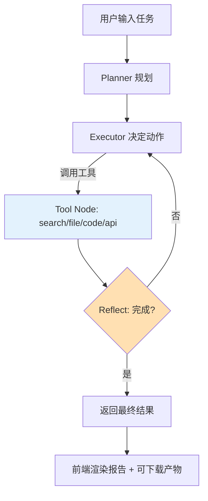

# 简单 PRD：基于 LangGraph 的自主任务 Agent 工程产品

> 文档级别：**简单 PRD（默认）** —— 不含竞品分析 / 市场象限图
> 产品经理：许清楚（Xu）　|　版本：v0.1（草案）　|　日期：2025-08-24
> 工作目录：`E:\code\demo`

---

## 1. 产品目标

### 1.1 一句话定位
一个基于 **LangGraph（Python）** 编排的「自主任务 Agent」平台：用户用自然语言下发任务，Agent 能自主规划、循环调用工具（联网检索、文件读写、代码执行、外部 API）完成多步任务，并通过前后端一体的可视化界面实时展示规划、执行与结果。

### 1.2 详细目标说明

| 编号 | 目标 | 说明 |
|------|------|------|
| G1 | 自主规划与执行 | 基于 LLM + LangGraph 状态机，将复杂任务拆解为可执行的子步骤，支持「反思 / 重试」循环，而非一次性问答。 |
| G2 | 工具编排能力 | 内置一组可扩展工具（web search、file I/O、code exec、HTTP API），工具调用由图节点驱动，结果回流状态图继续推理。 |
| G3 | 可观测与可控 | 前端实时可视化任务进度、每一步的规划 / 工具调用 / 中间结果，支持暂停、中断、人工介入。 |
| G4 | 工程化交付 | 提供 REST / WebSocket API 与 Web 前端，可本地或容器化部署，具备基础配置与运行健壮性。 |

### 1.3 成功标准

| 编号 | 标准 | 度量口径 |
|------|------|----------|
| SC1 | 端到端任务成功率 | 给定「调研某主题并生成带引用报告」类任务，10 个样本中 ≥ 70% 能自主完成并产生可用产物。 |
| SC2 | 实时可观测 | 工具调用全过程可在前端实时呈现（事件延迟 < 1s），并能被用户中途暂停。 |
| SC3 | 一键跑通 | 前后端可通过单条命令（启动脚本 / docker-compose）在本地跑通一个 demo 任务。 |
| SC4 | 可扩展 | 新增一个工具的上手成本 < 30 分钟（明确接口约定 + 示例即可接入并被 Agent 自动使用）。 |

---

## 2. 用户故事

| # | 角色 | 用户故事 | 价值 |
|---|------|----------|------|
| US1 | 开发者 | 作为开发者，我希望用自然语言让 Agent 自动完成「联网查资料 → 整理 → 写文件」的多步任务，而不必逐步手动调用，从而把精力放在结果校验上。 | 减少重复操作 |
| US2 | 开发者 | 作为开发者，我希望在前端实时看到 Agent 每一步的规划与工具调用（含入参 / 出参），以便理解和排查异常。 | 可观测、可调试 |
| US3 | 开发者 | 作为开发者，我希望能暂停 / 中断正在执行的任务并查看中间状态，以便对高风险步骤（如删除文件、外发 API）进行人工确认。 | 可控、安全 |
| US4 | 业务用户 | 作为业务用户，我希望像聊天一样下发任务并拿到结构化结果（文件 / 报告），而不关心底层工具细节。 | 低门槛 |
| US5 | 运维 / 管理员 | 作为运维，我希望通过环境变量 / 配置文件切换 LLM 供应商、设置限速与超时，并对运行日志做基本审计。 | 可运维 |
| US6 | 开发者 | 作为开发者，我希望按约定快速注册新工具（函数 + schema），Agent 能自动发现并使用，从而扩展能力边界。 | 可扩展 |

---

## 3. 需求池

### P0 — 必须（MVP 可交付）

| ID | 需求 | 功能点 | 验收标准 |
|----|------|--------|----------|
| P0-1 | Agent 编排内核 | 基于 LangGraph 构建状态图（Planner → Executor → Tool → Reflect 循环），支持多轮 step 直至完成或达到最大步数。 | 给定任务能产出最终结果；单任务步数可在配置中限制（默认 ≤ 15）。 |
| P0-2 | LLM 接入 | 支持至少 1 家 LLM（建议 OpenAI 兼容接口或 Anthropic），通过配置注入 API Key。 | 配置 Key 后可成功发起一次规划调用；缺失 Key 时给出明确错误。 |
| P0-3 | 工具：联网检索 | 内置 web search 工具（如 Tavily / Serper / DuckDuckGo），返回结构化结果。 | 给定查询返回 ≥ 1 条带 URL 的结果。 |
| P0-4 | 工具：文件读写 | 在沙箱目录内读 / 写 / 列目录，路径受白名单约束。 | 写入文件后可在指定目录读取到；越界路径被拒绝。 |
| P0-5 | 工具：代码执行 | 在受控环境（subprocess / 容器）执行 Python / Shell，捕获 stdout / stderr / 退出码。 | 执行 `1+1` 返回 2；异常代码不导致进程崩溃。 |
| P0-6 | 后端 API | FastAPI 暴露 `POST /tasks`（下发）、`GET /tasks/{id}`（状态）、流式接口（SSE / WS）推送步骤事件。 | 用 curl 能下发任务并收到流式步骤事件。 |
| P0-7 | 前端对话 / 任务面板 | Web 页面：输入任务、展示消息流与最终答案、展示任务状态（运行中 / 完成 / 失败）。 | 端到端 demo 任务可在前端发起并看到结果。 |
| P0-8 | 步骤可视化 | 前端以时间线 / 列表展示每个 step 的「规划文本 + 工具调用 + 入参 / 出参 + 状态」。 | 每个工具调用可见入参与出参摘要。 |
| P0-9 | 任务终止控制 | 前端提供「停止」按钮；后端收到信号后中断当前执行循环。 | 点击停止后 2s 内将当前任务标记为 interrupted。 |
| P0-10 | 配置与启动 | 通过 .env / 配置文件注入 LLM key、工具开关、步数上限；提供启动脚本。 | 按 README 启动后能跑通默认 demo。 |

### P1 — 重要（显著提升体验）

| ID | 需求 | 功能点 | 验收标准 |
|----|------|--------|----------|
| P1-1 | 工具：外部 HTTP API | 通用 HTTP 调用工具（GET / POST，含 header / body）。 | 能对测试接口发起请求并返回解析后的 JSON。 |
| P1-2 | 人工介入节点 | 对高风险工具（删除 / 外发）标记需确认，前端弹出确认。 | 标记工具执行前必须用户确认才继续。 |
| P1-3 | 持久化 | 任务与消息历史落库（SQLite / 文件），支持刷新后恢复查看。 | 重启服务后历史任务仍可见。 |
| P1-4 | 重试与退避 | 支持工具失败重试与简单退避；可选并行工具调用。 | 单工具失败按策略重试 ≥ 1 次。 |
| P1-5 | 流式排版与产物 | 最终产物（如报告文件）可在前端下载 / 预览。 | 报告类任务产物可一键下载。 |
| P1-6 | 鉴权（基础） | 前端 / API 简单口令或 token 保护（若部署在公网）。 | 未带凭证被拒。 |

### P2 — 可选（后续迭代）

| ID | 需求 | 功能点 | 验收标准 |
|----|------|--------|----------|
| P2-1 | 多 Agent 协作 | 子 Agent 分工（检索 / 写作）由 supervisor 调度。 | 复杂任务可拆分给子 Agent。 |
| P2-2 | 任务模板 | 用户保存常用任务为模板，一键发起。 | 可保存并复用模板。 |
| P2-3 | 成本 / 用量统计 | 展示每次任务的 token 消耗、工具调用次数。 | 任务详情含用量面板。 |
| P2-4 | 插件式工具市场 | 工具以独立包注册，动态加载。 | 新增工具无需改核心代码。 |
| P2-5 | 移动端适配 | 前端响应式，移动端可用。 | 窄屏下核心流程可用。 |

---

## 4. UI 设计稿

### 4.1 信息架构

```
App
├── 左侧栏：历史任务列表（History）
└── 主区
    ├── 顶部：任务标题 + 状态徽章 + 停止按钮
    ├── 中部：对话 / 任务流（消息 + 步骤时间线）
    └── 右侧（可选）：当前 step 详情（工具入参 / 出参、日志）
```

### 4.2 核心界面草图（ASCII）

```
┌───────────────┬──────────────────────────────────────┬──────────────┐
│ 历史任务       │  任务：调研 RAG 最新进展并写报告        │ Step 详情     │
│ ───────────    │  ┌────────────────────────────────┐  │              │
│ • 任务A   ✓    │  │ 用户：调研 RAG 最新进展…          │  │ 工具: search │
│ • 任务B   ⟳    │  └────────────────────────────────┘  │  │ 入参: {...}  │
│ + 新建         │  ┌────────────────────────────────┐  │  │ 出参: [3条]  │
│               │  │ 🤖 规划：1搜索 2阅读 3撰写        │  │  │ 状态: ✓     │
│               │  └────────────────────────────────┘  │              │
│               │  ▸ Step1  ▸ Step2  ▸ Step3 ...        │  │ 日志         │
│               │  ┌────────────────────────────────┐  │  │ > calling…   │
│               │  │ 📄 最终报告（可下载）            │  │              │
│               │  └────────────────────────────────┘  │              │
│               │  [输入框：输入新任务…] [发送] [停止]  │              │
└───────────────┴──────────────────────────────────────┴──────────────┘
```

### 4.3 Agent 执行流与前端渲染（mermaid）



### 4.4 交互流程

1. 用户在输入框提交任务 → 后端 `POST /tasks`，返回 `task_id`。
2. 前端订阅该 task 的流式事件（SSE / WS），逐步渲染 step。
3. 每出现工具调用，右侧详情面板展示入参 / 出参；高风险工具弹确认（P1-2）。
4. 任务完成 → 中部展示最终答案，若有产物文件提供下载（P1-5）。
5. 任意时刻点「停止」→ 后端中断循环 → 状态置 `interrupted`（P0-9）。

---

## 5. 待确认问题

| # | 问题 | 影响范围 | 需谁确认 |
|---|------|----------|----------|
| Q1 | 前端技术栈是否采用 **React + Vite + Tailwind**（产品经理建议）？ | 决定前端实现方式 | 架构师 |
| Q2 | LLM 供应商与接入方式（OpenAI / Anthropic / 本地推理 / 网关）？Key 如何管理？ | 影响 P0-2、配置设计 | 用户 / 架构师 |
| Q3 | 是否需要持久化（P1-3）？首版可仅内存 + 文件产物？ | 影响存储选型 | 用户 |
| Q4 | 鉴权需求（P1-6）：仅本地 demo 还是需要公网部署带登录？ | 影响安全设计范围 | 用户 |
| Q5 | 代码执行沙箱强度：本机 subprocess 是否足够，还是需要 Docker 隔离？ | 影响 P0-5 安全性 | 架构师 |
| Q6 | 默认内置哪些工具？web search 用哪家（是否需付费 Key）？ | 影响 P0-3 可行性 | 用户 |
| Q7 | 是否需要在首版支持人工介入确认（P1-2）？ | 影响交互与节点设计 | 产品 / 用户 |
| Q8 | 任务成功 / 失败的业务判定标准（SC1 的 70% 如何度量）？ | 影响验收口径 | 用户 / QA |

---

## 6. 范围边界

### 6.1 范围内（In Scope）

- 基于 LangGraph 的自主任务 Agent 后端编排内核与内置工具集（检索 / 文件 / 代码 / HTTP）。
- FastAPI 后端服务与流式接口。
- Web 前端：任务下发、步骤可视化、产物展示、停止控制。
- 本地 / 容器化一键启动与基础配置。
- 至少 1 个可演示的端到端 demo 任务。

### 6.2 范围外（Out of Scope，首版不做）

- 多租户 SaaS 与复杂账号体系（仅基础鉴权可选，见 P1-6）。
- 模型微调 / 自建 RAG 知识库（除非作为工具调用外部服务）。
- 移动端原生 App（仅响应式 Web 可选，见 P2-5）。
- 复杂多 Agent 编排与插件市场（见 P2-1 / P2-4，后续迭代）。
- 商业化计费与运营后台。
